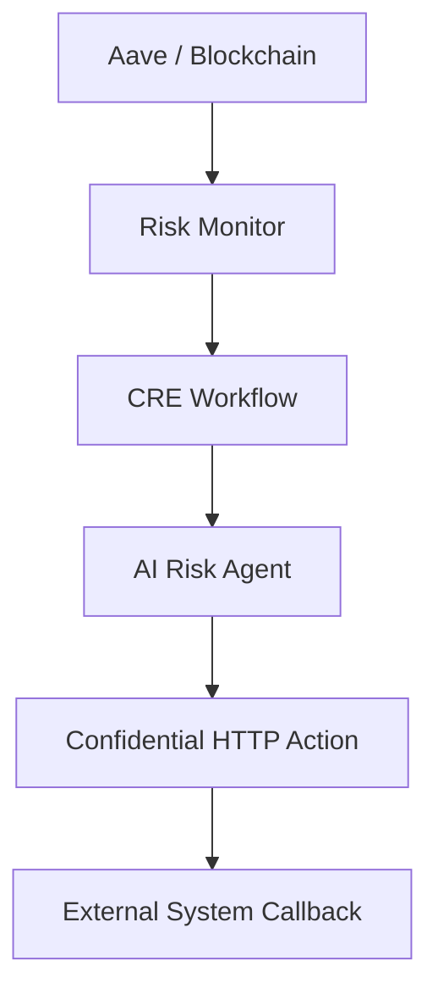
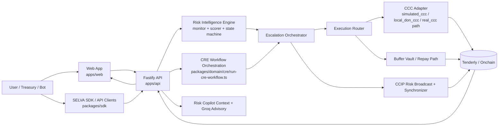
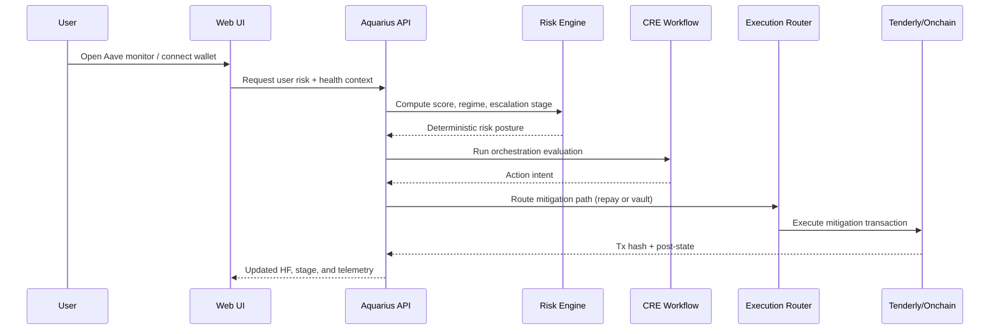
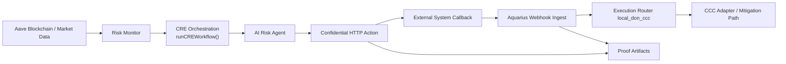
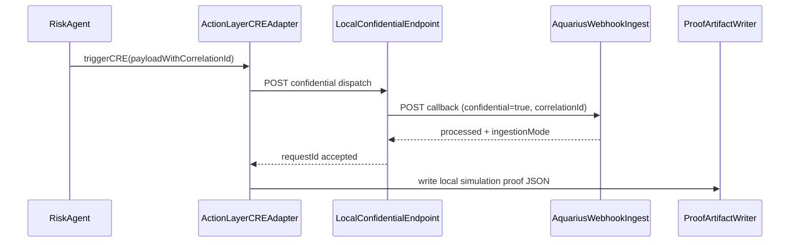

# Aquarius Risk Intelligence Protocol (AQUARIUS)
**Autonomous, protocol-aware real-time risk intelligence and mitigation infrastructure for DeFi - built on a Chainlink-oriented orchestration stack.**

Built with love ❤️ for users, developers, and automated systems.
In honor of <b><a href="https://en.wikipedia.org/wiki/Miki_Endo">Miki Endo</a></b>.

<p align="center">
  <strong><a href="https://youtu.be/YOUR_VIDEO_ID">▶ Walkthrough demo video</a></strong>
</p>

<p align="center">
  <a href="https://youtu.be/YOUR_VIDEO_ID">
    
  </a>
  &nbsp;&nbsp;
  <a href="https://aquarius-web.vercel.app/">
    
  </a>
  &nbsp;&nbsp;
  <a href="https://aquarius-web.vercel.app/docs/introduction">
    
  </a>
</p>

## Table of Contents

- [Aquarius Risk Intelligence Protocol (AQUARIUS)](#aquarius-risk-intelligence-protocol-aquarius)
  - [Table of Contents](#table-of-contents)
  - [Overview](#overview)
  - [Aquarius](#aquarius)
  - [What Problem Aquarius Solves](#what-problem-aquarius-solves)
    - [DeFi user problem](#defi-user-problem)
    - [Chainlink ecosystem problem](#chainlink-ecosystem-problem)
  - [How It Works](#how-it-works)
  - [Quick System Flow](#quick-system-flow)
  - [Architecture Diagram](#architecture-diagram)
  - [Contracts and Architecture](#contracts-and-architecture)
    - [Core Contracts](#core-contracts)
    - [API and Orchestration Layer](#api-and-orchestration-layer)
    - [Intelligence Layer](#intelligence-layer)
    - [Execution Layer](#execution-layer)
    - [SDK and Bot Surface](#sdk-and-bot-surface)
  - [System Actors](#system-actors)
  - [Chainlink Integrations](#chainlink-integrations)
    - [Chainlink CRE](#chainlink-cre)
    - [Chainlink Confidential Compute (CCC) Oriented Execution](#chainlink-confidential-compute-ccc-oriented-execution)
    - [Confidential HTTP (Local DON Simulation Validation)](#confidential-http-local-don-simulation-validation)
    - [Chainlink CCIP (Cross-Chain Risk Propagation)](#chainlink-ccip-cross-chain-risk-propagation)
  - [Workflow Flows](#workflow-flows)
    - [End-to-End Workflow Overview](#end-to-end-workflow-overview)
    - [Risk Monitoring Flow](#risk-monitoring-flow)
    - [Escalation Flow](#escalation-flow)
    - [Mitigation Execution Flow](#mitigation-execution-flow)
    - [Real-Time Risk Copilot Flow](#real-time-risk-copilot-flow)
    - [Confidential HTTP Local Flow](#confidential-http-local-flow)
    - [How Confidential HTTP Supports Aquarius Non-Custodial Promise](#how-confidential-http-supports-aquarius-non-custodial-promise)
  - [Health Score, SELVA SDK, and Bot APIs](#health-score-selva-sdk-and-bot-apis)
  - [Deploying](#deploying)
    - [Local](#local)
    - [Hosted split (recommended)](#hosted-split-recommended)
  - [Commands](#commands)
  - [Testing](#testing)
    - [local\_don\_ccc End-to-End Semantics](#local_don_ccc-end-to-end-semantics)
  - [Validation Report (End-to-End Proof)](#validation-report-end-to-end-proof)
    - [Latest successful run summary](#latest-successful-run-summary)
    - [Stage highlights](#stage-highlights)
    - [Tenderly explorer links (from latest run)](#tenderly-explorer-links-from-latest-run)
  - [Confidential HTTP Local Simulation Proof](#confidential-http-local-simulation-proof)
  - [CRE Requirement Compliance Checklist (Submission Proof Pack)](#cre-requirement-compliance-checklist-submission-proof-pack)
    - [Checklist](#checklist)
    - [Existing proof data already included in repo](#existing-proof-data-already-included-in-repo)
    - [Latest proof snapshot (from repo artifacts)](#latest-proof-snapshot-from-repo-artifacts)
  - [Chainlink Usage (Direct Code Links)](#chainlink-usage-direct-code-links)
  - [Known Issues and Limitations](#known-issues-and-limitations)
  - [Production considerations](#production-considerations)
    - [Post-hackathon API hardening (implemented)](#post-hackathon-api-hardening-implemented)
    - [Security and API surface](#security-and-api-surface)
    - [State persistence and scaling](#state-persistence-and-scaling)
    - [Operations and observability](#operations-and-observability)
    - [Real CRE and DON readiness](#real-cre-and-don-readiness)
    - [User-facing and compliance posture](#user-facing-and-compliance-posture)
  - [Future Developments](#future-developments)
  - [Challenges We Ran Into](#challenges-we-ran-into)
  - [Frontend](#frontend)
  - [Builder’s Note](#builders-note)
  - [Gratitude \& Acknowledgments](#gratitude--acknowledgments)
  - [Dedication](#dedication)
- [Fun Fact 😀](#fun-fact-)
  - [Meaning of Names We Chose for This Project and Why](#meaning-of-names-we-chose-for-this-project-and-why)

## Overview

Aquarius is an API-first, real-time DeFi risk intelligence system. It is designed to shift DeFi risk handling from reactive dashboards to proactive orchestration.

Instead of waiting for liquidation conditions, Aquarius continuously evaluates protocol and user posture, classifies escalation stage, and dispatches mitigation pathways through a deterministic workflow.

## Aquarius

Aquarius is a protocol-aware control system for DeFi position protection (starting with Aave), combining:

- deterministic risk ingestion and scoring
- staged escalation state machine
- CRE-oriented orchestration
- CCC-oriented dual-path execution
- local DON callback-driven CCC execution mode (`local_don_ccc`)
- CCIP-style cross-chain risk propagation
- real-time Risk AI Copilot (position-aware)
- bot-ready API and SELVA SDK interfaces

## What Problem Aquarius Solves

### DeFi user problem

DeFi users and operators typically monitor risk manually across fragmented tools. This introduces delays between risk detection and action, especially under volatility.

### Chainlink ecosystem problem

Chainlink infrastructure provides execution and messaging rails, but DeFi mitigation requires protocol-specific intelligence and measurable risk outcomes. Aquarius fills this last-mile intelligence gap by turning infrastructure primitives into a deterministic risk-control workflow with auditable execution results.

## How It Works

1. Users (or bots via API/SDK) connect and select chain context.
2. Aquarius ingests position state (collateral, debt, health factor, liquidation distance).
3. Deterministic risk intelligence computes score, regime, and escalation posture.
4. CRE orchestration evaluates agent decisioning.
5. If thresholds are met, Aquarius dispatches mitigation through:
   - non-custodial path (repay / add collateral)
   - vault-backed path (buffer vault reinforcement)
6. Cross-chain risk posture can be propagated through CCIP-style signaling.
7. The real-time Risk AI Copilot explains current position context in informational mode.

## Quick System Flow



This view is optimized for quick understanding of Aquarius Protocol : chain data enters Aquarius, risk is evaluated, CRE orchestrates decisions, actions are dispatched via confidential HTTP, and callbacks return execution outcomes.

## Architecture Diagram





## Contracts and Architecture

### Core Contracts

- [`contracts/src/AquaAgentPolicyGuard.sol`](contracts/src/AquaAgentPolicyGuard.sol)
- [`contracts/src/MitigationExecutor.sol`](contracts/src/MitigationExecutor.sol)
- [`contracts/src/BufferVault.sol`](contracts/src/BufferVault.sol)
- [`contracts/src/AquaAgent.sol`](contracts/src/AquaAgent.sol)
- [`contracts/src/CCIPCoordinator.sol`](contracts/src/CCIPCoordinator.sol)

### API and Orchestration Layer

- [`apps/api/src/app.ts`](apps/api/src/app.ts)
- [`apps/api/src/server.ts`](apps/api/src/server.ts)
- [`apps/api/src/routes/v1/index.ts`](apps/api/src/routes/v1/index.ts)
- [`apps/api/src/routes/cre/index.ts`](apps/api/src/routes/cre/index.ts)
- [`apps/api/src/routes/cre/demo.ts`](apps/api/src/routes/cre/demo.ts)
- [`packages/domain/cre/run-cre-workflow.ts`](packages/domain/cre/run-cre-workflow.ts)

### Intelligence Layer

- [`apps/api/src/protocols/aave/risk-intelligence/monitor.ts`](apps/api/src/protocols/aave/risk-intelligence/monitor.ts)
- [`apps/api/src/protocols/aave/risk-intelligence/signals.ts`](apps/api/src/protocols/aave/risk-intelligence/signals.ts)
- [`apps/api/src/protocols/aave/risk-intelligence/scorer.ts`](apps/api/src/protocols/aave/risk-intelligence/scorer.ts)
- [`apps/api/src/protocols/aave/risk-intelligence/escalation-state-machine.ts`](apps/api/src/protocols/aave/risk-intelligence/escalation-state-machine.ts)
- [`apps/api/src/services/health-engine/index.ts`](apps/api/src/services/health-engine/index.ts)

### Execution Layer

- [`apps/api/src/infrastructure/execution/execution-router.ts`](apps/api/src/infrastructure/execution/execution-router.ts)
- [`apps/api/src/infrastructure/ccc/CccExecutionAdapter.ts`](apps/api/src/infrastructure/ccc/CccExecutionAdapter.ts)
- [`apps/api/src/infrastructure/ccc/executionFactory.ts`](apps/api/src/infrastructure/ccc/executionFactory.ts)
- [`apps/api/src/protocols/aave/infrastructure/execution/confidential-cre.adapter.ts`](apps/api/src/protocols/aave/infrastructure/execution/confidential-cre.adapter.ts)

### SDK and Bot Surface

- [`packages/sdk/src/aave-selva/index.ts`](packages/sdk/src/aave-selva/index.ts)
- [`packages/sdk/src/aave-selva/health-score.ts`](packages/sdk/src/aave-selva/health-score.ts)
- [`packages/sdk/src/index.ts`](packages/sdk/src/index.ts)
- [`apps/api/src/routes/v1/aave-risk/index.ts`](apps/api/src/routes/v1/aave-risk/index.ts)

## System Actors

- **Users / Treasuries:** monitor and protect positions via UI and policy flows.
- **Bots / Integrators:** consume Aquarius API and SELVA SDK methods.
- **Operators:** validate posture, execution, and system safety via telemetry/validation layers.

## Chainlink Integrations

### Chainlink CRE

- Shared orchestration core: [`packages/domain/cre/run-cre-workflow.ts`](packages/domain/cre/run-cre-workflow.ts)
- API route wrapper: [`apps/api/src/routes/cre/index.ts`](apps/api/src/routes/cre/index.ts)
- Internal webhook ingestion: [`apps/api/src/routes/internal/ingest/cre-webhook.ts`](apps/api/src/routes/internal/ingest/cre-webhook.ts)
- CLI simulation: [`scripts/run-cre-simulation.ts`](scripts/run-cre-simulation.ts)

### Chainlink Confidential Compute (CCC) Oriented Execution

- CCC adapter: [`apps/api/src/infrastructure/ccc/CccExecutionAdapter.ts`](apps/api/src/infrastructure/ccc/CccExecutionAdapter.ts)
- mode factory (`simulated_ccc` / `local_don_ccc` / `real_ccc`): [`apps/api/src/infrastructure/ccc/executionFactory.ts`](apps/api/src/infrastructure/ccc/executionFactory.ts)
- confidential boundary adapter: [`apps/api/src/protocols/aave/infrastructure/execution/confidential-cre.adapter.ts`](apps/api/src/protocols/aave/infrastructure/execution/confidential-cre.adapter.ts)
- CRE demo route execution proof: [`apps/api/src/routes/cre/demo.ts`](apps/api/src/routes/cre/demo.ts)

Execution modes now have clear responsibilities:

- `simulated_ccc`: direct simulation-oriented adapter execution path.
- `local_don_ccc`: callback-driven local DON semantics (`confidential-http` callback -> correlation guards -> execution router -> CCC adapter).
- `real_ccc`: planned production DON-backed path.

Current validated modes in this repo are `simulated_ccc` and `local_don_ccc` (local DON simulation). `real_ccc` remains a planned production path.

### Confidential HTTP (Local DON Simulation Validation)

- Live dispatch boundary (action-layer): [`apps/api/src/protocols/aave/action-layer/cre-adapter.ts`](apps/api/src/protocols/aave/action-layer/cre-adapter.ts)
- Internal callback ingest + correlation mapping: [`apps/api/src/routes/internal/ingest/cre-webhook.ts`](apps/api/src/routes/internal/ingest/cre-webhook.ts)
- End-to-end local simulation runner: [`scripts/run-confidential-http-validation.ts`](scripts/run-confidential-http-validation.ts)
- Local simulation artifact runbook: [`docs/confidential-http-local-simulation.md`](docs/confidential-http-local-simulation.md)
- Aquarius-compatible simulation payload: [`workflows/aave-risk/payload.local-simulation.json`](workflows/aave-risk/payload.local-simulation.json)

Validated claim for this track submission:
`End-to-end Confidential HTTP validated in local CRE DON simulation`.

### Chainlink CCIP (Cross-Chain Risk Propagation)

- sender: [`apps/api/src/protocols/aave/ccip/sender.ts`](apps/api/src/protocols/aave/ccip/sender.ts)
- receiver: [`apps/api/src/protocols/aave/ccip/receiver.ts`](apps/api/src/protocols/aave/ccip/receiver.ts)
- broadcast and coordination services:
  - [`apps/api/src/protocols/aave/ccip/risk-broadcast.service.ts`](apps/api/src/protocols/aave/ccip/risk-broadcast.service.ts)
  - [`apps/api/src/protocols/aave/ccip/risk-state-synchronizer.ts`](apps/api/src/protocols/aave/ccip/risk-state-synchronizer.ts)
  - [`apps/api/src/protocols/aave/ccip/global-escalation-coordinator.ts`](apps/api/src/protocols/aave/ccip/global-escalation-coordinator.ts)

## Workflow Flows

Before diving into each flow, the key architectural point is that Aquarius has a shared orchestration entry point:
[`packages/domain/cre/run-cre-workflow.ts`](packages/domain/cre/run-cre-workflow.ts).

`runCREWorkflow()` is the common application-layer coordinator used by both CLI and API surfaces. It connects the deterministic risk pipeline (signals -> scoring -> monitoring), escalation logic, agent decisioning, optional LLM reasoning, and action dispatch into one coherent execution path. This gives all system layers a consistent contract and keeps behavior aligned across frontend polling, backend APIs, SDK consumers, and simulation tooling.

In short: different interfaces call the same orchestration core, so the project behaves as one connected system rather than disconnected features.

### End-to-End Workflow Overview



### Risk Monitoring Flow

1. ingest snapshots
2. compute deterministic metrics
3. derive score and escalation context
4. emit API/UI/SDK-consumable outputs

Implemented in:
[`apps/api/src/protocols/aave/risk-intelligence/monitor.ts`](apps/api/src/protocols/aave/risk-intelligence/monitor.ts),
[`apps/api/src/protocols/aave/risk-intelligence/signals.ts`](apps/api/src/protocols/aave/risk-intelligence/signals.ts),
[`apps/api/src/protocols/aave/risk-intelligence/scorer.ts`](apps/api/src/protocols/aave/risk-intelligence/scorer.ts).

### Escalation Flow

1. risk pressure accumulates
2. state machine updates stage
3. action posture becomes observe/protect/escalate

Implemented in:
[`apps/api/src/protocols/aave/risk-intelligence/escalation-state-machine.ts`](apps/api/src/protocols/aave/risk-intelligence/escalation-state-machine.ts),
[`apps/api/src/protocols/aave/risk-intelligence/escalation-store.ts`](apps/api/src/protocols/aave/risk-intelligence/escalation-store.ts),
[`apps/api/src/protocols/aave/ai-agents/ai-risk-agent.ts`](apps/api/src/protocols/aave/ai-agents/ai-risk-agent.ts).

### Mitigation Execution Flow

1. generate mitigation intent
2. route by execution mode
3. execute path A or path B
4. verify measurable pre/post state (e.g., HF improvement)

Implemented in:
[`apps/api/src/infrastructure/execution/execution-router.ts`](apps/api/src/infrastructure/execution/execution-router.ts),
[`apps/api/src/infrastructure/ccc/CccExecutionAdapter.ts`](apps/api/src/infrastructure/ccc/CccExecutionAdapter.ts),
[`apps/api/src/infrastructure/execution/mitigation-registry.ts`](apps/api/src/infrastructure/execution/mitigation-registry.ts).

### Real-Time Risk Copilot Flow

1. user asks question in floating copilot
2. frontend posts to `/api/v1/copilot/chat`
3. backend assembles deterministic context
4. advisory layer adds Groq interpretation
5. fallback-safe response returned if model unavailable

Implemented in:
[`apps/api/src/routes/v1/copilot/chat.ts`](apps/api/src/routes/v1/copilot/chat.ts),
[`apps/api/src/services/health-engine/ai-context.ts`](apps/api/src/services/health-engine/ai-context.ts),
[`packages/sdk/src/agent/llm-agent.ts`](packages/sdk/src/agent/llm-agent.ts).

### Confidential HTTP Local Flow

1. AI escalation service dispatches a confidential CRE action payload (with correlation ID)
2. local simulated confidential endpoint accepts the request
3. endpoint calls Aquarius internal webhook callback
4. Aquarius ingests callback as `ingestionMode: confidential-http`
5. in `local_don_ccc` mode, Aquarius:
   - checks callback freshness (`LOCAL_DON_CCC_CALLBACK_MAX_AGE_MS`)
   - reserves `correlationId` in replay ledger (`LOCAL_DON_CCC_REPLAY_TTL_MS`)
   - builds deterministic execution context
   - routes to CCC execution with timeout guard (`LOCAL_DON_CCC_EXECUTION_TIMEOUT_MS`)
6. artifacts are written for submission evidence

Implemented in:
[`apps/api/src/protocols/aave/action-layer/cre-adapter.ts`](apps/api/src/protocols/aave/action-layer/cre-adapter.ts),
[`apps/api/src/routes/internal/ingest/cre-webhook.ts`](apps/api/src/routes/internal/ingest/cre-webhook.ts),
[`scripts/run-confidential-http-validation.ts`](scripts/run-confidential-http-validation.ts).



### How Confidential HTTP Supports Aquarius Non-Custodial Promise

This section explains exactly how Confidential HTTP supports Aquarius' core promise:
***"mitigate risk without custody of user private keys or critical credentials."***

1. **Keeps API secrets/credentials out of normal node memory (enclave path).**
   - Aquarius dispatches confidential workflow payloads through the confidential boundary ([`apps/api/src/protocols/aave/action-layer/cre-adapter.ts`](apps/api/src/protocols/aave/action-layer/cre-adapter.ts)), including correlation and confidentiality markers.
   - In this submission, the behavior is validated through local CRE DON simulation artifacts ([`artifacts/confidential-http-validation.json`](artifacts/confidential-http-validation.json), [`artifacts/local-cre-don-simulation-proof.json`](artifacts/local-cre-don-simulation-proof.json)).
   - Production enclave guarantees require deployed Confidential HTTP workflow evidence and are listed as a future hardening step.

2. **Lets you process sensitive offchain inputs privately.**
   - Aquarius sends confidential action metadata (including correlation IDs and confidential markers) and ingests callback results via the internal webhook path ([`apps/api/src/routes/internal/ingest/cre-webhook.ts`](apps/api/src/routes/internal/ingest/cre-webhook.ts)).
   - The validated local flow confirms end-to-end confidential dispatch, callback processing, and `ingestionMode: "confidential-http"` mapping.

3. **Reduces exposure of critical credentials in orchestration flows.**
   - Credentials for confidential dispatch are handled via environment-based configuration (`CRE_CONFIDENTIAL_HTTP_TOKEN`, `CRE_CONFIDENTIAL_HTTP_URL`) and are not hardcoded in workflow dispatch logic.
   - Correlation-first logging gives traceability without requiring sensitive payload material to be printed in the main risk execution path.

4. **Generally Strengthens our Promise to users and institutions -- "we don't need your private key and credentials to run Aquarius intelligence/orchestration for you"**
   - Aquarius risk intelligence and orchestration run without requiring users to provide private keys to the backend.
   - Confidential HTTP strengthens this promise on the offchain side by supporting private orchestration of sensitive request/response handling, while non-custodial mitigation settlement remains policy-guarded and execution-mode controlled.
  
 *NOTE:* This is still under research. We hope to use other technologies to complement Confidential HTTP.

While Confidential HTTP secures the transport and fetching of data, the following technologies can help ensure that orchestration (decision-making) and execution (movement of funds) are equally private and non-custodial.

- **Multi-Party Computation (MPC):**  
  With MPC, we can generate a valid signature to move funds without ever holding the full key. Even if the backend is breached, an attacker only gets a useless key fragment.

- **Zero-Knowledge Proofs (ZKP) for Risk Logic:**  
  An institution may not want to share its exact portfolio balance or internal risk thresholds. With ZKPs (for example, zk-SNARKs), a user can prove they meet a required risk profile locally, and Aquarius can verify that proof to trigger orchestration.  
  This protects not only keys, but also strategy.

- **Account Abstraction (ERC-4337):**  
  This can help us enforce programmable non-custodial policies and safer user-controlled automation.

- **Fully Homomorphic Encryption (FHE):**  
  This may be important when we implement a unified security portfolio across multiple DeFi positions. Aquarius could run parts of its risk intelligence on encrypted portfolio data.

Our goal is to ensure maximum security, protection, and privacy for users and institutions.

## Health Score, SELVA SDK, and Bot APIs

Aquarius productizes risk intelligence for external builders and bots:

- protocol health: [`apps/api/src/routes/v1/aave-risk/protocol-health.ts`](apps/api/src/routes/v1/aave-risk/protocol-health.ts)
- user health: [`apps/api/src/routes/v1/aave-risk/user-health.ts`](apps/api/src/routes/v1/aave-risk/user-health.ts)
- user risk projection: [`apps/api/src/routes/v1/aave-risk/user-risk.ts`](apps/api/src/routes/v1/aave-risk/user-risk.ts)
- projected HF: [`apps/api/src/routes/v1/aave-risk/projected-hf.ts`](apps/api/src/routes/v1/aave-risk/projected-hf.ts)
- stress test: [`apps/api/src/routes/v1/aave-risk/stress-test.ts`](apps/api/src/routes/v1/aave-risk/stress-test.ts)
- actionable metrics: [`apps/api/src/routes/v1/aave-risk/actionable-metrics.ts`](apps/api/src/routes/v1/aave-risk/actionable-metrics.ts)

SELVA SDK integrations:

- [`packages/sdk/src/aave-selva/health-score.ts`](packages/sdk/src/aave-selva/health-score.ts)
- [`packages/sdk/src/aave-selva/risk.ts`](packages/sdk/src/aave-selva/risk.ts)
- [`packages/sdk/src/aave-selva/projected-hf.ts`](packages/sdk/src/aave-selva/projected-hf.ts)
- [`packages/sdk/src/client.ts`](packages/sdk/src/client.ts)
- [`packages/sdk/src/provider.ts`](packages/sdk/src/provider.ts)

## Deploying

### Local

```bash
pnpm install
cp .env.example .env
pnpm dev --filter api
pnpm dev --filter web
```

### Hosted split (recommended)

- Frontend: Vercel ([`apps/web`](apps/web))
- Backend: Render ([`apps/api`](apps/api))
- set `NEXT_PUBLIC_API_URL` on Vercel to your Render API URL

## Commands

| Command | Description |
| --- | --- |
| `pnpm build` | Build all workspaces |
| `pnpm dev` | Run monorepo dev |
| `pnpm dev --filter web` | Run web app |
| `pnpm dev --filter api` | Run api app |
| `pnpm test` | Run tests |
| `pnpm run:cre` | Run CRE simulation |
| `pnpm run:ccc-demo` | Run CCC demo simulation |
| `pnpm run:local-cre-don-sim` | Run local CRE DON confidential simulation proof |
| `cre -T staging-settings workflow simulate workflows/aave-risk --non-interactive --trigger-index 0 --engine-logs` | Run validated CRE CLI workflow simulation proof |
| `node --import tsx --test apps/api/tests/protocols/aave/local-don-ccc.execution.integration.test.ts` | Run local_don_ccc callback->execution integration proof |
| `pnpm run:full-validation` | Run full architecture validation |

## Testing

- protocol and architecture tests: [`apps/api/tests/`](apps/api/tests/)
- CRE simulation runner: [`scripts/run-cre-simulation.ts`](scripts/run-cre-simulation.ts)
- full validation runner: [`scripts/run-full-validation.ts`](scripts/run-full-validation.ts)
- local confidential simulation proof runner: [`scripts/run-confidential-http-validation.ts`](scripts/run-confidential-http-validation.ts)
- local confidential payload fixture: [`workflows/aave-risk/payload.local-simulation.json`](workflows/aave-risk/payload.local-simulation.json)
- local DON callback->router->CCC execution test: [`apps/api/tests/protocols/aave/local-don-ccc.execution.integration.test.ts`](apps/api/tests/protocols/aave/local-don-ccc.execution.integration.test.ts)

### local_don_ccc End-to-End Semantics

`local_don_ccc` is designed to prove a true local DON-like execution lifecycle without claiming production DON guarantees.

What it guarantees in code:

1. **Confidential callback gate**  
   `workflowId = aave-risk-confidential-http` callback enters internal webhook ingest path.

2. **Correlation-based idempotency and replay protection**  
   The callback correlation ID is reserved in an in-memory ledger with deterministic states:
   - `processing`
   - `completed`
   - `failed`
   - `timed_out`

3. **Stale callback rejection**  
   Late callbacks are rejected using `LOCAL_DON_CCC_CALLBACK_MAX_AGE_MS`.

4. **Deterministic execution handoff**  
   Callback data is normalized into `ExecutionContext` and handed to `ExecutionRouter("local_don_ccc")`.

5. **Bounded execution latency**  
   Router handoff is wrapped with timeout via `LOCAL_DON_CCC_EXECUTION_TIMEOUT_MS`.

6. **Machine-readable outcome**  
   Webhook response includes `localDonExecution.status`:
   - `executed`
   - `duplicate-ignored`
   - `replay-rejected`

Primary implementation:
- [`apps/api/src/routes/internal/ingest/cre-webhook.ts`](apps/api/src/routes/internal/ingest/cre-webhook.ts)
- [`apps/api/src/infrastructure/execution/execution-router.ts`](apps/api/src/infrastructure/execution/execution-router.ts)
- [`apps/api/src/infrastructure/ccc/executionFactory.ts`](apps/api/src/infrastructure/ccc/executionFactory.ts)

## Validation Report (End-to-End Proof)

Aquarius was validated end-to-end via:

```bash
pnpm run run:full-validation
```

### Latest successful run summary

- Mode: `FULL` (on-chain + off-chain)
- Contracts deployed: `5/5`
- Users created: `3`
- Events dispatched: `9`
- Predictions computed: `3`
- Mitigations executed: `2`
- CCIP broadcasts: `2`
- Anomalies tested: `3`
- API/SDK checks: `2`
- Explorer links: `10`
- Total assertions passed: `68`
- Total elapsed: `72682ms`

### Stage highlights

- Stage 1-2: core contract deployment + initialization complete
- Stage 3: 3 active users simulated with valid Aave positions
- Stage 4-5: event engine + prediction engine validated
- Stage 6: protocol isolation checks validated (cross-protocol violations rejected)
- Stage 7: dual-path mitigations executed with HF improvement
  - Path A: `3.418 -> 3.491`
  - Path B: `3.491 -> 3.525`
- Stage 8: cross-chain risk propagation and posture transitions validated
- Stage 9: scheduler anomaly + circuit breaker + recovery transitions validated
- Stage 10: API/SDK response consistency checks validated
- Stage 11: final state report generated

### Tenderly explorer links (from latest run)

- https://dashboard.tenderly.co/AQUARIUS/aqua-simulation/testnet/444ec6c6-eced-4b53-9852-ba6df3928682/tx/0x1d93bae6a5fec16e96c4db737e8ae2fbe0b8cbccf511ce96541e79d2d11d3be6
- https://dashboard.tenderly.co/AQUARIUS/aqua-simulation/testnet/444ec6c6-eced-4b53-9852-ba6df3928682/tx/0x2030f4b94fd30c7ae9eec5d3c9bc6b3fdd8830819ad5c87f8fc9746f268a1d1d
- https://dashboard.tenderly.co/AQUARIUS/aqua-simulation/testnet/444ec6c6-eced-4b53-9852-ba6df3928682/tx/0x141f88466ed76f98740afde03f3d3d823a25b6495652b6c4af769f2f16f24032
- https://dashboard.tenderly.co/AQUARIUS/aqua-simulation/testnet/444ec6c6-eced-4b53-9852-ba6df3928682/tx/0xcc8d18c4100e00d58183dfd7932be80e88b0a1a9c55376afcb9f0de7a095f15a
- https://dashboard.tenderly.co/AQUARIUS/aqua-simulation/testnet/444ec6c6-eced-4b53-9852-ba6df3928682/tx/0xd194b6222a7eff50c36d3fd39a814ef762b937a5ae9388f04ad0b6ce87362d18
- https://dashboard.tenderly.co/AQUARIUS/aqua-simulation/testnet/444ec6c6-eced-4b53-9852-ba6df3928682/tx/0x3ce44967c3ff8be9461ef25246321a1477c49d69bd30f3c5785905610ea3c3c1
- https://dashboard.tenderly.co/AQUARIUS/aqua-simulation/testnet/444ec6c6-eced-4b53-9852-ba6df3928682/tx/0x933ca46d1e7c1ab18e1cec617e4058378ee0ea5123b5731681b17b925cfb7a23
- https://dashboard.tenderly.co/AQUARIUS/aqua-simulation/testnet/444ec6c6-eced-4b53-9852-ba6df3928682/tx/0x59203525a94aa35a2cccc5f70ee5765355b8837aaf4665440a2a2044ed79fb2d
- https://dashboard.tenderly.co/AQUARIUS/aqua-simulation/testnet/444ec6c6-eced-4b53-9852-ba6df3928682/tx/0xc3c1136304d64b90ab228ec1b8977aeff4785556bef72f5f8474c47bb6f0346b
- https://dashboard.tenderly.co/AQUARIUS/aqua-simulation/testnet/444ec6c6-eced-4b53-9852-ba6df3928682/tx/0xdc6d73e9a86d9558ae38924576cbd84f8cc6a0efcf558f578b33a446f724ef28

## Confidential HTTP Local Simulation Proof

Aquarius includes a dedicated local DON simulation proof path for privacy-track validation without production deployment/JWT gateway triggering.

Run:

```bash
pnpm run:local-cre-don-sim
```

Generated artifacts:

- [`artifacts/confidential-http-validation.json`](artifacts/confidential-http-validation.json)
- [`artifacts/local-cre-don-simulation-proof.json`](artifacts/local-cre-don-simulation-proof.json)

Evidence fields in the generated proof include:

- `validationMode = "local_cre_don_simulation"`
- `claim = "End-to-end Confidential HTTP validated in local CRE DON simulation"`
- `dispatchReceived = true`
- `dispatchAuthorized = true`
- `callbackStatusCode = 200`
- `callbackBody.ingestionMode = "confidential-http"`
- matching `correlationId` between dispatch and callback

## CRE Requirement Compliance Checklist (Submission Proof Pack)

This section provides verifiable proof that the project satisfies the requirement:

> "Build, simulate, or deploy a CRE Workflow that's used as an orchestration layer within your project..."

All required workflow logic, simulation evidence, and artifacts are included in this repository.

### Checklist

- [x] **Workflow exists and is used as an orchestration layer**
  - Core orchestrator: [`packages/domain/cre/run-cre-workflow.ts`](packages/domain/cre/run-cre-workflow.ts)
  - API entrypoint using same workflow: [`apps/api/src/routes/cre/index.ts`](apps/api/src/routes/cre/index.ts)
  - CLI runner using same workflow: [`scripts/run-cre-simulation.ts`](scripts/run-cre-simulation.ts)

- [x] **Integrates blockchain + external system / AI path**
  - Blockchain risk data + scoring: [`apps/api/src/protocols/aave/risk-intelligence/monitor.ts`](apps/api/src/protocols/aave/risk-intelligence/monitor.ts)
  - AI agent decisioning: [`apps/api/src/protocols/aave/ai-agents/ai-risk-agent.ts`](apps/api/src/protocols/aave/ai-agents/ai-risk-agent.ts)
  - Optional LLM reasoning: [`packages/sdk/src/agent/llm-agent.ts`](packages/sdk/src/agent/llm-agent.ts)
  - Confidential external callback orchestration: [`apps/api/src/protocols/aave/action-layer/cre-adapter.ts`](apps/api/src/protocols/aave/action-layer/cre-adapter.ts)

- [x] **Successful local DON simulation artifacts captured**
  - [`artifacts/confidential-http-validation.json`](artifacts/confidential-http-validation.json)
  - [`artifacts/local-cre-don-simulation-proof.json`](artifacts/local-cre-don-simulation-proof.json)

- [x] **CRE CLI simulation evidence**
  - Verified command:
    ```bash
    cre -T staging-settings workflow simulate workflows/aave-risk \
      --non-interactive \
      --trigger-index 0 \
      --engine-logs
    ```
  - Captured CLI proof logs:
    - [`artifacts/cre-cli-sim-output.txt`](artifacts/cre-cli-sim-output.txt)
    - [`artifacts/cre-cli-version.txt`](artifacts/cre-cli-version.txt)
  - Confirmed success markers in output:
    - `✓ Workflow compiled`
    - `Running trigger trigger=cron-trigger@1.0.0`
    - `✓ Workflow Simulation Result`
    - `"status": "completed"`
    - `Simulation complete! Ready to deploy your workflow?`
  - Note: this workflow is cron-triggered, so `--http-payload` is not required for trigger index `0`.

### Existing proof data already included in repo

- Local DON simulation runbook: [`docs/confidential-http-local-simulation.md`](docs/confidential-http-local-simulation.md)
- Simulation payload used for CLI compatibility: [`workflows/aave-risk/payload.local-simulation.json`](workflows/aave-risk/payload.local-simulation.json)
- API ingest confirmation path: [`apps/api/src/routes/internal/ingest/cre-webhook.ts`](apps/api/src/routes/internal/ingest/cre-webhook.ts)
- Screenshot slots for submission package: [`docs/submission/screenshots/README.md`](docs/submission/screenshots/README.md)

### Latest proof snapshot (from repo artifacts)

From [`artifacts/local-cre-don-simulation-proof.json`](artifacts/local-cre-don-simulation-proof.json):

- `success: true`
- `validationMode: "local_cre_don_simulation"`
- `workflowId: "aave-risk-confidential-http"`
- `dispatchReceived: true`
- `dispatchAuthorized: true`
- `callbackStatusCode: 200`
- `callbackBody.ingestionMode: "confidential-http"`
- `callbackBody.correlationId == correlationId` (end-to-end propagation confirmed)

From [`artifacts/cre-cli-sim-output.txt`](artifacts/cre-cli-sim-output.txt):

- CRE target used: `staging-settings`
- Trigger executed: `cron-trigger@1.0.0`
- Workflow name: `aave-risk-staging`
- Simulation result status: `completed`
- Final CLI banner confirms simulation completion
- Benign simulation-only warnings observed:
  - `WARNING: Debug mode is enabled`
  - `no billing client has been configured`
  - These do not invalidate local CLI simulation success.


## Chainlink Usage (Direct Code Links)

- CRE workflow orchestration core:  
  https://github.com/FrankezeCode/Aquarius/blob/main/packages/domain/cre/run-cre-workflow.ts
- CRE API route (`/api/cre/run`):  
  https://github.com/FrankezeCode/Aquarius/blob/main/apps/api/src/routes/cre/index.ts
- CRE webhook ingest:  
  https://github.com/FrankezeCode/Aquarius/blob/main/apps/api/src/routes/internal/ingest/cre-webhook.ts
- CRE demo route:  
  https://github.com/FrankezeCode/Aquarius/blob/main/apps/api/src/routes/cre/demo.ts
- CRE CLI simulation:  
  https://github.com/FrankezeCode/Aquarius/blob/main/scripts/run-cre-simulation.ts
- Full architecture validation:  
  https://github.com/FrankezeCode/Aquarius/blob/main/scripts/run-full-validation.ts
- Local confidential simulation validation:  
  https://github.com/FrankezeCode/Aquarius/blob/main/scripts/run-confidential-http-validation.ts
- Local confidential simulation runbook:  
  https://github.com/FrankezeCode/Aquarius/blob/main/docs/confidential-http-local-simulation.md
- Local confidential payload fixture:  
  https://github.com/FrankezeCode/Aquarius/blob/main/workflows/aave-risk/payload.local-simulation.json

CCC and confidential execution:

- CCC adapter:  
  https://github.com/FrankezeCode/Aquarius/blob/main/apps/api/src/infrastructure/ccc/CccExecutionAdapter.ts
- CCC mode factory:  
  https://github.com/FrankezeCode/Aquarius/blob/main/apps/api/src/infrastructure/ccc/executionFactory.ts
- local DON callback execution ingress:  
  https://github.com/FrankezeCode/Aquarius/blob/main/apps/api/src/routes/internal/ingest/cre-webhook.ts
- Confidential boundary adapter:  
  https://github.com/FrankezeCode/Aquarius/blob/main/apps/api/src/protocols/aave/infrastructure/execution/confidential-cre.adapter.ts

CCIP propagation:

- Sender:  
  https://github.com/FrankezeCode/Aquarius/blob/main/apps/api/src/protocols/aave/ccip/sender.ts
- Receiver:  
  https://github.com/FrankezeCode/Aquarius/blob/main/apps/api/src/protocols/aave/ccip/receiver.ts

## Known Issues and Limitations
- This submission validates confidential behavior via local CRE DON simulation, not production DON deployment.
- Full production DON Confidential HTTP gateway-trigger evidence (JWT + deployed workflow endpoint) is reserved for post-hackathon hardening.
- local_don_ccc replay/idempotency ledger is in-memory (process-local), not yet backed by persistent shared storage.
- Some user flows are intentionally simulation-first for hackathon validation velocity.
- Production hardening (persistent infra/state and operational controls) is an active next step. For a structured production and CRE-readiness checklist, see [Production considerations](#production-considerations).

## Production considerations

Aquarius is API-first intelligence with optional orchestration and execution paths. Moving from hackathon validation to production requires explicit choices about what is enabled in each environment, durable state where correctness matters, and operational controls. This section summarizes the current posture and the hardening work tracked in code and docs.

### Post-hackathon API hardening (implemented)

After the hackathon submission, the API layer was tightened toward the goals described under [Security and API surface](#security-and-api-surface) and [Real CRE and DON readiness](#real-cre-and-don-readiness):

- **CRE webhook body validation (Zod)** — `POST /api/internal/ingest/cre-webhook` payloads are validated with a strict schema (`workflowId`, `chainId`, finite `timestamp`, object `data`). Invalid bodies return `400` with a stable error shape; detailed validation issues are logged server-side only. Schema and parser: [`apps/api/src/routes/internal/ingest/cre-webhook.schema.ts`](apps/api/src/routes/internal/ingest/cre-webhook.schema.ts); handler: [`apps/api/src/routes/internal/ingest/cre-webhook.ts`](apps/api/src/routes/internal/ingest/cre-webhook.ts).
- **Rate limiting (`@fastify/rate-limit`)** — Per-IP limits apply to `/api/v1` (public API), `/api/internal` (ingestion including CRE webhooks), and `/api/cre`, with a **stricter cap on** `POST /api/v1/copilot/chat`. Limits are **disabled when `NODE_ENV=test`** so the integration suite stays stable. Wiring: [`apps/api/src/app.ts`](apps/api/src/app.ts); copilot route override: [`apps/api/src/routes/v1/copilot/chat.ts`](apps/api/src/routes/v1/copilot/chat.ts).
- **Configuration** — Limits and the test/production toggle are driven from environment variables documented in [`apps/api/src/config/index.ts`](apps/api/src/config/index.ts) (`RATE_LIMIT_ENABLED`, `RATE_LIMIT_PUBLIC_MAX`, `RATE_LIMIT_COPILOT_MAX`, `RATE_LIMIT_INTERNAL_WEBHOOK_MAX`, `RATE_LIMIT_CRE_MAX`).

**Not yet done (follow-ups):** shared-secret or signed verification for the CRE webhook, durable idempotency storage for `local_don_ccc`, and broader Zod coverage on every public route—these remain part of the ongoing production checklist above.

### Security and API surface

- Extend strict schema validation (for example Zod) to **all** public and internal routes; **CRE webhook ingest is already covered** (see [Post-hackathon API hardening (implemented)](#post-hackathon-api-hardening-implemented)).
- Rate limiting is in place for `/api/v1`, `/api/internal`, `/api/cre`, and a stricter cap on copilot chat; tune limits via environment variables and keep abuse-prone surfaces reviewed as new endpoints ship.
- Keep secrets (RPC endpoints, API keys, webhook signing material) in environment configuration only; never commit or log them.
- Treat wallet addresses as identifiers, not proof of trust; separate authentication from authorization for any sensitive operation.

### State persistence and scaling

- Process-local or in-memory stores are appropriate for demos and single-node development; production multi-instance deployments need durable storage for user enrollment, policies, and execution idempotency or replay ledgers.
- Any "at most once" or "exactly once" execution semantics must be backed by shared storage and tested across restarts and horizontal scale.

### Operations and observability

- Use structured logs without sensitive payloads; propagate correlation IDs from HTTP ingress through workflows and callbacks.
- Define SLOs for read APIs versus execution paths; alert on elevated errors, webhook failures, and execution timeouts.
- Automate testing in CI and prefer a staging environment that mirrors production configuration.

### Real CRE and DON readiness

- Local CRE DON simulation validates architecture; production DON deployment adds requirements such as stable callback URLs, authenticated Confidential HTTP or gateway triggers, workflow versioning aligned with the API, and operational billing configuration.
- Before cutover, verify callback authentication, durable idempotency for correlation identifiers, and rollback or feature-flag controls for execution modes.

### User-facing and compliance posture

- Risk signals and copilot output are advisory; they are not financial guarantees. Demo or simulation flows must be clearly labeled and disabled or isolated in production when they do not represent real on-chain outcomes.
- Minimize collection of wallet-linked data; document retention and consent where insights could reveal user strategy.

For a concise list of current submission-time limitations, see [Known Issues and Limitations](#known-issues-and-limitations). For planned product direction, see [Future Developments](#future-developments).

## Future Developments

- production-grade `real_ccc` execution path
- additional protocol adapters beyond Aave
- expanded chain coverage and risk posture policy controls
- deeper formal verification coverage
- richer institutional bot and treasury automation tooling

## Challenges We Ran Into

- balancing deterministic risk reliability with LLM interpretation safely
- preventing behavior drift across provider modes (mock, Tenderly, onchain)
- proving measurable mitigation outcomes, not just risk detection
- validating end-to-end architecture reproducibly under hackathon time constraints
- I faced network/DNS issues that prevented direct CRE CLI installation. To work around this, I manually downloaded the CRE CLI ZIP from GitHub, installed it locally, and ran a full local CRE + DON simulation.
This allowed end-to-end testing of Confidential HTTP, including callbacks, correlation IDs, and proof artifacts:
artifacts/local-cre-don-simulation-proof.json
artifacts/confidential-http-validation.json
**Claim:** “End-to-end Confidential HTTP validated in local CRE DON simulation.”


How we addressed this:

- deterministic-first design and stage-driven escalation
- strict schema validation, timeout, and fallback controls for AI layers
- mode-based provider + execution abstractions
- full-system validation runner with assertion and explorer-link evidence
- manual  download of  the CRE CLI ZIP from GitHub

## Frontend

Frontend is built with Next.js + TypeScript and acts as an API consumer.

Key implementation surfaces:

- [`apps/web/protocols/aave/aave-risk-monitor.tsx`](apps/web/protocols/aave/aave-risk-monitor.tsx)
- [`apps/web/components/aave-risk-monitor/floating-risk-copilot.tsx`](apps/web/components/aave-risk-monitor/floating-risk-copilot.tsx)
- [`apps/web/components/aave-risk-monitor/risk-copilot-panel.tsx`](apps/web/components/aave-risk-monitor/risk-copilot-panel.tsx)
- [`apps/web/lib/use-risk-copilot.ts`](apps/web/lib/use-risk-copilot.ts)
- [`apps/web/lib/use-health-score.ts`](apps/web/lib/use-health-score.ts)
  

## Builder’s Note

Building Aquarius was never only about DeFi.
This project is simply one expression of a belief I have carried for most of my life.

Growing up in a developing country where insecurity and instability were part of daily life, chaos was the environment I knew best. It was everywhere — in the news, in the streets, in the uncertainty of the future.

But in the middle of that disorder, I began to notice something interesting.

There were always patterns.

Even when events felt overwhelming and unpredictable, I felt that chaos might not actually be random. I often told my mom:

> “No matter how big chaos becomes, it can still be managed.”


That idea stayed with me for years. I started imagining systems, models, and mathematical ways of understanding complex situations. I believed that with the right tools and intelligence, even large systems of uncertainty could be monitored, understood, and controlled.

When ChatGPT was released, it felt like a missing piece of that puzzle.
The idea that machines could assist human reasoning at scale opened a completely new dimension of possibilities.

Around that time, I came across the story of Miki Endo.

She was a 24-year-old crisis management official in Minamisanriku during the 2011 Tōhoku earthquake and tsunami. As the tsunami approached, she stayed at her microphone broadcasting warnings to residents, urging them to evacuate.

She continued broadcasting until the very end.

Thousands of people survived because of that voice.

When I read her story, I couldn’t stop wondering what must have been going through her mind in those final moments — knowing the danger was coming, yet choosing to keep helping others.

And I thought:

What if systems existed that could help people like her?

What if intelligent agents could continue critical operations automatically — allowing humans to step away from danger while the system continues protecting others?

That idea deeply influenced how I think about technology.

If we build systems with the right intention, AI and automation could remove humans from the most stressful, dangerous, and high-risk tasks, while still protecting what matters most.

In a small way, Aquarius follows the same philosophy.

Financial markets, especially in DeFi, are chaotic systems. Liquidations, cascading risks, and unpredictable volatility can harm users quickly. My goal with Aquarius is to create systems that observe that chaos, understand it, and protect people from its consequences.

Not because technology is powerful —
but because technology should be used to protect life and reduce suffering.

The world could be far more beautiful if we used our tools to help one another instead of harming one another.

Wars are not a sign of strength.

True strength is found in love ❤️, sacrifice, and the willingness to protect others. 🙏


## Gratitude & Acknowledgments

A project of this scale isn't built in a vacuum. I am deeply grateful to the individuals and organizations that made Aquarius possible:

* Family: A special thanks to my Mom for the unwavering emotional and financial support throughout the intensity of this hackathon— even without fully understanding what I was building.
  
* Mentorship: A massive thank you to sir @azizali ([Aziz Ali](https://github.com/azizali)). Your guidance at iLoveCoding unlocked my understanding of programming and set the foundation for everything I build today.

* Education: Deep gratitude to sir @PatrickAlphaC ([Patrick Collins](https://github.com/PatrickAlphaC)) for onboarding me into the world of blockchain and DeFi fundamentals—your teachings were the bedrock of this project.

* The @smartcontractkit (Chainlink) Foundation: Thank you for providing the platform and opportunity for developers to express ourselves and build the future of Web3. 

A special thanks as well to the Alchemy community calls @alchemyplatform ([Alchemy](https://github.com/alchemyplatform)). The T-shirt and stickers were a real motivational boost. Receiving a gift shipped from another country made me, for the first time, feel that I was truly part of something important.


* DevRel Teams: Thank you to **sir Harry *@.pappas99*, sir Bharath *@bharath7777,***  for the tireless support and for guiding me through the hackathon logistics. Also thanks to **sir Fillip *@filip.petroviccc*** for the free tenderly credit for deployment

* Community & Creators: Thanks to the creators of the tools utilized in this build and the YouTube educators --  @codeeaterweb3971 ([Code Eater Web3 ](https://www.youtube.com/@codeeaterweb3971)) , @Codevolution ([Codevolution](https://www.youtube.com/@Codevolution)) , @DaveGrayTeachesCode ([ Dave Gray ](https://www.youtube.com/@DaveGrayTeachesCode))  whose tutorials guided my technical decisions—you were key to completing this project.

> This project is a living proof that the little good will put into the world has a way of changing the world in a large way beyond our possible imagination.
>
> Somewhere, someday, a curious kid might read this—and start building too.

## Dedication

<p align="center">
  <a href="https://en.wikipedia.org/wiki/Miki_Endo">
    
  </a>
  <br />
  <a href="https://en.wikipedia.org/wiki/Miki_Endo">
    
  </a>
</p>

<p align="center">
  This project is dedicated to <b><a href="https://en.wikipedia.org/wiki/Miki_Endo">Miki Endo</a></b> — the voice that never stopped broadcasting.
</p>

> Her courage embodies the spirit behind **Aquarius**.
>
> She reminds us that even a single voice, standing in the face of overwhelming danger, can protect countless lives.
>
> May the systems we build carry that same spirit — where technology continues protecting people even when humans cannot, and ensuring we build to protect, not to harm.

---


# Fun Fact 😀

The names used for this project were not chosen at random; they mean something to us and our emerging community.

## Meaning of Names We Chose for This Project and Why

- **Aquarius** – represents the sea of ever-flowing data, non-stop, just like water.  

- **Aqua Agent** – derived from Aquarius; these agents constantly monitor streams of data to protect user positions.  

- **Selva** – a Finnish word meaning clarity. Our SDK provides clarity to other systems, enabling informed decisions at lightning speed.  

- **Endo** – our chat agent, named in honor of Miki Endo. She was newly married yet chose duty during the tsunami, giving her life so others may live.  

  Fun Fact: For us, Endo also means:  
  - E – Effort  
  - N – Never  
  - D – Dies  
  - O – Off  

The spirit of Miki Endo lives on ❤️
