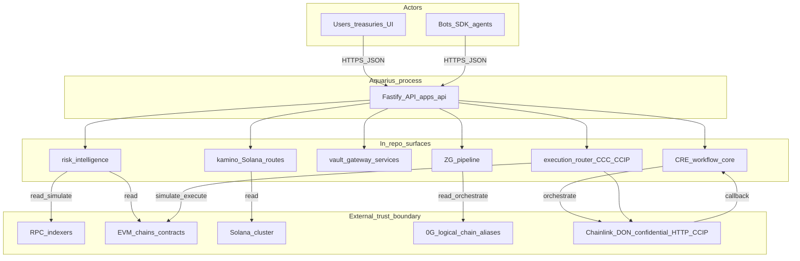
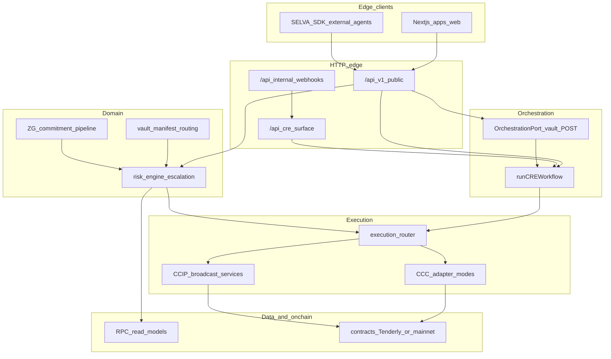
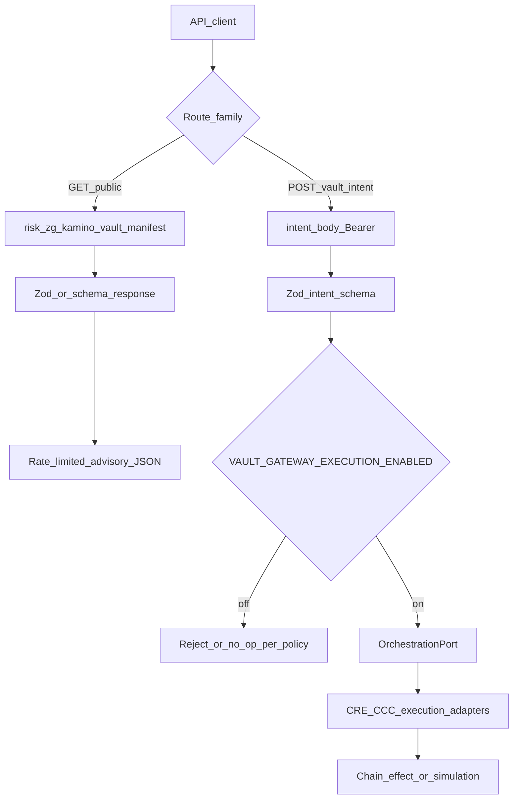
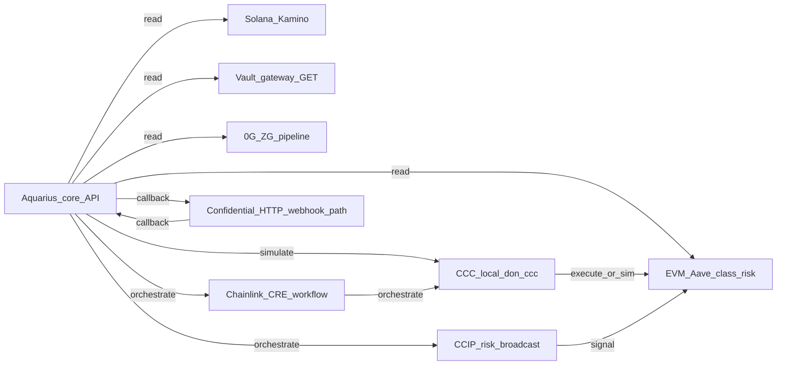
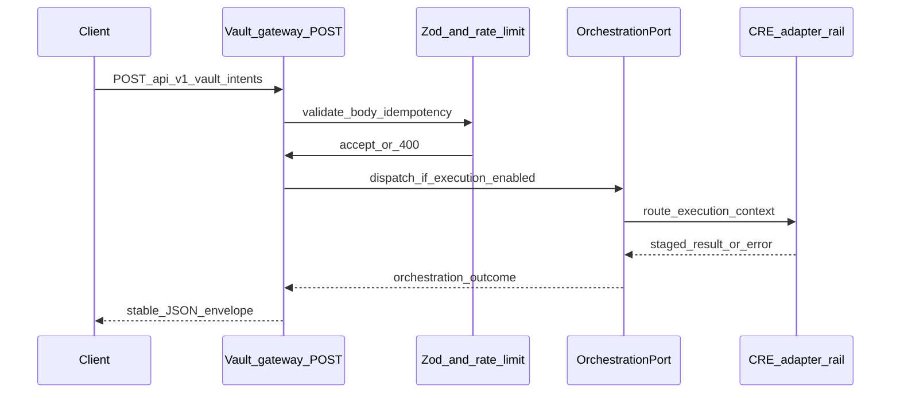
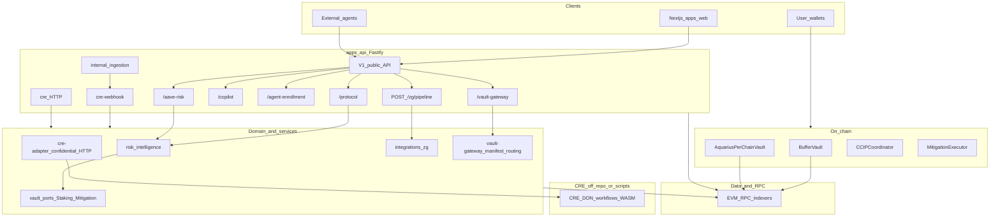
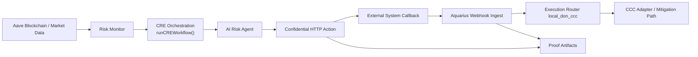
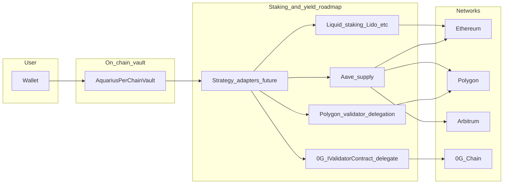

# Aquarius Risk Intelligence Protocol (AQUARIUS)

**Aquarius is a multi-chain risk intelligence and mitigation infrastructure for decentralized finance.**

**It provides real-time analysis of user positions, protocol conditions, and market data, enabling detection of risk states and coordination of mitigation workflows.**

**The system exposes unified APIs for integration and is designed to interoperate with on-chain and off-chain infrastructure, including oracle networks and automated execution layers.**

Built with love ❤️ for users, developers, and automated systems.  
In honor of **[Miki Endo](https://en.wikipedia.org/wiki/Miki_Endo)**.

<p align="center">
  <a href="https://youtu.be/Z0YKaZFClW4">
    <strong>▶ INTRO VIDEO ABOUT AQUARIUS </strong>
    <br /><br />
    
  </a>
</p>

<p align="center">
  <a href="https://youtu.be/b-kWwo4hqwk">
    
  </a>
  &nbsp;&nbsp;
  <a href="https://aquarius-web.vercel.app/">
    
  </a>
  &nbsp;&nbsp;
  <a href="https://aquarius-web.vercel.app/docs/introduction">
    
  </a>
</p>

**At a glance**

- **Unified risk surface** — Health metrics, scoring, and protocol-specific risk routes exposed through a consistent API interface.
- **Workflow orchestration** — A coordination layer that drives risk evaluation, escalation, and mitigation workflows.
- **Multi-chain support** — Chain-agnostic by design, with integrations across Ethereum, Arbitrum, Polygon, 0G, and Solana, including protocol-level support for Aave (EVM markets) and Kamino (Solana), with extensible adapters for additional ecosystems.
- **Vault gateway** — Structured routing for advisory insights and execution intents, with validation, rate limiting, and controlled execution modes.
- **Controlled execution** — Supports both advisory outputs and automated mitigation flows under defined conditions.  


## Table of Contents

- [Aquarius Risk Intelligence Protocol (AQUARIUS)](#aquarius-risk-intelligence-protocol-aquarius)
  - [Table of Contents](#table-of-contents)
  - [Hackathon Submissions](#hackathon-submissions)
  - [Problem \& approach](#problem--approach)
    - [Overview](#overview)
    - [What Problem Aquarius Solves](#what-problem-aquarius-solves)
      - [Fragmented risk and slow mitigation](#fragmented-risk-and-slow-mitigation)
      - [Same intelligence gap on every rail](#same-intelligence-gap-on-every-rail)
    - [Aquarius](#aquarius)
    - [Non-custodial promise and server-side boundary](#non-custodial-promise-and-server-side-boundary)
    - [How It Works](#how-it-works)
  - [Architecture](#architecture)
    - [System context](#system-context)
    - [Layered architecture](#layered-architecture)
    - [Request paths: advisory reads vs execution intents](#request-paths-advisory-reads-vs-execution-intents)
    - [Integration topology](#integration-topology)
    - [Sequence: vault POST intent](#sequence-vault-post-intent)
    - [Full stack API and domain (current)](#full-stack-api-and-domain-current)
    - [System Actors](#system-actors)
  - [Integrations](#integrations)
    - [Chainlink](#chainlink)
    - [EVM and lending intelligence](#evm-and-lending-intelligence)
    - [Vault gateway and execution rail](#vault-gateway-and-execution-rail)
    - [Solana and Kamino](#solana-and-kamino)
    - [Zero Gravity (0G) and ZG pipeline](#zero-gravity-0g-and-zg-pipeline)
    - [PoS, delegation, and chain security commitment](#pos-delegation-and-chain-security-commitment)
    - [Orchestration workflow flows](#orchestration-workflow-flows)
    - [Chainlink usage (direct code links)](#chainlink-usage-direct-code-links)
  - [Vault strategy and sleeves](#vault-strategy-and-sleeves)
    - [Vault strategy](#vault-strategy)
    - [Vault-gateway HTTP sketch](#vault-gateway-http-sketch)
    - [PoS and chain security](#pos-and-chain-security)
    - [Vault, staking, and yield (roadmap)](#vault-staking-and-yield-roadmap)
  - [Security \& trust](#security--trust)
    - [API trust for integrators](#api-trust-for-integrators)
    - [Post-hackathon API hardening (implemented)](#post-hackathon-api-hardening-implemented)
    - [Security and API surface](#security-and-api-surface)
  - [Contracts \& repositories](#contracts--repositories)
    - [Monorepo map](#monorepo-map)
    - [Core Contracts](#core-contracts)
    - [API and Orchestration Layer](#api-and-orchestration-layer)
    - [Intelligence Layer](#intelligence-layer)
    - [Execution Layer](#execution-layer)
    - [SDK, SELVA, and bot APIs](#sdk-selva-and-bot-apis)
  - [Operational \& developer](#operational--developer)
    - [Environment](#environment)
    - [Local development](#local-development)
    - [Hosted deploy](#hosted-deploy)
    - [Judge quick run (smoke)](#judge-quick-run-smoke)
    - [Commands](#commands)
    - [Testing](#testing)
    - [local\_don\_ccc End-to-End Semantics](#local_don_ccc-end-to-end-semantics)
  - [Validation \& evidence](#validation--evidence)
    - [Proof at a glance](#proof-at-a-glance)
    - [Validation Report (End-to-End Proof)](#validation-report-end-to-end-proof)
    - [Confidential HTTP Local Simulation Proof](#confidential-http-local-simulation-proof)
    - [CRE Requirement Compliance Checklist (Submission Proof Pack)](#cre-requirement-compliance-checklist-submission-proof-pack)
  - [Production considerations](#production-considerations)
    - [Redis orchestration jobs and horizontal scaling](#redis-orchestration-jobs-and-horizontal-scaling)
    - [State persistence and scaling](#state-persistence-and-scaling)
    - [Operations and observability](#operations-and-observability)
    - [Real CRE DON and production caveats](#real-cre-don-and-production-caveats)
    - [User-facing and compliance posture](#user-facing-and-compliance-posture)
  - [Known issues and limitations](#known-issues-and-limitations)
  - [Roadmap \& honesty](#roadmap--honesty)
    - [Future work aligned with integrations](#future-work-aligned-with-integrations)
    - [Honesty (shipping vs roadmap)](#honesty-shipping-vs-roadmap)
  - [Closing](#closing)
    - [Challenges We Ran Into](#challenges-we-ran-into)
    - [Frontend](#frontend)
    - [Builder's Note](#builders-note)
    - [Gratitude \& Acknowledgments](#gratitude--acknowledgments)
    - [Dedication](#dedication)
    - [Fun Fact 😀](#fun-fact-)
      - [Meaning of Names We Chose for This Project and Why](#meaning-of-names-we-chose-for-this-project-and-why)

## Hackathon Submissions

Aquarius has been refined across multiple hackathons. Each event has its own dedicated, judge-focused submission overview — the main README below remains the canonical technical document.

| Hackathon | Submission Page | Focus |
|---|---|---|
| Chainlink Convergence [online submisson](https://chain.link/hack-26/projects/aquarius)| [View Submission Overview](docs/hackathons/chainlink-convergence.md) | CRE, CCIP, orchestration, controlled execution |
| 0G APAC | [View Submission Overview](docs/hackathons/0g-apac.md) | 0G data infrastructure, AI risk pipeline, decentralized intelligence |
| Colosseum Frontier | [View Submission Overview](docs/hackathons/colosseum-frontier.md) | Solana, Kamino, wallet-native risk intelligence |
| Arbitrum Open House London | [View Submission Overview](docs/hackathons/arbitrum-open-house.md) | Arbitrum Aave risk agent, CRE orchestration, on-chain policy guard |

## Problem & approach

### Overview

Operators still stitch together dashboards, explorers, and ad-hoc alerts. **Fragmented visibility** and **slow hand-offs** between detection and action mean risk often becomes urgent only after prices move. Aquarius treats that as a systems problem: ship **deterministic intelligence** (signals, scoring, regime, escalation stage), **staged escalation** (observe → protect → escalate), and **orchestration** that dispatches through **protocol adapters**—so intent is explicit, traceable, and comparable run-over-run.

The same **HTTP API** intentionally brings **EVM**, **Solana/Kamino**, **0G/OG** (pipeline + vault-gateway routing), and **Chainlink-class** surfaces (CRE, CCC, CCIP, confidential HTTP) into **one orchestration story**. In this README they read as **co-equal pillars**: each has a bounded integration path in-repo; none is described as the sole center of the product—depth is in [Integrations](#integrations).

**Domain boundaries:** [ADR 0001 — Domains and boundaries](docs/adr/0001-domains-and-boundaries.md) (canonical `AquariusDomainId`, CRE vs intelligence, shared kernel). See also [docs/architecture.md](docs/architecture.md).

### What Problem Aquarius Solves

#### Fragmented risk and slow mitigation

Users and treasuries monitor health, collateral, and protocol news across **disjoint tools**. That fragmentation increases latency from **signal** to **action**—exactly when markets compress that window. Aquarius targets the gap between “we saw it” and “we executed a policy,” not a single chain’s UX.

#### Same intelligence gap on every rail

**EVM** markets, **Solana** programs, **0G**-aligned pipeline hooks, and **Chainlink** workflows all provide different primitives—but **protocol-specific posture** and **measurable outcomes** do not fall out of generic messaging or execution alone. Aquarius adds the missing layer: deterministic scoring and escalation, then orchestration through adapters so each venue can meet the same bar: auditable posture, clear stages, and mitigation paths where policy and deployment flags allow (see [Integrations](#integrations)).

### Aquarius

Aquarius is a protocol-aware control plane built from:

- **Deterministic intelligence** — Risk ingestion, scoring, regime, and escalation state (not a black-box “feel” for risk).
- **Staged escalation** — A state machine that turns raw pressure into **stages** before execution is even considered.
- **Orchestration** — `runCREWorkflow` and related adapters as the shared spine; CLI, API, and simulations call the same core.
- **Protocol adapters (co-equal surfaces)** — **EVM** lending intelligence and execution paths (Aave-class depth today); **Solana/Kamino** bounded routes; **0G/OG** ZG pipeline and vault-gateway advisory + typed intents; **Chainlink** stack (CRE, CCC, `local_don_ccc`, CCIP-style propagation, confidential HTTP boundary).
- **Human-facing and bot-facing outputs** — Risk copilot (advisory), SELVA SDK, and public HTTP routes with explicit read vs execution posture (`[docs/api/public-surface.md](docs/api/public-surface.md)`).

### Non-custodial promise and server-side boundary

**Non-custodial posture:** Aquarius does **not** ask end users to deposit **private keys** with the API to “run their wallet.” Mitigation and automation are designed around **user- or treasury-controlled signing** (or explicitly gated server-side execution modes where the deployment—not this document—defines what is enabled). Nothing in this repository should be read as “we custody your keys.”

**What runs server-side:** Ingestion, scoring, workflow orchestration, advisory responses, webhooks, and—only when configured—adapter calls that execute or simulate under policy. **Secrets** (RPC URLs, outbound API keys, webhook signing material, partner/delegation operator configuration) are **environment-only**, never hardcoded; see project security rules and [ADR 0003 — Phase 0 orchestration and execution](docs/adr/0003-phase0-orchestration-and-execution.md). **Delegation / operator paths** (for example curated testnet delegation via Phase 7-style adapters) load credentials from the **deployment environment** for the process that runs that code—not from arbitrary client payloads.

**Honesty:** Advisory GET routes remain **guidance**; execution POSTs and on-chain effects are **feature-flagged and deployment-specific**. For a precise split, use `[docs/api/public-surface.md](docs/api/public-surface.md)` and [API trust for integrators](#api-trust-for-integrators).

### How It Works

1. Users (or bots via API/SDK) connect and select **chain and protocol context** (for example EVM lending market, Kamino bounded route, or pipeline/vault mode as exposed by the API).
2. Aquarius ingests position or protocol state (collateral, debt, health factor, liquidation distance, or the adapter-specific snapshot available for that surface).
3. Deterministic risk intelligence computes score, regime, and escalation posture.
4. Orchestration (CRE workflow core) evaluates agent decisioning against policy.
5. If thresholds are met, Aquarius dispatches mitigation through paths enabled for that deployment:
  - non-custodial path (repay / add collateral) where signing remains with the user or designated executor
  - vault-backed path (buffer vault reinforcement) where contracts and flags allow
6. Cross-chain or cross-venue risk posture can be propagated (for example CCIP-style signaling on configured EVM deployments).
7. The real-time Risk Copilot explains current context in **informational** mode (not a substitute for execution guarantees).

## Architecture

These diagrams are the **minimum judge-facing set**: context, layers, read vs intent paths, integration topology, and a short vault-intent sequence. The **full stack** figure below still maps concrete routes to domain packages.

### System context




**What moves:** Wallets and bots call **only** the Aquarius HTTP API; the API pulls chain state via RPC, runs domain logic, and reaches **Chainlink-oriented** dispatch/callback paths and **EVM** execution adapters when a workflow or execution mode says so. **Trust:** you trust your RPC providers and chain confirmations for factual state; Aquarius **computes** posture and **orchestrates**—it is not a custodial signer for end-user keys. **Advisory:** most `/api/v1` GET surfaces are **guidance** (scores, manifests, routing hints), not guaranteed on-chain outcomes. **Execution:** mitigation and CCC paths are **deployment-gated** and may be simulation-first (`local_don_ccc`, Tenderly) in validation setups.

### Layered architecture




**What moves:** Requests enter at **L2** (public vs internal CRE webhook ingress), fan into **L3** orchestration (`runCREWorkflow`, optional `OrchestrationPort` for vault intents), then **L4** deterministic domain services, then **L5** execution adapters. **Trust:** domain layers are **deterministic-first**; LLM/copilot sits adjacent to risk context as **advisory**. **Advisory:** GET-heavy routes and copilot outputs stay in the “read / explain” band unless explicitly classified as execution in `[docs/api/public-surface.md](docs/api/public-surface.md)`. **Data:** RPC and indexers are **read models**; execution writes go through adapters and user/policy gates.

### Request paths: advisory reads vs execution intents




**What moves:** **Reads** flow through validators and return **advisory** JSON (health, pipeline output, manifest/routing). **Intents** carry a typed POST body, auth, idempotency, and hit **OrchestrationPort** only when execution is **enabled** for that deployment. **Trust:** clients must treat GET output as **non-binding** routing intelligence unless a separate signed tx flow exists off this API. **Advisory** is the default stance on public GETs; **execution** is explicit, gated, and never implied by “risk score alone.”

### Integration topology




**What moves:** One **core** node fans out to **five integration families**—**EVM**, **Solana/Kamino**, **vault-gateway**, **0G/ZG**, and **Chainlink** (CRE + CCC + confidential callback + CCIP). Edge labels summarize interaction *kind*: **read** (pull posture), **orchestrate** (workflow spine), **callback** (DON/confidential round-trip), **simulate** (CCC path without claiming production DON). **Trust:** **read** edges assume RPC truth; **orchestrate/callback** assume workflow config matches deployment; **simulate** is explicitly non-production-DON. **Advisory:** vault-gateway **GET** and most risk GETs remain guidance; **orchestrate/simulate** may change state only inside allowed modes.

### Sequence: vault POST intent




**What moves:** A **client** sends a **typed intent** to vault-gateway POST; validation happens **before** any orchestration work. **OrchestrationPort** is the **single door** for execution-shaped work (see **ADR 0003**). **Trust:** Bearer tokens and env flags are **server-side**; this diagram does **not** show secrets—only control flow. **Advisory:** if execution is disabled, the handler should not silently “execute”; see implementation in `[apps/api/src/routes/v1/vault-gateway/](apps/api/src/routes/v1/vault-gateway/)`. **Callback** vs this path: CRE confidential flows use **internal webhook** ingress instead of user POST—compare [Orchestration workflow flows](#orchestration-workflow-flows).

### Full stack API and domain (current)

Public HTTP routes live under `[apps/api/src/app.ts](apps/api/src/app.ts)`: `/api/v1` (rate-limited public API), `/api/internal` (webhooks), `/api/cre` (CRE workflow surface). The diagram below highlights **ZG** (0G-aligned pipeline) and **vault-gateway** (advisory manifest and routing) alongside existing protocol and risk surfaces.




**What moves:** The **apps/api** subgraph is the **only** application host in this figure: `/protocol`, `/aave-risk`, `/copilot`, `/zg/pipeline`, and `/vault-gateway` all terminate in **domain** services (`risk_intelligence`, `integrations_zg`, `vault-gateway_manifest_routing`). **CRE** webhooks and `/api/cre` hydrate the same domain through **cre-adapter**. **Trust:** on-chain boxes are **contracts** the repo deploys or talks to; **workflows** are off-repo DON/WASM. **Advisory:** vault-gateway and ZG GET/POST semantics follow **ADR 0003** and vault manifest language—GET remains routing guidance. **Data:** RPC is the shared **read** plane; execution paths must respect the same public-surface contract as in the request-path diagram above.

### System Actors

- **Users / Treasuries:** monitor and protect positions via UI and policy flows.
- **Bots / Integrators:** consume Aquarius API and SELVA SDK methods.
- **Operators:** validate posture, execution, and system safety via telemetry/validation layers.

## Integrations

This chapter is the **long-form technical map** of every rail. Each subsection below uses the **same template** so you can compare **role**, **read/write posture**, **entry points**, **configuration (names only)**, **limits**, and **related docs** side by side.

### Chainlink

**Role in Aquarius**  
Chainlink-class integrations provide **workflow orchestration** (CRE), **CCC execution modes**, **confidential HTTP** dispatch and **internal webhook callback** ingress, and **CCIP-style** cross-chain risk broadcast—wired into the same `[runCREWorkflow](packages/domain/cre/run-cre-workflow.ts)` spine as the rest of the product. They are **prominent** because mitigation and escalation paths are modeled around CRE + CCC, but they sit **beside** EVM, Solana, 0G, and vault surfaces—not as the only story.

**What runs here**


| Aspect                    | Detail                                                                                                                                                                                                                                                                                 |
| ------------------------- | -------------------------------------------------------------------------------------------------------------------------------------------------------------------------------------------------------------------------------------------------------------------------------------- |
| **Read vs write**         | **Read / trigger:** `/api/cre` runs orchestration; CLI/scripts call the same workflow. **Write path:** execution router + CCC adapters may simulate or send txs on EVM when mode allows. **Internal:** `POST /api/internal/ingest/cre-webhook` ingests callbacks (Zod-validated body). |
| **Advisory vs execution** | CRE evaluation produces **intent**; CCC path determines **simulated_ccc** / **local_don_ccc** / **real_ccc**. Copilot LLM inside CRE runs is **advisory** when `GROQ_API_KEY` is set—never a substitute for on-chain guarantees.                                                       |
| **Public vs internal**    | **Public:** `/api/cre/`*. **Internal:** `/api/internal/ingest/cre-webhook` (callbacks; rate-limited).                                                                                                                                                                                  |


**Entry points**


| Component                 | Primary paths                                                                                                                                                                                                                                                                                                                                              |
| ------------------------- | ---------------------------------------------------------------------------------------------------------------------------------------------------------------------------------------------------------------------------------------------------------------------------------------------------------------------------------------------------------- |
| **CRE core**              | `[packages/domain/cre/run-cre-workflow.ts](packages/domain/cre/run-cre-workflow.ts)`, `[apps/api/src/routes/cre/index.ts](apps/api/src/routes/cre/index.ts)`, `[scripts/run-cre-simulation.ts](scripts/run-cre-simulation.ts)`                                                                                                                             |
| **CCC + execution modes** | `[apps/api/src/infrastructure/ccc/executionFactory.ts](apps/api/src/infrastructure/ccc/executionFactory.ts)`, `[apps/api/src/infrastructure/ccc/CccExecutionAdapter.ts](apps/api/src/infrastructure/ccc/CccExecutionAdapter.ts)`, `[apps/api/src/infrastructure/execution/execution-router.ts](apps/api/src/infrastructure/execution/execution-router.ts)` |
| **Confidential HTTP**     | Dispatch: `[apps/api/src/protocols/aave/action-layer/cre-adapter.ts](apps/api/src/protocols/aave/action-layer/cre-adapter.ts)`; callback: `[apps/api/src/routes/internal/ingest/cre-webhook.ts](apps/api/src/routes/internal/ingest/cre-webhook.ts)`                                                                                                       |
| **CCIP**                  | `[apps/api/src/protocols/aave/ccip/sender.ts](apps/api/src/protocols/aave/ccip/sender.ts)`, `[apps/api/src/protocols/aave/ccip/receiver.ts](apps/api/src/protocols/aave/ccip/receiver.ts)`, `[risk-broadcast.service.ts](apps/api/src/protocols/aave/ccip/risk-broadcast.service.ts)`                                                                      |


**Configuration (environment variable names only)**


| Variable                               | Purpose                                                                   |
| -------------------------------------- | ------------------------------------------------------------------------- |
| `EXECUTION_MODE`                       | CCC path selection (`simulated_ccc`, `local_don_ccc`, etc.; see factory). |
| `CRE_CONFIDENTIAL_HTTP_URL`            | Outbound confidential dispatch endpoint.                                  |
| `CRE_CONFIDENTIAL_HTTP_TOKEN`          | Bearer for confidential dispatch.                                         |
| `CRE_CONFIDENTIAL_WORKFLOW_ID`         | Workflow id for confidential track.                                       |
| `CRE_CONFIDENTIAL_CALLBACK_URL`        | Callback base (often internal webhook URL).                               |
| `CRE_CONFIDENTIAL_HTTP_TIMEOUT_MS`     | Dispatch timeout.                                                         |
| `LOCAL_DON_CCC_CALLBACK_MAX_AGE_MS`    | Stale callback rejection.                                                 |
| `LOCAL_DON_CCC_REPLAY_TTL_MS`          | Correlation replay ledger TTL.                                            |
| `LOCAL_DON_CCC_EXECUTION_TIMEOUT_MS`   | Router handoff timeout.                                                   |
| `LOCAL_DON_CCC_DEFAULT_USER`           | Default user context for local DON path.                                  |
| `CCIP_DESTINATION_CHAINS`              | Comma-separated destinations for broadcast config.                        |
| `GROQ_API_KEY`                         | Optional LLM for CRE run (advisory).                                      |
| `TENDERLY_RPC_URL`, `TENDERLY_FORK_ID` | Simulation / fork context when used.                                      |


**Limits & failure modes**  
`RATE_LIMIT_CRE_MAX` caps `/api/cre`; `RATE_LIMIT_INTERNAL_WEBHOOK_MAX` caps internal ingestion (includes CRE webhook). Invalid webhook bodies return **400** with stable JSON (Phase 8). `local_don_ccc` uses in-memory replay state—**not** durable across processes until backed by shared storage (see [Production considerations](#production-considerations)). CCIP sender may be **stub** in demo—verify deployment before claiming mainnet sends.

**Related**  
`[docs/confidential-http-local-simulation.md](docs/confidential-http-local-simulation.md)`, `[workflows/aave-risk/payload.local-simulation.json](workflows/aave-risk/payload.local-simulation.json)`. Cross-cutting flows: [Orchestration workflow flows](#orchestration-workflow-flows).

---

### EVM and lending intelligence

**Role in Aquarius**  
EVM is the **primary lending-intelligence surface** today: deterministic monitors, scorers, escalation, and **vault- and buffer-facing** adapters that tie API posture to deployed contracts (`BufferVault`, `AquariusPerChainVault`, mitigation executors). Solana and ZG complement this; they do not replace EVM depth.

**What runs here**


| Aspect                    | Detail                                                                                                                                                                                     |
| ------------------------- | ------------------------------------------------------------------------------------------------------------------------------------------------------------------------------------------ |
| **Read vs write**         | **Read:** `/api/v1/aave-risk/`*, `/api/v1/protocol/*` style routes (see route tree). **Write / execution:** execution router, CCC, vault protocols—**gated** by execution mode and policy. |
| **Advisory vs execution** | Risk API responses and SDK methods are **advisory** unless explicitly classified as execution in `[docs/api/public-surface.md](docs/api/public-surface.md)`.                               |
| **Public vs internal**    | Mostly **public** `/api/v1`; internal monitors feed domain services.                                                                                                                       |


**Entry points**


| Area          | Path                                                                                                                                                                             |
| ------------- | -------------------------------------------------------------------------------------------------------------------------------------------------------------------------------- |
| **HTTP**      | `[apps/api/src/routes/v1/aave-risk/](apps/api/src/routes/v1/aave-risk/)` (protocol health, user health, stress, projected HF, actionable metrics, …)                             |
| **Domain**    | `[apps/api/src/protocols/aave/risk-intelligence/](apps/api/src/protocols/aave/risk-intelligence/)`, `[apps/api/src/protocols/aave/vaults/](apps/api/src/protocols/aave/vaults/)` |
| **SDK**       | [SDK, SELVA, and bot APIs](#sdk-selva-and-bot-apis) — `[packages/sdk/src/aave-selva/](packages/sdk/src/aave-selva/)`, `[packages/sdk/src/client.ts](packages/sdk/src/client.ts)` |
| **Contracts** | `[contracts/src/](contracts/src/)` — e.g. `BufferVault`, `MitigationExecutor`, `CCIPCoordinator`, `AquariusPerChainVault`                                                        |


**Configuration (environment variable names only)**


| Variable                                         | Purpose                                                                                                      |
| ------------------------------------------------ | ------------------------------------------------------------------------------------------------------------ |
| `RPC_URL`, `RPC_URL_ETHEREUM`, `RPC_URL_POLYGON` | EVM JSON-RPC.                                                                                                |
| `DATA_PROVIDER_MODE`                             | `mock` vs live provider selection.                                                                           |
| `AAVE_VALIDATION_REQUIRE_TENDERLY`               | Enforce Tenderly in validation flows.                                                                        |
| `TENDERLY_RPC_URL`, `TENDERLY_FORK_ID`           | Tenderly fork / simulation.                                                                                  |
| `WSS_URL`                                        | Optional websocket feed where used.                                                                          |
| `BUFFER_`*                                       | Buffer solvency policy (see `[apps/api/src/config/index.ts](apps/api/src/config/index.ts)` header comments). |


**Limits & failure modes**  
Public `/api/v1` rate limit: `RATE_LIMIT_PUBLIC_MAX`. RPC outages surface as read failures or degraded snapshots—Kamino has explicit circuit behavior; EVM paths depend on provider. Copilot uses `RATE_LIMIT_COPILOT_MAX`.

**Related**  
[Vault strategy](#vault-strategy) / [Vault strategy and sleeves](#vault-strategy-and-sleeves); [Chainlink](#chainlink) for execution spine.

---

### Vault gateway and execution rail

**Role in Aquarius**  
Vault-gateway exposes **cacheable advisory** manifest/routing plus **typed POST intents** that may hand work to `**OrchestrationPort`** when execution is enabled—this is the product’s **intent rail** aligned with `[docs/vault-strategy.md](docs/vault-strategy.md)` and **ADR 0003**.

**What runs here**


| Aspect                    | Detail                                                                                                                                                                                                               |
| ------------------------- | -------------------------------------------------------------------------------------------------------------------------------------------------------------------------------------------------------------------- |
| **Read vs write**         | **GET** `/manifest`, `/routing` — read (advisory). **POST** `/intents` — write-shaped; dispatches orchestration when `VAULT_GATEWAY_EXECUTION_ENABLED` is true.                                                      |
| **Advisory vs execution** | GET output is **never** a guarantee of on-chain execution. POST is **execution-shaped** but still server-orchestrated—not user raw signed txs through this handler.                                                  |
| **Public vs internal**    | **Public:** `/api/v1/vault-gateway/`*. **Internal:** optional job callback `[apps/api/src/routes/internal/ingest/vault-job-callback.ts](apps/api/src/routes/internal/ingest/vault-job-callback.ts)` (secret header). |


**Entry points**

- `[apps/api/src/routes/v1/vault-gateway/routes.ts](apps/api/src/routes/v1/vault-gateway/routes.ts)` (GET manifest/routing)
- `[apps/api/src/routes/v1/vault-gateway/post-intents.ts](apps/api/src/routes/v1/vault-gateway/post-intents.ts)` (POST intents)
- `[apps/api/src/services/vault-gateway/](apps/api/src/services/vault-gateway/)`
- `[apps/api/src/application/ports/orchestration.port.ts](apps/api/src/application/ports/orchestration.port.ts)`

**Configuration (environment variable names only)**


| Variable                                                                                                      | Purpose                                       |
| ------------------------------------------------------------------------------------------------------------- | --------------------------------------------- |
| `VAULT_GATEWAY_EXECUTION_ENABLED`                                                                             | Master switch for POST intent execution path. |
| `VAULT_GATEWAY_INTENT_TOKEN` / `VAULT_GATEWAY_INTENT_TOKENS`                                                  | Bearer secret(s) for intents.                 |
| `ORCHESTRATION_EXECUTION_MODE`                                                                                | `mock` vs live orchestration I/O.             |
| `VAULT_GATEWAY_IDEMPOTENCY_TTL_MS`                                                                            | Idempotency key retention.                    |
| `REDIS_URL`, `VAULT_ORCHESTRATION_REDIS_URL`                                                                  | Optional durable job + idempotency store.     |
| `ORCHESTRATION_JOB_TTL_SECONDS`                                                                               | Redis job TTL.                                |
| `RATE_LIMIT_VAULT_GATEWAY_INTENTS_MAX`                                                                        | POST intents rate cap.                        |
| `VAULT_INTENT_CRE_WORKFLOW_ID`                                                                                | Workflow id mapping for remote CRE.           |
| `CRE_VAULT_WORKFLOW_TRIGGER_URL`, `CRE_VAULT_WORKFLOW_TRIGGER_TOKEN`, `CRE_VAULT_WORKFLOW_TRIGGER_TIMEOUT_MS` | Remote CRE trigger.                           |
| `VAULT_CRE_CALLBACK_URL`                                                                                      | Callback URL for remote runs.                 |
| `INTERNAL_VAULT_JOB_CALLBACK_SECRET`                                                                          | Internal callback shared secret.              |
| `VAULT_PROTOCOL_SIMULATED_OWNER`                                                                              | Simulated buffer owner address (dev).         |


**Limits & failure modes**  
Rate limit on POST intents; Zod validation failures return **400** stable shape; execution off returns policy-defined response—not silent success. Redis optional—without it, job/idempotency semantics may be process-local.

**Related**  
[Vault-gateway HTTP sketch](#vault-gateway-http-sketch), [ADR 0003](docs/adr/0003-phase0-orchestration-and-execution.md), [Sequence: vault POST intent](#sequence-vault-post-intent) in Architecture.

---

### Solana and Kamino

**Role in Aquarius**  
Provides a **bounded Solana / Kamino lending** risk context so the API can speak **Solana** co-equally with EVM in the integration story—without claiming full parity of depth with Aave-class EVM paths.

**What runs here**


| Aspect                    | Detail                                                                                                                                                                                                                                   |
| ------------------------- | ---------------------------------------------------------------------------------------------------------------------------------------------------------------------------------------------------------------------------------------- |
| **Read vs write**         | **Read:** GET Kamino risk routes (market + wallet snapshot). **Write-shaped:** repay **simulate** path when `KAMINO_WRITE_ENABLED` allows (still not user key custody—server builds simulateTransaction-style flows per implementation). |
| **Advisory vs execution** | Classify routes per `[docs/api/public-surface.md](docs/api/public-surface.md)`; CRE webhook can trigger Kamino refresh for workflow-bound paths.                                                                                         |
| **Public vs internal**    | **Public:** `/api/v1/kamino-risk/`*.                                                                                                                                                                                                     |


**Entry points**

- `[apps/api/src/routes/v1/kamino-risk/index.ts](apps/api/src/routes/v1/kamino-risk/index.ts)`
- `[apps/api/src/protocols/kamino-solana/](apps/api/src/protocols/kamino-solana/)`
- `[apps/api/src/infrastructure/kamino/](apps/api/src/infrastructure/kamino/)`

**Configuration (environment variable names only)**


| Variable                                                                                         | Purpose                                         |
| ------------------------------------------------------------------------------------------------ | ----------------------------------------------- |
| `SOLANA_RPC_URL`                                                                                 | HTTPS RPC (required for live reads).            |
| `SOLANA_CLUSTER`                                                                                 | `mainnet-beta` / `devnet` / `testnet`.          |
| `KAMINO_MARKET_PUBKEY`                                                                           | Default market pubkey.                          |
| `SOLANA_RPC_TIMEOUT_MS`                                                                          | Per-call timeout.                               |
| `KAMINO_READ_ENABLED`                                                                            | Force enable/disable reads.                     |
| `KAMINO_CIRCUIT_FAILURE_THRESHOLD`, `KAMINO_CIRCUIT_OPEN_MS`                                     | Circuit breaker when RPC fails.                 |
| `KAMINO_MARKET_LOAD_CACHE_TTL_MS`                                                                | In-process cache TTL.                           |
| `KAMINO_CRE_STALE_SNAPSHOT`, `KAMINO_STALE_SNAPSHOT_MAX_AGE_MS`, `KAMINO_CRE_BACKGROUND_REFRESH` | Stale snapshot policy for CRE-integrated paths. |
| `KAMINO_WRITE_ENABLED`                                                                           | Repay simulate path.                            |
| `KAMINO_REPAY_SIMULATE_TIMEOUT_MS`                                                               | Simulate timeout.                               |
| `KAMINO_MAX_REPAY_UI`, `KAMINO_ALLOWED_REPAY_MINTS`                                              | Allowlist / caps.                               |
| `RATE_LIMIT_KAMINO_WRITE_MAX`                                                                    | Cap on write-shaped route.                      |


**Limits & failure modes**  
Circuit opens after repeated RPC failures (`KAMINO_READ_DISABLED` style errors). Rate limits on write-shaped endpoints. No Solana path in this repo should be read as “full DeFi coverage of all Kamino products.”

**Related**  
[Monorepo map](#monorepo-map) (Kamino paths); `[docs/api/public-surface.md](docs/api/public-surface.md)`; internal webhook Kamino branches in `[cre-webhook.ts](apps/api/src/routes/internal/ingest/cre-webhook.ts)`.

---

### Zero Gravity (0G) and ZG pipeline

**Role in Aquarius**  
**ZG** is the server-side **0G-aligned pipeline**: commitment over canonical JSON, optional inference hook, optional storage bridge—plus **vault-gateway** query params that expose logical `**og_chain`** / `0g` / `galileo` routing. It complements CRE; it does not replace Chainlink orchestration for mitigation.

**What runs here**


| Aspect                    | Detail                                                                                                                                                                 |
| ------------------------- | ---------------------------------------------------------------------------------------------------------------------------------------------------------------------- |
| **Read vs write**         | **POST** `/api/v1/zg/pipeline` runs pipeline modes. Optional **POST** to `ZG_STORAGE_BRIDGE_URL`. Vault-gateway **GET** exposes advisory routing including 0G aliases. |
| **Advisory vs execution** | Pipeline output is **advisory / attestable** (commitment hash); on-chain vault strategy adapters for 0G remain **roadmap** unless separately shipped.                  |
| **Public vs internal**    | **Public:** ZG route under `/api/v1`.                                                                                                                                  |


**Entry points**

- `[apps/api/src/routes/v1/zg/](apps/api/src/routes/v1/zg/)`
- `[apps/api/src/integrations/zg/](apps/api/src/integrations/zg/)` (`config.ts`, `commitment.ts`, `pipeline.ts`)

**Configuration (environment variable names only)**


| Variable                  | Purpose                                |
| ------------------------- | -------------------------------------- |
| `ZG_PIPELINE_MODE`        | `off` / `mock` / `live`.               |
| `ZG_INFERENCE_BASE_URL`   | OpenAI-compatible endpoint (optional). |
| `ZG_INFERENCE_API_KEY`    | Inference auth (secret—env only).      |
| `ZG_INFERENCE_MODEL`      | Model id.                              |
| `ZG_INFERENCE_TIMEOUT_MS` | Inference timeout bound.               |
| `ZG_STORAGE_BRIDGE_URL`   | Optional bridge worker URL.            |


**Limits & failure modes**  
`off` mode returns **503**-class disabled behavior for the pipeline route (per config). Inference and bridge are **optional**; failures should not be read as “chain halted”—they are **service dependencies**.

**Related**  
[Vault gateway](#vault-gateway-and-execution-rail) for `og_chain` query routing; [web docs](https://aquarius-web.vercel.app/docs/zero-gravity).

**0G Chain (EVM mainnet — HackQuest / 0G APAC Track 5 proof)**  
On-chain anchor for deterministic commitments: Solidity `RiskCommitmentAnchor` (`contracts/src/og/RiskCommitmentAnchor.sol`) + viem deploy script (`apps/api/scripts/0g-chain-anchor.ts`). Step-by-step submission checklist: [`docs/integrations/0g-chain-hackquest-proof.md`](docs/integrations/0g-chain-hackquest-proof.md).

---

### PoS, delegation, and chain security commitment

**Role in Aquarius**  
**Shipped:** a **curated delegation** testnet path (`pos.delegate`) for **Phase 7**-style partner delegation through a router adapter—**not** broad retail validator productization. **Roadmap:** general validator participation and LST narratives live in [Vault strategy §1.1](docs/vault-strategy.md)—do not overclaim here.

**What runs here**


| Aspect                    | Detail                                                                                                               |
| ------------------------- | -------------------------------------------------------------------------------------------------------------------- |
| **Read vs write**         | **Mock** mode for CI; **testnet** mode may submit router calls when env and chain allowlists line up.                |
| **Advisory vs execution** | Delegation transactions are **execution**; there is no “advisory delegation” that moves stake without chain effects. |
| **Public vs internal**    | Exposed through protocol/orchestration surfaces—see `[apps/api/src/protocols/pos/](apps/api/src/protocols/pos/)`.    |


**Entry points**

- `[apps/api/src/protocols/pos/partner-delegation.adapter.ts](apps/api/src/protocols/pos/partner-delegation.adapter.ts)`
- `[apps/api/src/protocols/pos/](apps/api/src/protocols/pos/)`
- Workflow id `pos-partner-delegate`
- `[runbooks/phase7-delegation-router.md](runbooks/phase7-delegation-router.md)`

**Configuration (environment variable names only)**


| Variable                              | Purpose                                                                                       |
| ------------------------------------- | --------------------------------------------------------------------------------------------- |
| `POS_DELEGATION_EXECUTION_MODE`       | `mock` vs `testnet`.                                                                          |
| `POS_DELEGATION_ENABLED_CHAINS`       | Comma allowlist.                                                                              |
| `POS_DELEGATION_RPC_URL`              | RPC endpoint.                                                                                 |
| `POS_DELEGATION_CHAIN_ID`             | Chain id.                                                                                     |
| `POS_DELEGATION_ROUTER_ADDRESS`       | Router contract.                                                                              |
| `POS_DELEGATION_OPERATOR_PRIVATE_KEY` | Operator key material (**env only**; never commit). Alias: `DELEGATION_OPERATOR_PRIVATE_KEY`. |


**Limits & failure modes**  
Wrong chain / missing router → adapter errors; mock mode never sends mainnet txs. **Roadmap** validator ops remain out of scope for “shipped” claims—see [Honesty (shipping vs roadmap)](#honesty-shipping-vs-roadmap).

**Related**  
[PoS and chain security](#pos-and-chain-security), `[runbooks/phase7b-validator-pilot.md](runbooks/phase7b-validator-pilot.md)` (roadmap / ops), `[docs/vault-strategy.md](docs/vault-strategy.md)`.

---

### Orchestration workflow flows

Cross-cutting **CRE workflow** behavior (monitor → escalate → confidential dispatch → callback → `local_don_ccc` → CCC) is centralized in `[runCREWorkflow](packages/domain/cre/run-cre-workflow.ts)`. The following is a **compact** map; use the links under **Related** for deeper steps and confidential-HTTP context.

**Role in Aquarius**  
Ensures CLI, `/api/cre`, and simulations share **one** orchestration contract.

**What runs here**  
Mix of **read** (risk outputs), **orchestrate** (workflow evaluation), **callback** (internal webhook), **simulate** (CCC / Tenderly).

**Entry points** | Same as [Chainlink](#chainlink) CRE + `[apps/api/src/routes/internal/ingest/cre-webhook.ts](apps/api/src/routes/internal/ingest/cre-webhook.ts)`

**End-to-end overview (mermaid)**




**Deeper flows (pointers)** — Risk monitoring: `[monitor.ts](apps/api/src/protocols/aave/risk-intelligence/monitor.ts)`, `[scorer.ts](apps/api/src/protocols/aave/risk-intelligence/scorer.ts)`. Escalation: `[escalation-state-machine.ts](apps/api/src/protocols/aave/risk-intelligence/escalation-state-machine.ts)`. Mitigation routing: `[execution-router.ts](apps/api/src/infrastructure/execution/execution-router.ts)`. Copilot: `[routes/v1/copilot/chat.ts](apps/api/src/routes/v1/copilot/chat.ts)`. For confidential dispatch → callback → `local_don_ccc` mechanics and the **non-custodial** framing, see [Security & trust](#security--trust), `[docs/confidential-http-local-simulation.md](docs/confidential-http-local-simulation.md)` (includes sequence diagrams), and **[Validation & evidence](#validation--evidence)** — [Confidential HTTP Local Simulation Proof](#confidential-http-local-simulation-proof) and [CRE Requirement Compliance Checklist](#cre-requirement-compliance-checklist-submission-proof-pack).

**Configuration**  
Uses Chainlink + execution env vars above (`EXECUTION_MODE`, `CRE_CONFIDENTIAL_*`, `LOCAL_DON_CCC_*`, `GROQ_API_KEY`).

**Limits & failure modes**  
Same as Chainlink section; correlation replay ledger is process-local unless persisted.

---

### Chainlink usage (direct code links)

Permanent GitHub pointers for judges who want raw file URLs:

- CRE workflow orchestration core:  
[https://github.com/FrankezeCode/Aquarius/blob/main/packages/domain/cre/run-cre-workflow.ts](https://github.com/FrankezeCode/Aquarius/blob/main/packages/domain/cre/run-cre-workflow.ts)
- CRE API route (`/api/cre/run`):  
[https://github.com/FrankezeCode/Aquarius/blob/main/apps/api/src/routes/cre/index.ts](https://github.com/FrankezeCode/Aquarius/blob/main/apps/api/src/routes/cre/index.ts)
- CRE webhook ingest:  
[https://github.com/FrankezeCode/Aquarius/blob/main/apps/api/src/routes/internal/ingest/cre-webhook.ts](https://github.com/FrankezeCode/Aquarius/blob/main/apps/api/src/routes/internal/ingest/cre-webhook.ts)
- CRE demo route:  
[https://github.com/FrankezeCode/Aquarius/blob/main/apps/api/src/routes/cre/demo.ts](https://github.com/FrankezeCode/Aquarius/blob/main/apps/api/src/routes/cre/demo.ts)
- CRE CLI simulation:  
[https://github.com/FrankezeCode/Aquarius/blob/main/scripts/run-cre-simulation.ts](https://github.com/FrankezeCode/Aquarius/blob/main/scripts/run-cre-simulation.ts)
- Full architecture validation:  
[https://github.com/FrankezeCode/Aquarius/blob/main/scripts/run-full-validation.ts](https://github.com/FrankezeCode/Aquarius/blob/main/scripts/run-full-validation.ts)
- Local confidential simulation validation:  
[https://github.com/FrankezeCode/Aquarius/blob/main/scripts/run-confidential-http-validation.ts](https://github.com/FrankezeCode/Aquarius/blob/main/scripts/run-confidential-http-validation.ts)
- Local confidential simulation runbook:  
[https://github.com/FrankezeCode/Aquarius/blob/main/docs/confidential-http-local-simulation.md](https://github.com/FrankezeCode/Aquarius/blob/main/docs/confidential-http-local-simulation.md)
- Local confidential payload fixture:  
[https://github.com/FrankezeCode/Aquarius/blob/main/workflows/aave-risk/payload.local-simulation.json](https://github.com/FrankezeCode/Aquarius/blob/main/workflows/aave-risk/payload.local-simulation.json)

CCC and confidential execution:

- CCC adapter:  
[https://github.com/FrankezeCode/Aquarius/blob/main/apps/api/src/infrastructure/ccc/CccExecutionAdapter.ts](https://github.com/FrankezeCode/Aquarius/blob/main/apps/api/src/infrastructure/ccc/CccExecutionAdapter.ts)
- CCC mode factory:  
[https://github.com/FrankezeCode/Aquarius/blob/main/apps/api/src/infrastructure/ccc/executionFactory.ts](https://github.com/FrankezeCode/Aquarius/blob/main/apps/api/src/infrastructure/ccc/executionFactory.ts)
- local DON callback execution ingress:  
[https://github.com/FrankezeCode/Aquarius/blob/main/apps/api/src/routes/internal/ingest/cre-webhook.ts](https://github.com/FrankezeCode/Aquarius/blob/main/apps/api/src/routes/internal/ingest/cre-webhook.ts)
- Confidential boundary adapter:  
[https://github.com/FrankezeCode/Aquarius/blob/main/apps/api/src/protocols/aave/infrastructure/execution/confidential-cre.adapter.ts](https://github.com/FrankezeCode/Aquarius/blob/main/apps/api/src/protocols/aave/infrastructure/execution/confidential-cre.adapter.ts)

CCIP propagation:

- Sender:  
[https://github.com/FrankezeCode/Aquarius/blob/main/apps/api/src/protocols/aave/ccip/sender.ts](https://github.com/FrankezeCode/Aquarius/blob/main/apps/api/src/protocols/aave/ccip/sender.ts)
- Receiver:  
[https://github.com/FrankezeCode/Aquarius/blob/main/apps/api/src/protocols/aave/ccip/receiver.ts](https://github.com/FrankezeCode/Aquarius/blob/main/apps/api/src/protocols/aave/ccip/receiver.ts)

## Vault strategy and sleeves

This chapter is where judges reconcile **product intent** (strategy, sleeves, network participation) with **what is actually live** (advisory surfaces, gated execution, staged delegation). The canonical long-form spec remains `[docs/vault-strategy.md](docs/vault-strategy.md)`; **ADR 0003** records orchestration and execution boundaries: `[docs/adr/0003-phase0-orchestration-and-execution.md](docs/adr/0003-phase0-orchestration-and-execution.md)`. Public route inventory: `[docs/api/public-surface.md](docs/api/public-surface.md)`.

### Vault strategy

**Sleeves (buffer vs yield).** Advisory routing distinguishes two sleeves — `**buffer_insurance`** and `**yield_seeker`** — implemented as **policy**, not as automatic on-chain allocation from the gateway. The **buffer** sleeve is the operational backstop narrative: liquidity positioned so agents and mitigation paths can respond when policy elevates risk (domain actions such as `**INCREASE_BUFFER`** in the Aave vaults flow). The **yield** sleeve represents seek-yield strategy *kinds* (lending, LST, incentives, etc.) as **recommendations** with maturity labels — not a promise of APY or venue execution from a `GET` response.

**Advisory routing vs execution.** `**GET`** manifest and routing are **read-only**, **pure** (`resolveVaultRouting` has no I/O), and **cache-friendly**. They answer “what would we recommend?” with disclaimers. `**POST /intents`** is the **execution rail** when enabled: validated intents map to `**OrchestrationPort`** workflows and protocol adapters (CRE, simulated buffer top-up, vault protect with **declared** risk level, curated PoS delegation). Without `**VAULT_GATEWAY_EXECUTION_ENABLED`**, the API does not accept authenticated execution intents — clients stay in advisory mode. Internal buffer health signals (e.g. domains metrics, buffer solvency runbook) remain **observability**, not a guarantee of closed-loop mainnet automation unless explicitly shipped.

**Live vs roadmap (honesty).** On-chain vault shell today is **ERC-20 share accounting** per `[AquariusPerChainVault](contracts/src/vaults/AquariusPerChainVault.sol)`; **native staking, LST routing, and broad validator operations** are **adapter roadmap**, not something the README claims as production-complete. See also [PoS and chain security](#pos-and-chain-security) and [Honesty (shipping vs roadmap)](#honesty-shipping-vs-roadmap).

### Vault-gateway HTTP sketch

**Base path:** `/api/v1/vault-gateway` (see `[routes.ts](apps/api/src/routes/v1/vault-gateway/routes.ts)`, `[post-intents.ts](apps/api/src/routes/v1/vault-gateway/post-intents.ts)`, `[get-job.ts](apps/api/src/routes/v1/vault-gateway/get-job.ts)`).


| Method | Path                     | Role                                                                                                                                                                                                 |
| ------ | ------------------------ | ---------------------------------------------------------------------------------------------------------------------------------------------------------------------------------------------------- |
| `GET`  | `/manifest`              | Architecture manifest JSON; per-chain `delegationExecution` (`advisory`                                                                                                                              |
| `GET`  | `/routing?chain=&asset=` | `[RoutingRecommendation](apps/api/src/services/vault-gateway/types.ts)`; same `**disclosureKind`** and `**executionBackedDelegation**` pattern at the sleeve level when delegation strategies apply. |
| `POST` | `/intents`               | Typed intents (`cre.workflow`, `aave.buffer.top_up`, `aave.vault.protect`, `pos.delegate`, …) → job id; requires execution flag + Bearer token per ADR 0003.                                         |
| `GET`  | `/jobs/:jobId`           | Poll orchestration status (Bearer); optional `includeResult=true`.                                                                                                                                   |


**Configuration (env names only).**


| Area                         | Variables                                                                                                                                                                                                                                                                                                                                                                                          |
| ---------------------------- | -------------------------------------------------------------------------------------------------------------------------------------------------------------------------------------------------------------------------------------------------------------------------------------------------------------------------------------------------------------------------------------------------- |
| Gateway execution gate       | `VAULT_GATEWAY_EXECUTION_ENABLED`, `VAULT_GATEWAY_INTENT_TOKEN`, `VAULT_GATEWAY_INTENT_TOKENS`                                                                                                                                                                                                                                                                                                     |
| Orchestration / jobs         | `ORCHESTRATION_EXECUTION_MODE`, `REDIS_URL`, `VAULT_ORCHESTRATION_REDIS_URL`, `ORCHESTRATION_JOB_TTL_SECONDS`, `VAULT_INTENT_CRE_WORKFLOW_ID`, `VAULT_GATEWAY_IDEMPOTENCY_TTL_MS`, `CRE_VAULT_WORKFLOW_TRIGGER_URL`, `CRE_VAULT_WORKFLOW_TRIGGER_TOKEN`, `CRE_VAULT_WORKFLOW_TRIGGER_TIMEOUT_MS`, `VAULT_CRE_CALLBACK_URL`, `INTERNAL_VAULT_JOB_CALLBACK_SECRET`, `VAULT_PROTOCOL_SIMULATED_OWNER` |
| Rate limit (intents)         | `RATE_LIMIT_VAULT_GATEWAY_INTENTS_MAX`                                                                                                                                                                                                                                                                                                                                                             |
| Curated delegation (Phase 7) | `POS_DELEGATION_ENABLED_CHAINS`, `POS_DELEGATION_EXECUTION_MODE`, `POS_DELEGATION_CHAIN_ID`, `POS_DELEGATION_RPC_URL`, `POS_DELEGATION_ROUTER_ADDRESS`, `POS_DELEGATION_OPERATOR_PRIVATE_KEY` (alias `DELEGATION_OPERATOR_PRIVATE_KEY`)                                                                                                                                                            |


**Failure / trust notes.** Advisory `GET` responses do not imply venue availability or APY; `executionBackedDelegation` only signals that **this deployment** exposes a **live-staged** delegation rail on at least one chain — not that retail staking is a shipped product surface. `POST` returns **401/403** when execution is disabled or the Bearer is wrong; orchestration may stay `**running`** until workflows complete (see `[docs/vault-strategy.md](docs/vault-strategy.md)` §2.2–2.3).

### PoS and chain security

**Narrative.** Aquarius aims to **participate in securing networks it integrates with** (validators and/or delegation) so the protocol has **skin in the game** aligned with **network health** — this is **not** positioned as a generic retail staking product in this repo’s claims.

**Shipping / staged (say this plainly).** **Curated delegation** via the vault-gateway intent `**pos.delegate`** and workflow `**pos-partner-delegate`** — **testnet-oriented** router adapter path, gated by `**POS_DELEGATION_`*** and per-chain enablement. Manifest/routing expose **honest** `delegationExecution` and `**executionBackedDelegation`** without implying broad validator productization. Runbooks: `[runbooks/phase7-delegation-router.md](runbooks/phase7-delegation-router.md)`.

**Roadmap (do not overclaim).** **Own validators**, **KMS / ops hardening**, **broad LST routing**, and **retail-native delegation UX** stay **roadmap** — see [Vault, staking, and yield (roadmap)](#vault-staking-and-yield-roadmap), `[docs/vault-strategy.md` §1.1](docs/vault-strategy.md#11-network-participation-pos), and `[runbooks/phase7b-validator-pilot.md](runbooks/phase7b-validator-pilot.md)`. If it is not wired and operated in the deployment, it is not “live.”

**Related:** [PoS, delegation, and chain security commitment](#pos-delegation-and-chain-security-commitment) (Integrations rail), [Honesty (shipping vs roadmap)](#honesty-shipping-vs-roadmap).

### Vault, staking, and yield (roadmap)

**Phase 1 vault strategy + API sketch** (authoritative detail): `[docs/vault-strategy.md](docs/vault-strategy.md)`.

`AquariusPerChainVault` (`[contracts/src/vaults/AquariusPerChainVault.sol](contracts/src/vaults/AquariusPerChainVault.sol)`) currently holds **ERC-20 shares only**. **Native staking, delegation, and LST routing** are intended to plug in via **future strategy adapters** (allowlisted contracts or modules), not via the API server holding keys.




## Security & trust

### API trust for integrators

**Is this safe to wire bots to?** For **public product** traffic, **yes within the intended contract**: versioned routes under `**/api/v1`** are rate-limited (when enabled), return a **stable JSON error shape** (below), and do **not** ask end-user private keys over HTTP. Treat `**/api/internal`** as **operator-only** (webhooks, metrics, buffer health) — **not** a supported surface for third-party bots. **Execution-shaped** calls (`POST` vault intents, Kamino repay simulate, agent enrollment, ZG pipeline, copilot) consume quota and may start server work or simulations — use **Bearer** and feature flags where documented. Nothing here is investment or legal advice; validate **chain IDs**, **deployment config**, and **disclosure** fields (`disclosureKind`, etc.) in your integration.

**Global error contract** — Unhandled failures and unknown routes use a single client-facing envelope (no stack traces): `**error`** (short machine-oriented code, e.g. `NOT_FOUND`, `VALIDATION_ERROR`, `RATE_LIMIT_EXCEEDED`, `INTERNAL_ERROR`), `**message`** (safe, generic explanation), optional `**requestId**` (correlation id when the server assigned one — use it when reporting issues; full detail stays in **server logs**). Routes that already return their own structured bodies (for example some Kamino validation responses) are unchanged. Implementation: `[apps/api/src/http/register-public-error-handler.ts](apps/api/src/http/register-public-error-handler.ts)`.

**Rate limits (overview)** — Wired in `[apps/api/src/app.ts](apps/api/src/app.ts)`; defaults and semantics in `[apps/api/src/config/index.ts](apps/api/src/config/index.ts)`. `**RATE_LIMIT_ENABLED`** overrides auto mode (limits are typically **off** when `NODE_ENV=test`). Per-scope caps (requests per minute, names only):


| Variable                               | Surface                                   |
| -------------------------------------- | ----------------------------------------- |
| `RATE_LIMIT_PUBLIC_MAX`                | `/api/v1` (broad public cap)              |
| `RATE_LIMIT_COPILOT_MAX`               | `POST /api/v1/copilot/chat` (stricter)    |
| `RATE_LIMIT_INTERNAL_WEBHOOK_MAX`      | `/api/internal`                           |
| `RATE_LIMIT_CRE_MAX`                   | `/api/cre`                                |
| `RATE_LIMIT_KAMINO_WRITE_MAX`          | `POST /api/v1/kamino-risk/repay/simulate` |
| `RATE_LIMIT_VAULT_GATEWAY_INTENTS_MAX` | `POST /api/v1/vault-gateway/intents`      |


Operational drills: `[runbooks/phase8-rate-limit-and-abuse-drills.md](runbooks/phase8-rate-limit-and-abuse-drills.md)`.

**Public API surface (short matrix)** — Full route-by-route classification (advisory vs execution, auth notes): `[docs/api/public-surface.md](docs/api/public-surface.md)`.


| Prefix          | Bot / integrator stance                                                                                                                     |
| --------------- | ------------------------------------------------------------------------------------------------------------------------------------------- |
| `/api/v1`       | **Supported** product API — mix of **read/advisory** GETs and **gated** POSTs (vault intents, copilot, ZG pipeline, Kamino simulate, etc.). |
| `/api/cre`      | CRE workflow HTTP helpers — **separate** rate bucket; not “static file” semantics.                                                          |
| `/api/internal` | **Do not** target from public SDKs — ingestion webhooks, metrics, internal vault/buffer APIs.                                               |


| Notable `/api/v1` routes                                        | Trust class (summary)                                            |
| --------------------------------------------------------------- | ---------------------------------------------------------------- |
| `GET /vault-gateway/manifest`, `GET /vault-gateway/routing`     | Read / advisory (`disclosureKind` on responses)                  |
| `POST /vault-gateway/intents`, `GET /vault-gateway/jobs/:jobId` | Execution / polling — Bearer + `VAULT_GATEWAY_EXECUTION_ENABLED` |
| `GET /aave-risk/*`, `GET /kamino-risk/*`                        | Read / advisory intelligence                                     |
| `POST /copilot/chat`                                            | Read + side effects (LLM); stricter rate limit                   |
| `POST /zg/pipeline`                                             | Read + side effects                                              |
| `POST /kamino-risk/repay/simulate`                              | Execution-shaped simulation; dedicated cap                       |


**Secrets and configuration** — API keys, RPC URLs, webhook secrets, and operator private material live **only** in **environment variables** (see `.env.example` patterns); they must **never** be committed, echoed in client error bodies, or logged verbatim. Prefer structured logs without secret fields; rotate material per `[runbooks/phase8-key-rotation.md](runbooks/phase8-key-rotation.md)` when operational policy requires it.

### Post-hackathon API hardening (implemented)

After the hackathon submission, the API layer was tightened toward the goals described under [API trust for integrators](#api-trust-for-integrators), [Security and API surface](#security-and-api-surface), and [Real CRE DON and production caveats](#real-cre-don-and-production-caveats):

- **CRE webhook body validation (Zod)** — `POST /api/internal/ingest/cre-webhook` payloads are validated with a strict schema (`workflowId`, `chainId`, finite `timestamp`, object `data`). Invalid bodies return `400` with a stable error shape; detailed validation issues are logged server-side only. Schema and parser: `[apps/api/src/routes/internal/ingest/cre-webhook.schema.ts](apps/api/src/routes/internal/ingest/cre-webhook.schema.ts)`; handler: `[apps/api/src/routes/internal/ingest/cre-webhook.ts](apps/api/src/routes/internal/ingest/cre-webhook.ts)`.
- **Rate limiting (`@fastify/rate-limit`)** — Per-IP limits apply to `/api/v1` (public API), `/api/internal` (ingestion including CRE webhooks), and `/api/cre`, with a **stricter cap on** `POST /api/v1/copilot/chat`. Limits are **disabled when `NODE_ENV=test`** so the integration suite stays stable. Wiring: `[apps/api/src/app.ts](apps/api/src/app.ts)`; copilot route override: `[apps/api/src/routes/v1/copilot/chat.ts](apps/api/src/routes/v1/copilot/chat.ts)`.
- **Configuration** — Limits and the test/production toggle are driven from environment variables documented in `[apps/api/src/config/index.ts](apps/api/src/config/index.ts)` (`RATE_LIMIT_ENABLED`, `RATE_LIMIT_PUBLIC_MAX`, `RATE_LIMIT_COPILOT_MAX`, `RATE_LIMIT_INTERNAL_WEBHOOK_MAX`, `RATE_LIMIT_CRE_MAX`).

**Not yet done (follow-ups):** shared-secret or signed verification for the CRE webhook, durable idempotency storage for `local_don_ccc`, and broader Zod coverage on every public route—these remain part of the ongoing production checklist above.

### Security and API surface

- **Errors, limits, and route classes** — See [API trust for integrators](#api-trust-for-integrators) and `[docs/api/public-surface.md](docs/api/public-surface.md)`.
- Extend strict schema validation (for example Zod) to **all** public and internal routes; **CRE webhook ingest is already covered** (see [Post-hackathon API hardening (implemented)](#post-hackathon-api-hardening-implemented)).
- Treat wallet addresses as identifiers, not proof of trust; separate authentication from authorization for any sensitive operation.

## Contracts & repositories

### Monorepo map

Where the main code lives (Phase 9). `**apps/api/src/protocols/`** is split by protocol; **Kamino** = `**kamino-solana`** + `**routes/v1/kamino-risk/`** + `**infrastructure/kamino/**`.


| Area                     | Path                                                                       | What lives here                                                                                                                                                                               |
| ------------------------ | -------------------------------------------------------------------------- | --------------------------------------------------------------------------------------------------------------------------------------------------------------------------------------------- |
| **Solidity**             | `[contracts/](contracts/)`                                                 | Agents, buffer/CCIP, mitigation, per-chain vault shell — see [Core Contracts](#core-contracts).                                                                                               |
| **HTTP API**             | `[apps/api/](apps/api/)`                                                   | Fastify app (`[app.ts](apps/api/src/app.ts)`), `[routes/v1/](apps/api/src/routes/v1/)` (REST), `[routes/cre/](apps/api/src/routes/cre/)`, internal ingest, `[config/](apps/api/src/config/)`. |
| **Domain (CRE)**         | `[packages/domain/](packages/domain/)`                                     | `[cre/run-cre-workflow.ts](packages/domain/cre/run-cre-workflow.ts)` — workflow orchestration shared with the API.                                                                            |
| **SDK**                  | `[packages/sdk/](packages/sdk/)`                                           | HTTP client, **SELVA** bounded contexts, LLM agent, runtime — see [SDK, SELVA, and bot APIs](#sdk-selva-and-bot-apis).                                                                        |
| **Types / utils**        | `[packages/types/](packages/types/)`, `[packages/utils/](packages/utils/)` | Shared DTOs and small helpers consumed by API and SDK.                                                                                                                                        |
| **Protocol code in API** | `[apps/api/src/protocols/](apps/api/src/protocols/)`                       | Per-protocol domains (table below).                                                                                                                                                           |
| **Integrations**         | `[apps/api/src/integrations/](apps/api/src/integrations/)`                 | e.g. ZG (`integrations/zg/`).                                                                                                                                                                 |
| **Web**                  | `[apps/web/](apps/web/)`                                                   | Next.js UI (not the integration source of truth for Kamino logic).                                                                                                                            |


`**apps/api/src/protocols/` (top-level folders)**


| Folder                                                                                 | Role                                                                                     |
| -------------------------------------------------------------------------------------- | ---------------------------------------------------------------------------------------- |
| `[aave/](apps/api/src/protocols/aave/)`                                                | Lending intelligence, vaults, CCIP, CRE/action adapters, escalation.                     |
| `[kamino-solana/](apps/api/src/protocols/kamino-solana/)`                              | Kamino market snapshot, mitigation application, policy — **primary Kamino domain code**. |
| `[kamino/](apps/api/src/protocols/kamino/)`                                            | Supplementary Kamino notes/README alongside `kamino-solana`.                             |
| `[lido/](apps/api/src/protocols/lido/)`, `[uniswap/](apps/api/src/protocols/uniswap/)` | Protocol-specific agents and stubs.                                                      |
| `[pos/](apps/api/src/protocols/pos/)`                                                  | Curated delegation adapter (Phase 7).                                                    |
| `[agent-security/](apps/api/src/protocols/agent-security/)`                            | Cross-protocol policy guards and entities.                                               |
| `[shared/](apps/api/src/protocols/shared/)`                                            | Shared monitors, services, risk types.                                                   |


**Kamino HTTP surface (one glance):** `[apps/api/src/routes/v1/kamino-risk/index.ts](apps/api/src/routes/v1/kamino-risk/index.ts)` — RPC/infrastructure: `[apps/api/src/infrastructure/kamino/](apps/api/src/infrastructure/kamino/)`.

### Core Contracts

- `[contracts/src/AquaAgentPolicyGuard.sol](contracts/src/AquaAgentPolicyGuard.sol)`
- `[contracts/src/MitigationExecutor.sol](contracts/src/MitigationExecutor.sol)`
- `[contracts/src/BufferVault.sol](contracts/src/BufferVault.sol)`
- `[contracts/src/AquaAgent.sol](contracts/src/AquaAgent.sol)`
- `[contracts/src/CCIPCoordinator.sol](contracts/src/CCIPCoordinator.sol)`
- `[contracts/src/vaults/AquariusPerChainVault.sol](contracts/src/vaults/AquariusPerChainVault.sol)`

### API and Orchestration Layer

- `[apps/api/src/app.ts](apps/api/src/app.ts)`
- `[apps/api/src/server.ts](apps/api/src/server.ts)`
- `[apps/api/src/routes/v1/index.ts](apps/api/src/routes/v1/index.ts)` (includes `[zg](apps/api/src/routes/v1/zg/)` and `[vault-gateway](apps/api/src/routes/v1/vault-gateway/)`)
- `[apps/api/src/routes/cre/index.ts](apps/api/src/routes/cre/index.ts)`
- `[apps/api/src/routes/cre/demo.ts](apps/api/src/routes/cre/demo.ts)`
- `[packages/domain/cre/run-cre-workflow.ts](packages/domain/cre/run-cre-workflow.ts)`

### Intelligence Layer

- `[apps/api/src/protocols/aave/risk-intelligence/monitor.ts](apps/api/src/protocols/aave/risk-intelligence/monitor.ts)`
- `[apps/api/src/protocols/aave/risk-intelligence/signals.ts](apps/api/src/protocols/aave/risk-intelligence/signals.ts)`
- `[apps/api/src/protocols/aave/risk-intelligence/scorer.ts](apps/api/src/protocols/aave/risk-intelligence/scorer.ts)`
- `[apps/api/src/protocols/aave/risk-intelligence/escalation-state-machine.ts](apps/api/src/protocols/aave/risk-intelligence/escalation-state-machine.ts)`
- `[apps/api/src/services/health-engine/index.ts](apps/api/src/services/health-engine/index.ts)`

### Execution Layer

- `[apps/api/src/infrastructure/execution/execution-router.ts](apps/api/src/infrastructure/execution/execution-router.ts)`
- `[apps/api/src/infrastructure/ccc/CccExecutionAdapter.ts](apps/api/src/infrastructure/ccc/CccExecutionAdapter.ts)`
- `[apps/api/src/infrastructure/ccc/executionFactory.ts](apps/api/src/infrastructure/ccc/executionFactory.ts)`
- `[apps/api/src/protocols/aave/infrastructure/execution/confidential-cre.adapter.ts](apps/api/src/protocols/aave/infrastructure/execution/confidential-cre.adapter.ts)`

### SDK, SELVA, and bot APIs

The npm package `[@aquarius/sdk](packages/sdk/)` (`[packages/sdk/src/index.ts](packages/sdk/src/index.ts)`) exports `**createClient` / `createProvider`**, SELVA modules (`**aaveSelva`**, `**uniswapSelva**`, `**lidoSelva**`), `**ProtocolRiskAdapter**`, `**AquariusLLMAgent**` / prompts (`[packages/sdk/src/agent/](packages/sdk/src/agent/)`), and the **Selva runtime** (policy, limiter, strategy — `[packages/sdk/src/runtime/](packages/sdk/src/runtime/)`).


| Concern                                 | Path                                                                                                                                                 |
| --------------------------------------- | ---------------------------------------------------------------------------------------------------------------------------------------------------- |
| Aave SELVA (health, risk, projected HF) | `[packages/sdk/src/aave-selva/](packages/sdk/src/aave-selva/)`                                                                                       |
| Uniswap / Lido SELVA                    | `[packages/sdk/src/uniswap-selva/](packages/sdk/src/uniswap-selva/)`, `[packages/sdk/src/lido-selva/](packages/sdk/src/lido-selva/)`                 |
| LLM agent (Groq-compatible)             | `[packages/sdk/src/agent/llm-agent.ts](packages/sdk/src/agent/llm-agent.ts)`, `[packages/sdk/src/agent/prompt.ts](packages/sdk/src/agent/prompt.ts)` |
| Streams / provider                      | `[packages/sdk/src/streams.ts](packages/sdk/src/streams.ts)`, `[packages/sdk/src/provider.ts](packages/sdk/src/provider.ts)`                         |


**Server-side counterparts (HTTP, not the SDK package):** Aave risk routes — `[apps/api/src/routes/v1/aave-risk/index.ts](apps/api/src/routes/v1/aave-risk/index.ts)`; copilot chat — `[apps/api/src/routes/v1/copilot/chat.ts](apps/api/src/routes/v1/copilot/chat.ts)`. Kamino: see [Monorepo map](#monorepo-map).

## Operational & developer

Phase 10 — **reproducibility**: install dependencies, copy env template, run API or web locally, run tests, optional hosted split. Requires **Node ≥ 20** and **pnpm** (see root `[package.json](package.json)` `packageManager`).

### Environment

1. From the **repository root**, copy the template: `cp .env.example .env` (on Windows CMD: `copy .env.example .env`).
2. Defaults in `[.env.example](.env.example)` include `PORT=3001` for the API and `DATA_PROVIDER_MODE=mock` for local work. Add RPC keys and secrets only via env — never commit `.env`.
3. Full variable catalog: comments in `[.env.example](.env.example)` and `[apps/api/src/config/index.ts](apps/api/src/config/index.ts)`.

### Local development

```bash
pnpm install
cp .env.example .env
pnpm dev --filter api    # HTTP API (tsx watch → Fastify)
pnpm dev --filter web    # Next.js UI (optional second terminal)
```

- **API listen address:** `0.0.0.0` and port from `PORT` (default **3001** per `.env.example`).
- **Build:** `pnpm build` (Turbo builds workspaces).

### Hosted deploy

**One-line split (still accurate):** deploy `**[apps/web](apps/web)`** to **Vercel** and `**[apps/api](apps/api)`** to **Render** (or any Node host), then set `**NEXT_PUBLIC_API_URL`** on the frontend to the public API origin so the web app calls your API.

### Judge quick run (smoke)

Optional **three commands** after clone — installs, creates `.env`, starts API, checks liveness (`GET /health` returns `{ "status": "ok" }` from `[app.ts](apps/api/src/app.ts)`):

```bash
pnpm install && cp .env.example .env
pnpm dev --filter api
curl -s http://localhost:3001/health
```

Run the `curl` in another terminal once the API has bound to the port (if you changed `PORT`, substitute it in the URL).

### Commands


| Command                                                                                                           | Description                                                                                       |
| ----------------------------------------------------------------------------------------------------------------- | ------------------------------------------------------------------------------------------------- |
| `pnpm build`                                                                                                      | Build all workspaces (Turbo)                                                                      |
| `pnpm dev`                                                                                                        | Run all dev tasks via Turbo                                                                       |
| `pnpm dev --filter web`                                                                                           | Web app only                                                                                      |
| `pnpm dev --filter api`                                                                                           | API only                                                                                          |
| `pnpm test`                                                                                                       | Run workspace tests via Turbo (`api` uses `NODE_ENV=test`)                                        |
| `pnpm run:cre`                                                                                                    | CRE simulation (`[scripts/run-cre-simulation.ts](scripts/run-cre-simulation.ts)`)                 |
| `pnpm run:ccc-demo`                                                                                               | CCC demo (`[scripts/run-ccc-demo.ts](scripts/run-ccc-demo.ts)`)                                   |
| `pnpm run:local-cre-don-sim`                                                                                      | Local CRE DON confidential simulation / confidential HTTP validation                              |
| `cre -T staging-settings workflow simulate workflows/aave-risk --non-interactive --trigger-index 0 --engine-logs` | CRE CLI workflow proof (requires CRE CLI)                                                         |
| `node --import tsx --test apps/api/tests/protocols/aave/local-don-ccc.execution.integration.test.ts`              | `local_don_ccc` integration test                                                                  |
| `pnpm run:full-validation`                                                                                        | Full architecture validation (`[scripts/run-full-validation.ts](scripts/run-full-validation.ts)`) |


### Testing

- **Public API trust boundaries (read-only vs execution):** `[docs/api/public-surface.md](docs/api/public-surface.md)`
- Protocol and architecture tests: `[apps/api/tests/](apps/api/tests/)` — run via `pnpm test` or target a file with `node --import tsx --test …` as in the table above.
- CRE simulation runner: `[scripts/run-cre-simulation.ts](scripts/run-cre-simulation.ts)`
- Full validation runner: `[scripts/run-full-validation.ts](scripts/run-full-validation.ts)`
- Local confidential simulation proof runner: `[scripts/run-confidential-http-validation.ts](scripts/run-confidential-http-validation.ts)`
- Local confidential payload fixture: `[workflows/aave-risk/payload.local-simulation.json](workflows/aave-risk/payload.local-simulation.json)`
- Local DON callback→router→CCC execution test: `[apps/api/tests/protocols/aave/local-don-ccc.execution.integration.test.ts](apps/api/tests/protocols/aave/local-don-ccc.execution.integration.test.ts)`

### local_don_ccc End-to-End Semantics

`local_don_ccc` is designed to prove a true local DON-like execution lifecycle without claiming production DON guarantees.

What it guarantees in code:

1. **Confidential callback gate**
  `workflowId = aave-risk-confidential-http` callback enters internal webhook ingest path.
2. **Correlation-based idempotency and replay protection**
  The callback correlation ID is reserved in an in-memory ledger with deterministic states:
  - `processing`
  - `completed`
  - `failed`
  - `timed_out`
3. **Stale callback rejection**
  Late callbacks are rejected using `LOCAL_DON_CCC_CALLBACK_MAX_AGE_MS`.
4. **Deterministic execution handoff**
  Callback data is normalized into `ExecutionContext` and handed to `ExecutionRouter("local_don_ccc")`.
5. **Bounded execution latency**
  Router handoff is wrapped with timeout via `LOCAL_DON_CCC_EXECUTION_TIMEOUT_MS`.
6. **Machine-readable outcome**
  Webhook response includes `localDonExecution.status`:
  - `executed`
  - `duplicate-ignored`
  - `replay-rejected`

Primary implementation:

- `[apps/api/src/routes/internal/ingest/cre-webhook.ts](apps/api/src/routes/internal/ingest/cre-webhook.ts)`
- `[apps/api/src/infrastructure/execution/execution-router.ts](apps/api/src/infrastructure/execution/execution-router.ts)`
- `[apps/api/src/infrastructure/ccc/executionFactory.ts](apps/api/src/infrastructure/ccc/executionFactory.ts)`

## Validation & evidence

Phase 11 — **proof is grouped here** (after architecture and integrations) so the protocol story stays readable above. **Where is the proof?** → **[Validation & evidence](#validation--evidence)** (this section — one anchor for judges). For a compact index, see **[Proof at a glance](#proof-at-a-glance)**.

### Proof at a glance


| Proof                             | Command / entry                                                                                                   | What it establishes (short)                                                                                                                                                                                                                                                                                                                                                                                          |
| --------------------------------- | ----------------------------------------------------------------------------------------------------------------- | -------------------------------------------------------------------------------------------------------------------------------------------------------------------------------------------------------------------------------------------------------------------------------------------------------------------------------------------------------------------------------------------------------------------- |
| **Full-system validation**        | `pnpm run:full-validation`                                                                                        | Stages 1–11 on a **Tenderly Virtual TestNet** fork: deploy 5 contracts → users + Aave positions → event + prediction engines → **CRE + agent isolation** → dual-path mitigations → **CCIP** propagation → scheduler / circuit breaker → **API + SDK** checks → final report (`[scripts/run-full-validation.ts](scripts/run-full-validation.ts)`). **Requires** `TENDERLY_RPC_URL` (or `--dry-run` without live RPC). |
| **Confidential HTTP / local DON** | `pnpm run:local-cre-don-sim`                                                                                      | End-to-end dispatch → callback → ingest with **correlation id**; writes `[confidential-http-validation.json](artifacts/confidential-http-validation.json)` and `[local-cre-don-simulation-proof.json](artifacts/local-cre-don-simulation-proof.json)`.                                                                                                                                                               |
| **CRE CLI workflow**              | `cre -T staging-settings workflow simulate workflows/aave-risk --non-interactive --trigger-index 0 --engine-logs` | Workflow compiles and simulation **completed**; logs in `[artifacts/cre-cli-sim-output.txt](artifacts/cre-cli-sim-output.txt)`.                                                                                                                                                                                                                                                                                      |
| `**local_don_ccc` integration**   | `node --import tsx --test apps/api/tests/protocols/aave/local-don-ccc.execution.integration.test.ts`              | Callback → **ExecutionRouter** → CCC path matches production wiring shape.                                                                                                                                                                                                                                                                                                                                           |


### Validation Report (End-to-End Proof)

Run:

```bash
pnpm run:full-validation
```

**Representative successful run (metrics)**


| Metric                  | Value                         |
| ----------------------- | ----------------------------- |
| Mode                    | `FULL` (on-chain + off-chain) |
| Contracts deployed      | `5/5`                         |
| Users created           | `3`                           |
| Events dispatched       | `9`                           |
| Predictions computed    | `3`                           |
| Mitigations executed    | `2`                           |
| CCIP broadcasts         | `2`                           |
| Anomalies tested        | `3`                           |
| API/SDK checks          | `2`                           |
| Explorer links captured | `10`                          |
| Total assertions passed | `68`                          |
| Total elapsed           | `72682ms`                     |


**Stage highlights**


| Stage(s) | Outcome                                                                       |
| -------- | ----------------------------------------------------------------------------- |
| 1–2      | Core contract deployment + initialization                                     |
| 3        | 3 active users with valid Aave positions                                      |
| 4–5      | Event engine + prediction engine                                              |
| 6        | Protocol isolation (cross-protocol violations rejected)                       |
| 7        | Dual-path mitigations; HF e.g. path A `3.418 → 3.491`, path B `3.491 → 3.525` |
| 8        | CCIP cross-chain risk propagation                                             |
| 9        | Scheduler anomaly + circuit breaker + recovery                                |
| 10       | API/SDK consistency                                                           |
| 11       | Final state report                                                            |


**Tenderly dashboard (public links from latest run)**


| #   | Transaction (Tenderly)                                                                                                                                                                                                                                                                                                                                 |
| --- | ------------------------------------------------------------------------------------------------------------------------------------------------------------------------------------------------------------------------------------------------------------------------------------------------------------------------------------------------------ |
| 1   | [https://dashboard.tenderly.co/AQUARIUS/aqua-simulation/testnet/444ec6c6-eced-4b53-9852-ba6df3928682/tx/0x1d93bae6a5fec16e96c4db737e8ae2fbe0b8cbccf511ce96541e79d2d11d3be6](https://dashboard.tenderly.co/AQUARIUS/aqua-simulation/testnet/444ec6c6-eced-4b53-9852-ba6df3928682/tx/0x1d93bae6a5fec16e96c4db737e8ae2fbe0b8cbccf511ce96541e79d2d11d3be6) |
| 2   | [https://dashboard.tenderly.co/AQUARIUS/aqua-simulation/testnet/444ec6c6-eced-4b53-9852-ba6df3928682/tx/0x2030f4b94fd30c7ae9eec5d3c9bc6b3fdd8830819ad5c87f8fc9746f268a1d1d](https://dashboard.tenderly.co/AQUARIUS/aqua-simulation/testnet/444ec6c6-eced-4b53-9852-ba6df3928682/tx/0x2030f4b94fd30c7ae9eec5d3c9bc6b3fdd8830819ad5c87f8fc9746f268a1d1d) |
| 3   | [https://dashboard.tenderly.co/AQUARIUS/aqua-simulation/testnet/444ec6c6-eced-4b53-9852-ba6df3928682/tx/0x141f88466ed76f98740afde03f3d3d823a25b6495652b6c4af769f2f16f24032](https://dashboard.tenderly.co/AQUARIUS/aqua-simulation/testnet/444ec6c6-eced-4b53-9852-ba6df3928682/tx/0x141f88466ed76f98740afde03f3d3d823a25b6495652b6c4af769f2f16f24032) |
| 4   | [https://dashboard.tenderly.co/AQUARIUS/aqua-simulation/testnet/444ec6c6-eced-4b53-9852-ba6df3928682/tx/0xcc8d18c4100e00d58183dfd7932be80e88b0a1a9c55376afcb9f0de7a095f15a](https://dashboard.tenderly.co/AQUARIUS/aqua-simulation/testnet/444ec6c6-eced-4b53-9852-ba6df3928682/tx/0xcc8d18c4100e00d58183dfd7932be80e88b0a1a9c55376afcb9f0de7a095f15a) |
| 5   | [https://dashboard.tenderly.co/AQUARIUS/aqua-simulation/testnet/444ec6c6-eced-4b53-9852-ba6df3928682/tx/0xd194b6222a7eff50c36d3fd39a814ef762b937a5ae9388f04ad0b6ce87362d18](https://dashboard.tenderly.co/AQUARIUS/aqua-simulation/testnet/444ec6c6-eced-4b53-9852-ba6df3928682/tx/0xd194b6222a7eff50c36d3fd39a814ef762b937a5ae9388f04ad0b6ce87362d18) |
| 6   | [https://dashboard.tenderly.co/AQUARIUS/aqua-simulation/testnet/444ec6c6-eced-4b53-9852-ba6df3928682/tx/0x3ce44967c3ff8be9461ef25246321a1477c49d69bd30f3c5785905610ea3c3c1](https://dashboard.tenderly.co/AQUARIUS/aqua-simulation/testnet/444ec6c6-eced-4b53-9852-ba6df3928682/tx/0x3ce44967c3ff8be9461ef25246321a1477c49d69bd30f3c5785905610ea3c3c1) |
| 7   | [https://dashboard.tenderly.co/AQUARIUS/aqua-simulation/testnet/444ec6c6-eced-4b53-9852-ba6df3928682/tx/0x933ca46d1e7c1ab18e1cec617e4058378ee0ea5123b5731681b17b925cfb7a23](https://dashboard.tenderly.co/AQUARIUS/aqua-simulation/testnet/444ec6c6-eced-4b53-9852-ba6df3928682/tx/0x933ca46d1e7c1ab18e1cec617e4058378ee0ea5123b5731681b17b925cfb7a23) |
| 8   | [https://dashboard.tenderly.co/AQUARIUS/aqua-simulation/testnet/444ec6c6-eced-4b53-9852-ba6df3928682/tx/0x59203525a94aa35a2cccc5f70ee5765355b8837aaf4665440a2a2044ed79fb2d](https://dashboard.tenderly.co/AQUARIUS/aqua-simulation/testnet/444ec6c6-eced-4b53-9852-ba6df3928682/tx/0x59203525a94aa35a2cccc5f70ee5765355b8837aaf4665440a2a2044ed79fb2d) |
| 9   | [https://dashboard.tenderly.co/AQUARIUS/aqua-simulation/testnet/444ec6c6-eced-4b53-9852-ba6df3928682/tx/0xc3c1136304d64b90ab228ec1b8977aeff4785556bef72f5f8474c47bb6f0346b](https://dashboard.tenderly.co/AQUARIUS/aqua-simulation/testnet/444ec6c6-eced-4b53-9852-ba6df3928682/tx/0xc3c1136304d64b90ab228ec1b8977aeff4785556bef72f5f8474c47bb6f0346b) |
| 10  | [https://dashboard.tenderly.co/AQUARIUS/aqua-simulation/testnet/444ec6c6-eced-4b53-9852-ba6df3928682/tx/0xdc6d73e9a86d9558ae38924576cbd84f8cc6a0efcf558f578b33a446f724ef28](https://dashboard.tenderly.co/AQUARIUS/aqua-simulation/testnet/444ec6c6-eced-4b53-9852-ba6df3928682/tx/0xdc6d73e9a86d9558ae38924576cbd84f8cc6a0efcf558f578b33a446f724ef28) |


### Confidential HTTP Local Simulation Proof

Local DON simulation path for privacy-track validation **without** production JWT/gateway triggering.

```bash
pnpm run:local-cre-don-sim
```

**Artifacts**


| File                                                                                             | Role                     |
| ------------------------------------------------------------------------------------------------ | ------------------------ |
| `[artifacts/confidential-http-validation.json](artifacts/confidential-http-validation.json)`     | Validation runner output |
| `[artifacts/local-cre-don-simulation-proof.json](artifacts/local-cre-don-simulation-proof.json)` | End-to-end proof object  |


**Expected fields (generated / snapshot)**


| Field                                     | Expected                                                               |
| ----------------------------------------- | ---------------------------------------------------------------------- |
| `success`                                 | `true`                                                                 |
| `validationMode`                          | `"local_cre_don_simulation"`                                           |
| `workflowId`                              | `"aave-risk-confidential-http"`                                        |
| `claim`                                   | `"End-to-end Confidential HTTP validated in local CRE DON simulation"` |
| `dispatchReceived` / `dispatchAuthorized` | `true`                                                                 |
| `callbackStatusCode`                      | `200`                                                                  |
| `callbackBody.ingestionMode`              | `"confidential-http"`                                                  |
| `correlationId`                           | Matches between dispatch and callback                                  |


**CLI snapshot (from `[artifacts/cre-cli-sim-output.txt](artifacts/cre-cli-sim-output.txt)`)**


| Item              | Value                                                      |
| ----------------- | ---------------------------------------------------------- |
| CRE target        | `staging-settings`                                         |
| Trigger           | `cron-trigger@1.0.0`                                       |
| Workflow name     | `aave-risk-staging`                                        |
| Simulation status | `completed`                                                |
| Benign warnings   | Debug mode / no billing client — do not invalidate success |


### CRE Requirement Compliance Checklist (Submission Proof Pack)

Requirement:

> "Build, simulate, or deploy a CRE Workflow that's used as an orchestration layer within your project..."

**Checklist → evidence paths**


| Criterion                           | Status | Evidence                                                                                                                                                                                                                                                                                   |
| ----------------------------------- | ------ | ------------------------------------------------------------------------------------------------------------------------------------------------------------------------------------------------------------------------------------------------------------------------------------------ |
| Workflow is the orchestration layer | Done   | `[packages/domain/cre/run-cre-workflow.ts](packages/domain/cre/run-cre-workflow.ts)`; API `[apps/api/src/routes/cre/index.ts](apps/api/src/routes/cre/index.ts)`; CLI `[scripts/run-cre-simulation.ts](scripts/run-cre-simulation.ts)`                                                     |
| Blockchain + external / AI path     | Done   | `[monitor.ts](apps/api/src/protocols/aave/risk-intelligence/monitor.ts)`, `[ai-risk-agent.ts](apps/api/src/protocols/aave/ai-agents/ai-risk-agent.ts)`, `[llm-agent.ts](packages/sdk/src/agent/llm-agent.ts)`, `[cre-adapter.ts](apps/api/src/protocols/aave/action-layer/cre-adapter.ts)` |
| Local DON simulation artifacts      | Done   | `[artifacts/confidential-http-validation.json](artifacts/confidential-http-validation.json)`, `[artifacts/local-cre-don-simulation-proof.json](artifacts/local-cre-don-simulation-proof.json)`                                                                                             |
| CRE CLI simulation                  | Done   | Command below; `[artifacts/cre-cli-sim-output.txt](artifacts/cre-cli-sim-output.txt)`, `[artifacts/cre-cli-version.txt](artifacts/cre-cli-version.txt)`                                                                                                                                    |


```bash
cre -T staging-settings workflow simulate workflows/aave-risk \
  --non-interactive \
  --trigger-index 0 \
  --engine-logs
```

Success markers: `✓ Workflow compiled`, `Running trigger trigger=cron-trigger@1.0.0`, `✓ Workflow Simulation Result`, `"status": "completed"`, `Simulation complete! Ready to deploy your workflow?` — cron trigger index `0` does not require `--http-payload`.

**Supporting docs and fixtures**


| Path                                                                                                       | Role                                 |
| ---------------------------------------------------------------------------------------------------------- | ------------------------------------ |
| `[docs/confidential-http-local-simulation.md](docs/confidential-http-local-simulation.md)`                 | Runbook + Confidential HTTP sequence |
| `[workflows/aave-risk/payload.local-simulation.json](workflows/aave-risk/payload.local-simulation.json)`   | CLI-compatible payload               |
| `[apps/api/src/routes/internal/ingest/cre-webhook.ts](apps/api/src/routes/internal/ingest/cre-webhook.ts)` | Callback ingest                      |
| `[docs/submission/screenshots/README.md](docs/submission/screenshots/README.md)`                           | Screenshot slots                     |


## Production considerations

Phase 12 — **maturity and honesty**: what changes when you leave single-node dev—**Redis-backed orchestration**, **horizontal scale**, **production Chainlink/CRE/DON** expectations—and how that lines up with the integration rails above (no contradictions: roadmap items stay roadmap). Proof of what already ran: [Validation & evidence](#validation--evidence).

### Redis orchestration jobs and horizontal scaling

Vault-gateway **async intents** and **idempotency** can use `**REDIS_URL`** or `**VAULT_ORCHESTRATION_REDIS_URL`** so job state and deduplication survive process restarts and can be shared across instances (`[docs/vault-strategy.md](docs/vault-strategy.md)` §2.2, `[apps/api/src/config/index.ts](apps/api/src/config/index.ts)`). `**ORCHESTRATION_JOB_TTL_SECONDS**` bounds Redis job record lifetime.

Without Redis, the `**OrchestrationJobStore**` falls back to **in-memory** semantics — appropriate for demos and single-replica staging; **not** sufficient for multi-instance “exactly-once” orchestration claims. Treat **rate limits** (`RATE_LIMIT_*`) and **public error `requestId`** as per-process until load balancers and shared stores are validated end-to-end.

### State persistence and scaling

- **Enrollment, policies, execution idempotency, and `local_don_ccc`-style replay ledgers** need **durable shared storage** before horizontal scale or restart-safety can be asserted for execution paths.
- **“At most once” / “exactly once”** semantics for orchestration must be **tested across restarts and replicas**, not assumed from happy-path single-node runs.

### Operations and observability

- **Structured logs** without secrets; propagate **correlation IDs** from HTTP ingress through workflows and callbacks (see [API trust for integrators](#api-trust-for-integrators)).
- **SLOs** for read APIs vs execution paths; alert on webhook failures, execution timeouts, and elevated **429/5xx** on public routes.
- **CI + staging** that mirrors production flags (`VAULT_GATEWAY_EXECUTION_ENABLED`, `DATA_PROVIDER_MODE`, `ZG_PIPELINE_MODE`, `POS_DELEGATION_`*, etc.).

### Real CRE DON and production caveats


| Topic                             | Hackathon / repo today                                                                                  | Production DON / CRE expectations                                                                                                              |
| --------------------------------- | ------------------------------------------------------------------------------------------------------- | ---------------------------------------------------------------------------------------------------------------------------------------------- |
| **Simulation evidence**           | Local CRE DON + CLI proof artifacts ([Validation & evidence](#validation--evidence))                    | Live workflow versioning, billing, and SLA with Chainlink platform                                                                             |
| **Confidential HTTP**             | Validated in **local** simulation; gateway JWT path not the submission centerpiece                      | Stable callback URLs, authenticated dispatch, operational gateway config                                                                       |
| **CRE webhook ingest**            | Zod validation, rate limits ([Post-hackathon API hardening](#post-hackathon-api-hardening-implemented)) | **Shared-secret or signature verification** still on the hardening list                                                                        |
| `**local_don_ccc` replay ledger** | In-memory ([Orchestration workflow flows](#orchestration-workflow-flows))                               | **Durable** store if claiming cross-restart idempotency                                                                                        |
| **CCC**                           | `local_don_ccc` and adapter paths per deployment                                                        | `**real_ccc`** and production CCC operations are **roadmap** ([Future work aligned with integrations](#future-work-aligned-with-integrations)) |


Before any production cutover: **callback authentication**, **durable idempotency** for correlation IDs, and **feature flags** for execution modes ([ADR 0003](docs/adr/0003-phase0-orchestration-and-execution.md)).

### User-facing and compliance posture

- Risk signals and copilot output are **advisory**, not guarantees. Label **demo / simulation** flows; isolate or disable in production when they do not reflect real on-chain outcomes.
- **Minimize** wallet-linked analytics; document retention and consent where insights could reveal strategy.

## Known issues and limitations


| Issue                               | Why it matters                                                                            | Relation to README sections                                                                                                 |
| ----------------------------------- | ----------------------------------------------------------------------------------------- | --------------------------------------------------------------------------------------------------------------------------- |
| **Local CRE DON vs production DON** | Submission proof is **architecture validation**, not a hosted DON SLA                     | [Validation & evidence](#validation--evidence), [Real CRE DON and production caveats](#real-cre-don-and-production-caveats) |
| **Confidential HTTP gateway / JWT** | Full production gateway-trigger evidence is **out of scope** for this README’s proof pack | [Chainlink](#chainlink), [Security & trust](#security--trust)                                                               |
| `**local_don_ccc` replay ledger**   | **Process-local** unless extended to shared storage                                       | [Orchestration workflow flows](#orchestration-workflow-flows)                                                               |
| **CRE webhook verification**        | Ingest is Zod-hardened; **cryptographic verification** of sender not done                 | [Post-hackathon API hardening](#post-hackathon-api-hardening-implemented)                                                   |
| **Simulation-first UX**             | Intentional for validation velocity; not all flows are mainnet-complete                   | [EVM and lending intelligence](#evm-and-lending-intelligence), [Kamino](#solana-and-kamino)                                 |


**Summary:** Hardening **persistent infra**, **webhook trust**, and **multi-instance orchestration** is explicit next work — aligned with [Production considerations](#production-considerations), not hidden.

## Roadmap & honesty

### Future work aligned with integrations

Directions below **extend** the same rails described in [Integrations](#integrations)—they do **not** replace or contradict “what is live” claims in each subsection.


| Rail / area                                 | Future direction (high level)                                                        | Read first                                                                                                                                         |
| ------------------------------------------- | ------------------------------------------------------------------------------------ | -------------------------------------------------------------------------------------------------------------------------------------------------- |
| **Chainlink (CRE, CCC, confidential HTTP)** | Production `**real_ccc`**, DON operational hardening, stronger webhook/callback auth | [Chainlink](#chainlink), [Chainlink usage (direct code links)](#chainlink-usage-direct-code-links)                                                 |
| **Vault gateway & orchestration**           | HA job execution, Redis everywhere it matters, optional remote CRE triggers in prod  | [Vault gateway and execution rail](#vault-gateway-and-execution-rail), [Vault-gateway HTTP sketch](#vault-gateway-http-sketch)                     |
| **EVM / Aave intelligence**                 | More protocol adapters, deeper policy, formal verification                           | [EVM and lending intelligence](#evm-and-lending-intelligence)                                                                                      |
| **Solana / Kamino**                         | Broader market coverage, stricter RPC SLOs                                           | [Solana and Kamino](#solana-and-kamino)                                                                                                            |
| **0G / ZG**                                 | Inference and storage-bridge reliability, mode governance                            | [Zero Gravity (0G) and ZG pipeline](#zero-gravity-0g-and-zg-pipeline)                                                                              |
| **PoS / delegation**                        | Beyond **curated testnet** delegation — only where ops and legal posture allow       | [PoS, delegation, and chain security commitment](#pos-delegation-and-chain-security-commitment), [PoS and chain security](#pos-and-chain-security) |
| **Product / institutional**                 | Richer treasury automation and bot workflows on top of the same API posture          | [SDK, SELVA, and bot APIs](#sdk-selva-and-bot-apis), [API trust for integrators](#api-trust-for-integrators)                                       |


### Honesty (shipping vs roadmap)

Use **Live** vs **Roadmap** consistently with [ADR 0003](docs/adr/0003-phase0-orchestration-and-execution.md) and `[docs/vault-strategy.md](docs/vault-strategy.md)`. The README already separates **advisory GET** vs **execution POST** (`[docs/api/public-surface.md](docs/api/public-surface.md)`), **vault** strategy vs on-chain completion ([Vault strategy](#vault-strategy)), and **curated delegation** vs broad validator productization ([PoS and chain security](#pos-and-chain-security)). If a capability is listed only under **[Future work aligned with integrations](#future-work-aligned-with-integrations)** or **[Known issues and limitations](#known-issues-and-limitations)**, it is **not** claimed as production-shipped.

## Closing

Phase 13 — **human close.** The sections below (challenges through names) stay **personal by design**; only light edits for clarity and working links.

### Challenges We Ran Into

- balancing deterministic risk reliability with LLM interpretation safely
- preventing behavior drift across provider modes (mock, Tenderly, onchain)
- proving measurable mitigation outcomes, not just risk detection
- validating end-to-end architecture reproducibly under hackathon time constraints
- I faced network/DNS issues that prevented direct CRE CLI installation. To work around this, I manually downloaded the CRE CLI ZIP from GitHub, installed it locally, and ran a full local CRE + DON simulation.
This allowed end-to-end testing of Confidential HTTP, including callbacks, correlation IDs, and proof artifacts:
  - `[artifacts/local-cre-don-simulation-proof.json](artifacts/local-cre-don-simulation-proof.json)`
  - `[artifacts/confidential-http-validation.json](artifacts/confidential-http-validation.json)`
  **Claim:** “End-to-end Confidential HTTP validated in local CRE DON simulation.”

How we addressed this:

- deterministic-first design and stage-driven escalation
- strict schema validation, timeout, and fallback controls for AI layers
- mode-based provider + execution abstractions
- full-system validation runner with assertion and explorer-link evidence
- manual download of the CRE CLI ZIP from GitHub

### Frontend

Frontend is built with Next.js + TypeScript and acts as an API consumer.

Key implementation surfaces:

- `[apps/web/protocols/aave/aave-risk-monitor.tsx](apps/web/protocols/aave/aave-risk-monitor.tsx)`
- `[apps/web/components/aave-risk-monitor/floating-risk-copilot.tsx](apps/web/components/aave-risk-monitor/floating-risk-copilot.tsx)`
- `[apps/web/components/aave-risk-monitor/risk-copilot-panel.tsx](apps/web/components/aave-risk-monitor/risk-copilot-panel.tsx)`
- `[apps/web/lib/use-risk-copilot.ts](apps/web/lib/use-risk-copilot.ts)`
- `[apps/web/lib/use-health-score.ts](apps/web/lib/use-health-score.ts)`

### Builder's Note

Building Aquarius was never only about DeFi.
This project is simply one expression of a belief I have carried for most of my life.

Growing up in a developing country where insecurity and instability were part of daily life, chaos was the environment I knew best. It was everywhere — in the news, in the streets, in the uncertainty of the future.

But in the middle of that disorder, I began to notice something interesting.

There were always patterns.

Even when events felt overwhelming and unpredictable, I felt that chaos might not actually be random. I often told my mom:

> “No matter how big chaos becomes, it can still be managed.”

That idea stayed with me for years. I started imagining systems, models, and mathematical ways of understanding complex situations. I believed that with the right tools and intelligence, even large systems of uncertainty could be monitored, understood, and controlled.

When ChatGPT was released, it felt like a missing piece of that puzzle.
The idea that machines could assist human reasoning at scale opened a completely new dimension of possibilities.

Around that time, I came across the story of Miki Endo.

She was a 24-year-old crisis management official in Minamisanriku during the 2011 Tōhoku earthquake and tsunami. As the tsunami approached, she stayed at her microphone broadcasting warnings to residents, urging them to evacuate.

She continued broadcasting until the very end.

Thousands of people survived because of that voice.

When I read her story, I couldn’t stop wondering what must have been going through her mind in those final moments — knowing the danger was coming, yet choosing to keep helping others.

And I thought:

What if systems existed that could help people like her?

What if intelligent agents could continue critical operations automatically — allowing humans to step away from danger while the system continues protecting others?

That idea deeply influenced how I think about technology.

If we build systems with the right intention, AI and automation could remove humans from the most stressful, dangerous, and high-risk tasks, while still protecting what matters most.

In a small way, Aquarius follows the same philosophy.

Financial markets, especially in DeFi, are chaotic systems. Liquidations, cascading risks, and unpredictable volatility can harm users quickly. My goal with Aquarius is to create systems that observe that chaos, understand it, and protect people from its consequences.

Not because technology is powerful —
but because technology should be used to protect life and reduce suffering.

The world could be far more beautiful if we used our tools to help one another instead of harming one another.

Wars are not a sign of strength.

True strength is found in love ❤️, sacrifice, and the willingness to protect others. 🙏

### Gratitude & Acknowledgments

A project of this scale isn't built in a vacuum. I am deeply grateful to the individuals and organizations that made Aquarius possible:

- **Family:** A special thanks to my Mom for the unwavering emotional and financial support throughout the intensity of this hackathon — even without fully understanding what I was building.
- **Mentorship:** A massive thank you to sir [Aziz Ali](https://github.com/azizali). Your guidance at iLoveCoding unlocked my understanding of programming and set the foundation for everything I build today.
- **Education:** Deep gratitude to sir [Patrick Collins](https://github.com/PatrickAlphaC) for onboarding me into the world of blockchain and DeFi fundamentals — your teachings were the bedrock of this project.
- **Chainlink:** Thank you to the Chainlink Foundation and [@smartcontractkit](https://github.com/smartcontractkit) for providing the platform and opportunity for developers to express ourselves and build the future of Web3.

A special thanks as well to the [Alchemy](https://github.com/alchemyplatform) community calls. The T-shirt and stickers were a real motivational boost. Receiving a gift shipped from another country made me, for the first time, feel that I was truly part of something important.

- **DevRel:** Thank you to sir Harry ([@pappas99](https://github.com/pappas99)), sir Bharath ([@bharath7777](https://github.com/bharath7777)) for the tireless support and for guiding me through the hackathon logistics. Also thanks to sir Fillip ([@filip.petroviccc](https://github.com/filip.petroviccc)) for the free Tenderly credit for deployment.
- **Community & creators:** Thanks to the creators of the tools used in this build and the YouTube educators — [Code Eater Web3](https://www.youtube.com/@codeeaterweb3971), [Codevolution](https://www.youtube.com/@Codevolution), [Dave Gray](https://www.youtube.com/@DaveGrayTeachesCode) — whose tutorials guided my technical decisions; you were key to completing this project.

> This project is a living proof that the little good will put into the world has a way of changing the world in a large way beyond our possible imagination.
>
> Somewhere, someday, a curious kid might read this—and start building too.

### Dedication

This project is dedicated to **[Miki Endo](https://en.wikipedia.org/wiki/Miki_Endo)** — the voice that never stopped broadcasting.

> Her courage embodies the spirit behind **Aquarius**.
>
> She reminds us that even a single voice, standing in the face of overwhelming danger, can protect countless lives.
>
> May the systems we build carry that same spirit — where technology continues protecting people even when humans cannot, and ensuring we build to protect, not to harm.

---

### Fun Fact 😀

The names used for this project were not chosen at random; they mean something to us and our emerging community.

#### Meaning of Names We Chose for This Project and Why

- **Aquarius** – represents the sea of ever-flowing data, non-stop, just like water.
- **Aqua Agent** – derived from Aquarius; these agents constantly monitor streams of data to protect user positions.
- **Selva** – a Finnish word meaning clarity. Our SDK provides clarity to other systems, enabling informed decisions at lightning speed.
- **Endo** – our chat agent, named in honor of Miki Endo. She was newly married yet chose duty during the tsunami, giving her life so others may live.
Fun Fact: For us, Endo also means:
  - E – Effort
  - N – Never
  - D – Dies
  - O – Off

The spirit of Miki Endo lives on ❤️