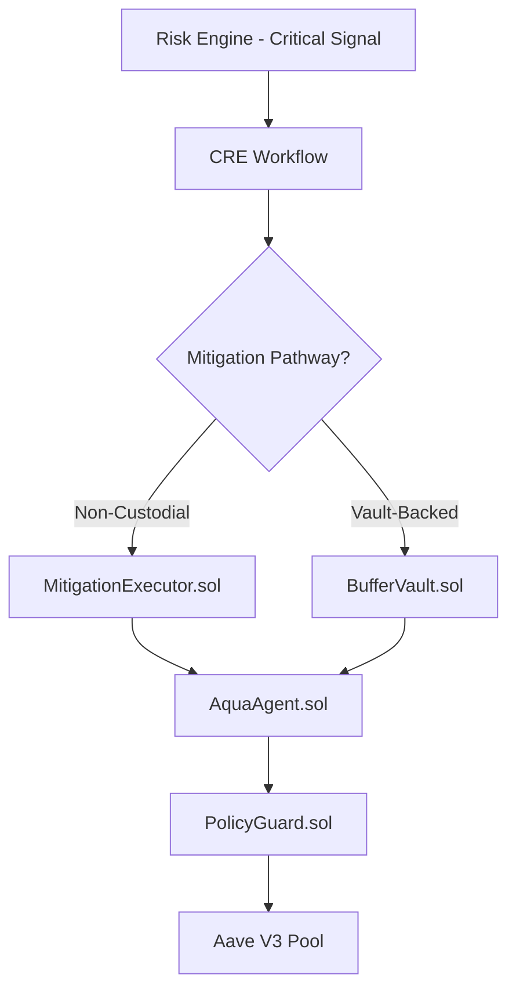

## Overview

The Aqua Agent is Aquarius's on-chain execution layer. When the Risk Intelligence Engine determines that a position requires intervention, the Aqua Agent executes the selected mitigation action through one of two pathways:

1. **Non-Custodial Mitigation** — User retains full custody; agent executes only pre-approved, bounded actions
2. **BufferVault Mitigation** — Pooled capital from the Aquarius Vault is used to protect positions automatically

Both pathways are permission-bounded, policy-enforced, and auditable.



## Non-Custodial Mitigation

In the non-custodial pathway, the user maintains full custody of their assets. The Aqua Agent can only execute actions that the user has explicitly pre-approved.

### How It Works

1. **User pre-approves** a set of bounded actions (e.g., "repay up to 1000 USDC on my behalf")
2. Risk Engine detects critical health factor decline
3. CRE Workflow selects the appropriate mitigation action
4. `MitigationExecutor.sol` verifies the user's approval and spending limit
5. `PolicyGuard.sol` enforces per-action size limits and daily frequency caps
6. Action executes against the Aave V3 Pool

### Supported Actions

| Action | Contract Method | Description |
|---|---|---|
| Partial Repay | `repayOnBehalf()` | Repays a portion of the user's debt to improve health factor |
| Collateral Top-Up | `supplyOnBehalf()` | Adds collateral to the user's position |
| Asset Rebalance | `repayOnBehalf()` + `supplyOnBehalf()` | Restructures the position for better risk profile |

### Security Model

```solidity
// MitigationExecutor.sol — bounded spending
mapping(address => mapping(address => uint256)) public approvedLimits;

function repayOnBehalf(address user, address asset, uint256 amount)
  external onlyAgent
{
  require(amount <= approvedLimits[user][asset], "Exceeds approved limit");
  policyGuard.checkPolicy(user, amount);
  // Execute repay...
}
```

Key security properties:

- **No private key exposure** — The agent never holds or accesses user private keys
- **Bounded action permissions** — Each action has an explicit spending cap set by the user
- **No arbitrary call execution** — The agent can only call pre-defined functions on the Mitigation Executor
- **Policy enforcement** — The on-chain PolicyGuard enforces maximum single-action USD value and maximum daily actions per user

### PolicyGuard Constraints

The `AquaAgentPolicyGuard` contract enforces two hard limits:

```solidity
uint256 public maxSingleActionUsd;    // e.g., $10,000
uint256 public maxDailyActionsPerUser; // e.g., 5 per 24h
```

Daily counters automatically reset after 24 hours. Both limits are owner-configurable and emit `PolicyUpdated` events on change.

<Callout type="success" title="Confidential Compute">
Non-custodial execution leverages Chainlink Confidential Compute to ensure that user approvals and spending limits are verified in a trusted execution environment.
</Callout>

## BufferVault Mitigation

The BufferVault pathway provides **institutional-grade pooled protection**. Users deposit assets into the Aquarius Vault, which maintains a reserve of mitigation capital that the Aqua Agent can draw from when risk is detected.

### How It Works

1. **Users deposit** collateral into `BufferVault.sol` and receive proportional `aqShares`
2. Risk Engine detects critical risk on a monitored position
3. CRE Workflow selects vault-backed mitigation
4. `BufferVault.sol` calls `injectLiquidity()` — repaying debt on behalf of the at-risk position from pooled reserves
5. Vault shares adjust proportionally

### Vault Mechanics

```solidity
// BufferVault.sol — core operations
function deposit(uint256 amount) external returns (uint256 shares) {
  shares = (totalShares == 0)
    ? amount
    : (amount * totalShares) / totalAssets();
  aqShares[msg.sender] += shares;
  // Transfer assets into vault...
}

function injectLiquidity(
  address beneficiary,
  address debtAsset,
  uint256 amount
) external onlyAgent {
  // Repay debt from pooled reserves
  POOL.repay(debtAsset, amount, 2, beneficiary);
}
```

### Benefits

| Benefit | Description |
|---|---|
| Automatic protection | No manual intervention required when risk is detected |
| No gas scramble | Mitigation capital is pre-positioned in the vault |
| Institutional usability | Funds-of-funds and treasury managers can deposit once and rely on automated protection |
| Yield-bearing | Vault shares represent claims on the underlying pool, which can accrue yield |
| Proportional risk sharing | Losses and protections are distributed proportionally across vault depositors |

<Callout type="warning" title="Agent-Only Execution">
Only the registered Aqua Agent can call `injectLiquidity()`. Direct vault-to-pool transfers by depositors are not permitted.
</Callout>

## AquaAgent.sol — Action Router

The `AquaAgent.sol` contract is the on-chain router that directs mitigation actions to the appropriate executor:

```solidity
function executeAction(
  string calldata actionType,
  address target,
  bytes calldata params
) external onlyOwner {
  require(approvedActions[keccak256(bytes(actionType))], "Unapproved action");

  if (equals(actionType, "partialRepay")) {
    mitigationExecutor.repayOnBehalf(/* decoded params */);
  } else if (equals(actionType, "vaultInject")) {
    bufferVault.injectLiquidity(/* decoded params */);
  } else if (equals(actionType, "addCollateral")) {
    mitigationExecutor.supplyOnBehalf(/* decoded params */);
  }

  emit ActionExecuted(actionType, target, block.timestamp);
}
```

The router maintains a registry of approved action types using `keccak256` hashes, ensuring that only explicitly whitelisted actions can be dispatched.

## Decision Flow

The complete decision flow from risk detection to on-chain execution:

1. Risk Engine emits a critical-severity signal
2. CRE Workflow evaluates available mitigation options
3. AI Risk Agent classifies the action as `OK`, `OBSERVE_ONLY`, or `ESCALATE`
4. If `ESCALATE`: select optimal mitigation (repay vs. top-up vs. vault inject)
5. Aqua Agent routes the action to the appropriate on-chain contract
6. PolicyGuard verifies bounds
7. Action executes against Aave V3
8. Post-execution health factor is verified
