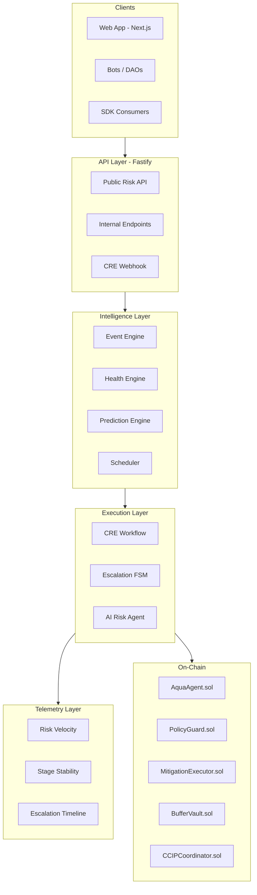

## Architecture Philosophy

Aquarius follows an **API-first, protocol-isolated, event-driven** architecture. Every layer has a clear responsibility boundary and communicates through well-defined contracts.

- **APIs are the product** — the primary surface for external developers, bots, and institutional services
- **UI is a consumer** — the web app consumes the API; no protocol logic lives in UI components
- **Protocol logic is isolated** — each protocol adapter is a bounded context with its own types and risk models
- **Real-time systems are first-class** — streams and event-driven pipelines are core infrastructure, not afterthoughts

## System Layers



## Directory Structure

The codebase is organized as a monorepo with clear separation of concerns:

```
aquarius-defi-lab/
├── apps/
│   ├── web/          → Next.js 16 frontend (consumer of API)
│   └── api/          → Fastify API (the product)
├── services/
│   ├── event-engine/     → Real-time WSS + event routing
│   ├── prediction-engine/ → HF projection, stress testing
│   ├── scheduler/        → Anomaly detection, circuit breaker
│   └── indexers/         → Per-chain blockchain indexers
├── packages/
│   ├── types/        → Shared TypeScript types
│   ├── sdk/          → Aquarius SDK + agent runtime
│   ├── domain/       → CRE workflow orchestration
│   └── utils/        → Shared utilities
├── contracts/
│   └── src/          → Solidity smart contracts
├── scripts/          → Validation + simulation runners
└── infra/            → Deployment configuration
```

## Data Flow Summary

Data flows through Aquarius in a unidirectional pipeline:

1. **Ingest** — Blockchain state changes arrive via WSS streams and indexers
2. **Normalize** — Protocol-specific data is transformed into canonical risk types
3. **Compute** — The prediction engine calculates risk metrics, projections, and stress scenarios
4. **Score** — The Health Engine derives composite scores and AI context from risk dimensions
5. **Escalate** — The SELVA FSM accumulates risk pressure and determines escalation stage
6. **Decide** — The CRE workflow and AI agent evaluate risk and select mitigation actions
7. **Execute** — The Aqua Agent dispatches bounded, pre-approved actions on-chain
8. **Validate** — Post-execution state is verified for correctness
9. **Observe** — The telemetry layer captures risk velocity, stage stability, and an escalation audit trail

<Callout type="info" title="Deterministic Core">
Steps 1-5 complete in under 100ms (excluding optional LLM reasoning). The deterministic path never depends on or waits for the LLM layer.
</Callout>

## Key Design Decisions

### Why Fastify for the API?

The API layer uses Fastify over Next.js API routes because risk intelligence endpoints must operate independently of the frontend deployment cycle. Fastify provides schema-based validation, structured logging, and predictable performance characteristics suitable for infrastructure-grade services.

### Why Separate Services?

The event engine, prediction engine, and scheduler are independent services — not library functions called by the API. This allows:

- Independent scaling under load
- Isolated failure domains (a prediction engine crash does not take down event ingestion)
- Clear ownership boundaries for each concern

### Why Tenderly for Testing?

Tenderly Virtual TestNets provide deterministic fork-based simulation that mirrors mainnet state. This enables:

- Pre-deployment contract verification
- Liquidation cascade simulation
- Gas estimation for mitigation actions
- Full end-to-end validation without spending real assets
