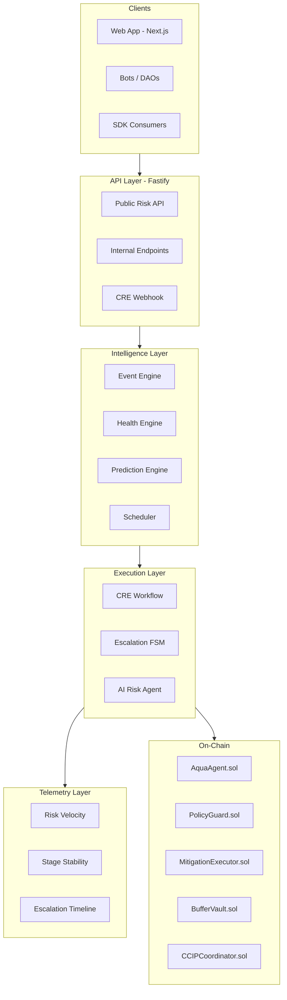
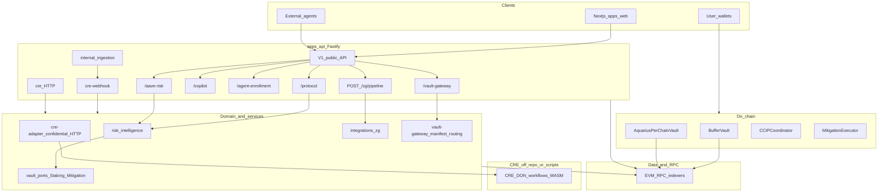
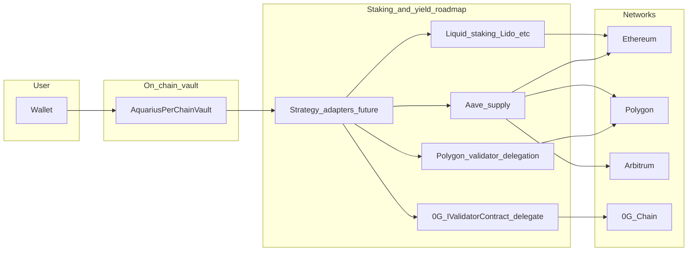
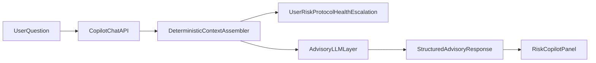

## Architecture Philosophy

Aquarius follows an **API-first, protocol-isolated, event-driven** architecture. Every layer has a clear responsibility boundary and communicates through well-defined contracts.

- **APIs are the product** — the primary surface for external developers, bots, and institutional services
- **UI is a consumer** — the web app consumes the API; no protocol logic lives in UI components
- **Protocol logic is isolated** — each protocol adapter is a bounded context with its own types and risk models
- **Real-time systems are first-class** — streams and event-driven pipelines are core infrastructure, not afterthoughts

## System Layers



## Runtime API surfaces and Zero Gravity (0G)

Aquarius exposes additional **versioned** routes under `/api/v1` for **ZG** (0G-aligned advisory pipeline) and **vault-gateway** (manifest + advisory routing). These are **server-side** integrations: they do not replace Chainlink CRE or custody user keys.

See **[Zero Gravity (0G)](/docs/zero-gravity)** for diagrams, environment variables, and code paths.

### Full stack API and domain (current)



### Vault, staking, and yield (roadmap)

`AquariusPerChainVault` holds **ERC-20 shares** only today. Staking and delegation plug in via **future strategy adapters**.



## Directory Structure

The codebase is organized as a monorepo with clear separation of concerns:

```
aquarius-defi-lab/
├── apps/
│   ├── web/          → Next.js 16 frontend (consumer of API)
│   └── api/          → Fastify API (the product)
├── services/
│   ├── event-engine/     → Real-time WSS + event routing
│   ├── prediction-engine/ → HF projection, stress testing
│   ├── scheduler/        → Anomaly detection, circuit breaker
│   └── indexers/         → Per-chain blockchain indexers
├── packages/
│   ├── types/        → Shared TypeScript types
│   ├── sdk/          → Aquarius SDK + agent runtime
│   ├── domain/       → CRE workflow orchestration
│   └── utils/        → Shared utilities
├── contracts/
│   └── src/          → Solidity smart contracts
├── scripts/          → Validation + simulation runners
└── infra/            → Deployment configuration
```

## Data Flow Summary

Data flows through Aquarius in a unidirectional pipeline:

1. **Ingest** — Blockchain state changes arrive via WSS streams and indexers
2. **Normalize** — Protocol-specific data is transformed into canonical risk types
3. **Compute** — The prediction engine calculates risk metrics, projections, and stress scenarios
4. **Score** — The Health Engine derives composite scores and AI context from risk dimensions
5. **Escalate** — The SELVA FSM accumulates risk pressure and determines escalation stage
6. **Decide** — The CRE workflow and AI agent evaluate risk and select mitigation actions
7. **Execute** — The Aqua Agent dispatches bounded, pre-approved actions on-chain
8. **Validate** — Post-execution state is verified for correctness
9. **Observe** — The telemetry layer captures risk velocity, stage stability, and an escalation audit trail

<Callout type="info" title="Deterministic Core">
Steps 1-5 complete in under 100ms (excluding optional LLM reasoning). The deterministic path never depends on or waits for the LLM layer.
</Callout>

## Risk Co-Pilot (Option A)

Aquarius now supports an informational **Risk Co-Pilot** for Aave that is strictly grounded in deterministic context.

- Scope: read + explain only
- Chains: `ethereum`, `polygon`
- Execution: disabled in this mode
- LLM role: interpretation layer only

The co-pilot uses the existing risk APIs and orchestration state as context input. It does not compute protocol math and does not read blockchain data directly.



Upgrade seams are preserved for later phases:

- `toolRouter` reserved for Option B simulation tools
- `intentEnvelope` reserved for Option C confirmed execution flow
- response schema versioned (`v1`) for non-breaking evolution

## Agent Enrollment (Phase A + Phase B Hard-Fail)

Aquarius supports a phased enrollment architecture from the Aave CTA (`Employ Aqua Agents`) with stable API contracts.

- Storage now: in-memory enrollment store (prototype validation)
- Supported channels now: Telegram mandatory (non-strict), Webhook optional
- Policy modes now: `alert_only`, `mitigate_agent`, `buffer_vault`
- Binding lifecycle now:
  - `pending_onchain`
  - `signing_requested`
  - `pending_tx`
  - `bound_onchain`
  - `bind_failed`

Architecture seam for infra-grade upgrade is preserved through service-port abstraction:

- `AgentEnrollmentService` (application logic)
- `EnrollmentStorePort` (storage contract)
- `InMemoryEnrollmentStore` (Phase A adapter)

Phase B hard-fail is additive: wallet signing and on-chain activation/deactivation are introduced without breaking existing read contracts.

### Wallet + Tenderly prerequisites and policy signing path

- The `Employ Aqua Agents` CTA requires MetaMask on a supported chain and Tenderly RPC configured for that chain.
- Phase B is gated behind:
  - `PHASE_B_POLICY_BINDING=1`
  - `NEXT_PUBLIC_PHASE_B_POLICY_BINDING=1`
  - `DATA_PROVIDER_MODE=tenderly`
  - `AAVE_VALIDATION_REQUIRE_TENDERLY=1`
- Enrollment flow in Phase B:
  - start bind intent (`/v1/agent-enrollment/bind-intent`)
  - wallet signs/submits tx (MetaMask popup)
  - confirm bind (`/v1/agent-enrollment/confirm-bind`)
  - start deactivate intent (`/v1/agent-enrollment/deactivate-intent`)
  - wallet signs/submits tx (MetaMask popup)
  - confirm deactivate (`/v1/agent-enrollment/confirm-deactivate`)
- On any signing/tx failure, operation fails closed and does not finalize activation/deactivation state transitions.

## Chain-Aware Execution Context

Aquarius now treats chain selection as a first-class execution context for Aave risk paths.

- **Active validation scope (today):** `ethereum`, `polygon`
- **Architecture posture (future):** chain-extensible by configuration, not rewrite
- **Boundary contract:** one shared chain schema at API/web boundary
- **Runtime behavior:** chain-specific infra resolution (RPC, addresses, readers)

This preserves DDD boundaries:

- **Domain/Application:** chain-aware orchestration and normalized contracts
- **Infrastructure:** per-chain adapters and endpoint/address resolution
- **Frontend:** pure consumer of chain-scoped API responses

```mermaid
flowchart LR
  chainToggle[ChainToggle] --> chainState[ProtocolChainContext]
  chainState --> webHooks[WebHooksChainParam]
  webHooks --> apiRoutes[FastifyRoutesChainValidated]
  apiRoutes --> providerFactory[ProviderFactoryModeAndChain]
  providerFactory --> chainInfra[ChainSpecificRpcAndAaveAddresses]
  chainInfra --> scoring[HealthAndCreScoring]
  scoring --> ui[ChainScopedUiMetrics]
```



<Callout type="warning" title="Shared Contract vs Shared Runtime">
"Shared chain contract" means shared request/response schema and validation only. It does not mean shared RPC clients or shared chain addresses. Runtime remains chain-specific for correctness and latency.
</Callout>

## Key Design Decisions

### Why Fastify for the API?

The API layer uses Fastify over Next.js API routes because risk intelligence endpoints must operate independently of the frontend deployment cycle. Fastify provides schema-based validation, structured logging, and predictable performance characteristics suitable for infrastructure-grade services.

### Why Separate Services?

The event engine, prediction engine, and scheduler are independent services — not library functions called by the API. This allows:

- Independent scaling under load
- Isolated failure domains (a prediction engine crash does not take down event ingestion)
- Clear ownership boundaries for each concern

### Why Tenderly for Testing?

Tenderly Virtual TestNets provide deterministic fork-based simulation that mirrors mainnet state. This enables:

- Pre-deployment contract verification
- Liquidation cascade simulation
- Gas estimation for mitigation actions
- Full end-to-end validation without spending real assets
