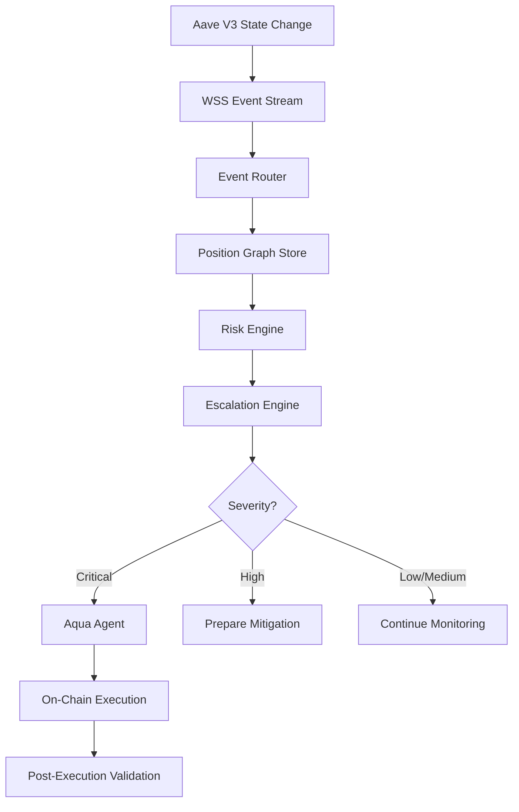
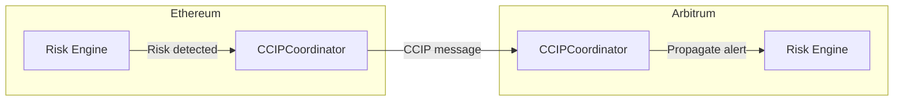

## Overview

Aquarius processes data through three distinct pipelines: on-chain state ingestion, off-chain intelligence computation, and cross-chain risk propagation. Each pipeline is designed for deterministic execution, bounded latency, and graceful degradation.

## On-Chain Data Flow

The primary data pipeline ingests blockchain state and transforms it into actionable risk intelligence.



### Step-by-Step

| Step | Layer | Description | Latency Target |
|---|---|---|---|
| 1 | Ingestion | Aave V3 pool emits supply/borrow/liquidation events | Network-dependent |
| 2 | Routing | Event Router dispatches to subscribers via microtasks | &lt; 1ms |
| 3 | Storage | Position Graph Store updates in-memory state | &lt; 0.5ms |
| 4 | Computation | Prediction Engine computes HF projection, risk velocity, liquidation probability | &lt; 0.1ms per position |
| 5 | Classification | Severity score assigned based on composite risk index | &lt; 0.1ms |
| 6 | Decision | CRE workflow evaluates and selects mitigation action | &lt; 50ms |
| 7 | Execution | Aqua Agent dispatches bounded action on-chain | Transaction-dependent |
| 8 | Validation | Post-execution state verified against expected outcome | &lt; 10ms |

<Callout type="info" title="End-to-End Latency">
The deterministic path from event ingestion to mitigation dispatch completes in under 100ms, excluding network latency and transaction confirmation.
</Callout>

## Off-Chain Intelligence Flow

The off-chain pipeline handles computation that does not require direct blockchain interaction.

```
┌─────────────────────────────────────┐
│  1. Data Normalization              │
│     Raw events → Canonical types    │
├─────────────────────────────────────┤
│  2. Risk Metric Computation         │
│     HF projection, risk velocity,   │
│     liquidation probability          │
├─────────────────────────────────────┤
│  3. Severity Score Assignment       │
│     0-100 composite → severity enum │
├─────────────────────────────────────┤
│  4. Structured Event Emission       │
│     Risk signal broadcast via Router │
├─────────────────────────────────────┤
│  5. Execution Queue Population      │
│     Mitigation actions queued for   │
│     CRE dispatch                    │
└─────────────────────────────────────┘
```

### CRE Workflow Pipeline

The CRE (Chainlink Runtime Environment) workflow is the orchestration layer that ties intelligence to execution. It runs as a shared domain function callable from both CLI and API:

```typescript
// Simplified CRE workflow pipeline
const result: CREWorkflowResult = {
  protocolStatus: "stable" | "watch" | "high-risk",
  riskScore: {
    composite: number,
    level: RiskSeverity,
    dimensions: { utilization, liquidations, oracleHealth },
  },
  agentDecision: {
    decision: "OK" | "ESCALATE" | "OBSERVE_ONLY",
    confidence: number,
    actionsRequested: string[],
    blackSwanDetected: boolean,
  },
  llmReasoning: {
    action: string,
    confidence: number,
    reason: string,
  } | null,
  latencies: Record<string, number>,
};
```

The deterministic layers (risk computation, agent decision) always run first. The optional LLM reasoning layer runs asynchronously and **never blocks** the deterministic path.

## Cross-Chain Flow (CCIP)

Aquarius includes a cross-chain risk propagation layer built on Chainlink CCIP.



### Current Capabilities

- **Risk broadcast** — When risk is detected on one chain, a structured risk event is broadcast to registered chains via the `CCIPCoordinator` contract
- **Observe-only mode** — Cross-chain signals are currently informational; they do not trigger automatic mitigation on the receiving chain
- **Chain registration** — Chains must be explicitly registered before they can receive cross-chain risk broadcasts

### Future Capabilities

- Multi-chain liquidation monitoring with correlated risk detection
- Cross-chain mitigation execution (e.g., rebalance collateral from Arbitrum to Ethereum)
- Aggregated risk scoring across positions on multiple chains

<Callout type="warning" title="Roadmap Feature">
Cross-chain mitigation execution is on the roadmap. Current implementation supports observe-only risk propagation.
</Callout>

## Event Router Architecture

The Event Router is the central nervous system of the data flow. It provides:

- **Non-blocking dispatch** — All handlers execute in the microtask queue, preventing any single handler from blocking the event loop
- **Wildcard subscriptions** — Handlers can subscribe to all events via the `"*"` channel
- **Event statistics** — The router tracks total event count and last event timestamp for observability
- **Deterministic ordering** — Events are processed in the order they are dispatched

```typescript
const router = new EventRouter();

router.on("risk:evaluated", (event) => {
  // Handle risk signal
});

router.onAny((event) => {
  // Audit log all events
});

router.dispatch({
  type: "risk:evaluated",
  payload: riskSignal,
});

router.getStats();
// → { eventCount: 1, lastEventTimestamp: 1708444800000 }
```
