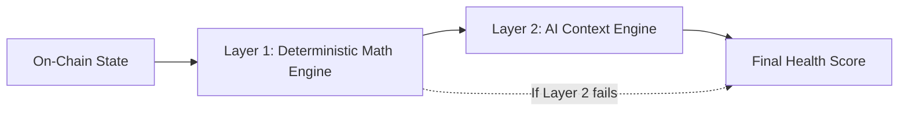
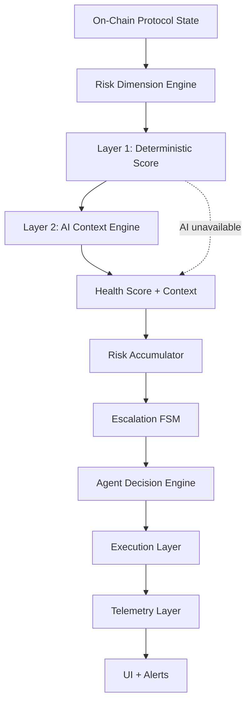

## Purpose

The Health Engine is the foundation layer of the Aquarius intelligence stack. It converts raw protocol state into structured, interpretable risk scores that drive every downstream system — escalation logic, agent decisions, action dispatch, and user-facing risk displays.

Two independent scores are produced:

- **Protocol Health Score** — overall risk posture of a protocol (e.g., Aave market health across all positions)
- **User Health Score** — risk assessment for a specific wallet's position on a protocol

Both scores are deterministic, reproducible, and auditable. The optional AI layer interprets but never controls.

## Chain Scope and Routing

For Aave validation, the Health Engine is now chain-aware end-to-end.

- **Current active chains:** `ethereum`, `polygon`
- **Default when omitted:** `ethereum`
- **Validation behavior:** unsupported chains are rejected at API boundary (`400`)
- **Computation behavior:** cache keys and snapshot resolution are chain-scoped

This prevents cross-chain cache bleed and ensures every score reflects the selected chain context.

## Three-Layer Scoring Pipeline



| Layer | Responsibility | Latency | Required |
|---|---|---|---|
| Layer 1 | Weighted risk computation from on-chain signals | &lt; 10ms | Yes |
| Layer 2 | Regime classification, dominant risk identification, bounded score adjustment | &lt; 8s | No |
| Layer 3 | Stress simulation via Tenderly (future) | Variable | No |

Layer 1 always runs and always produces a valid score. Layer 2 may adjust the score within strict bounds. If Layer 2 fails for any reason — API timeout, invalid response, missing credentials — the system falls back to the Layer 1 result with zero downtime.

## Risk Dimension Weighting

Layer 1 computes a composite health score from four normalized risk dimensions. Each dimension is scored 0–100 (higher = more risk).

| Dimension | Weight | Signal Source |
|---|---|---|
| Liquidation Risk | 30% | Proximity of positions to liquidation thresholds |
| Volatility | 25% | Health factor pressure and price movement exposure |
| Liquidity Risk | 25% | Market concentration and utilization depth |
| Smart Contract / Governance Risk | 20% | Debt-to-collateral ratio and protocol parameter stability |

**Formula:**

```
Score = 100 - Σ(weight_i × risk_dimension_i)
```

The result is clamped to 0–100 and rounded to the nearest integer.

## Score Interpretation Bands

| Score Range | Category | Meaning |
|---|---|---|
| 75–100 | **Stable** | All risk dimensions within safe bounds |
| 50–74 | **Watch** | Elevated risk in one or more dimensions — monitoring advised |
| 0–49 | **High Risk** | Significant risk detected — mitigation may be required |

These bands are used consistently across the protocol health score, user health score, and the downstream escalation engine.

## Protocol Health Score

The protocol-level score assesses the aggregate risk posture of a protocol across all tracked positions on a chain.

**Pipeline:**

1. Fetch position snapshots from the market data provider (up to 50 positions)
2. Derive chain-level metrics (utilization, liquidation counts, collateral/debt totals)
3. Correlate signals across risk dimensions using the signal correlator
4. Map correlated dimensions to the four risk inputs (0–100 each)
5. Compute the weighted composite score

Chain is part of the protocol-health cache key and source path, so Ethereum and Polygon produce independent score timelines.

**Response shape:**

```typescript
interface ProtocolHealthScore {
  protocol: string;
  score: number;              // 0–100
  category: HealthCategory;   // "stable" | "watch" | "high_risk"
  confidence: number;         // 0–1
  breakdown: {
    liquidity: number;        // 0–100 (inverted: higher = healthier)
    riskConcentration: number;
    liquidationRisk: number;
    smartContractRisk: number;
  };
  reasoning: string;
  regime?: MarketRegime;      // "normal" | "elevated" | "stressed"
  dominantRisk?: string;
  metadata: {
    block: number | null;
    timestamp: string;        // ISO-8601
    sources: string[];
  };
}
```

Confidence is derived from sample size and signal clarity. A larger position sample and stronger signal agreement produce higher confidence.

## User Health Score

The user-level score assesses a specific wallet's position risk. It uses a penalty-based model built on the health factor.

**Pipeline:**

1. Read user's on-chain position (health factor, collateral, debt)
2. Normalize health factor to a 0–100 base score
3. Apply risk penalties (volatility, concentration, correlation)
4. Compute final score as `Base - Penalties`, clamped 0–100

User health now resolves on-chain position data by selected chain. If a wallet has no active position on the selected chain, the route returns a chain-specific not-found response rather than falling back to another chain.

**Health factor normalization:**

| Health Factor | Base Score |
|---|---|
| &lt;= 1.0 | 0 |
| 1.5 | 50 |
| 2.0 | 75 |
| &gt;= 3.0 | 100 |

**Penalty model:**

| Penalty | Trigger | Max Impact |
|---|---|---|
| Volatility | HF slope &lt; -0.1 (declining trajectory) | Up to 15 points |
| Concentration | Largest collateral asset &gt; 70% of total | Variable |
| Correlation | Collateral assets are price-correlated (e.g., ETH + stETH) | 5 points |

**Response shape:**

```typescript
interface UserHealthScore {
  user: string;
  protocol: string;
  score: number;
  category: HealthCategory;
  confidence: number;
  base: number;               // HF-derived base before penalties
  penalties: {
    volatility: number;
    concentration: number;
    correlation: number;
  };
  reasoning: string;
  regime?: MarketRegime;
  dominantRisk?: string;
  metadata: HealthScoreMetadata;
}
```

## AI Context Engine (Layer 2)

The AI Context Engine is an interpretive layer that sits on top of the deterministic score. It does not recompute risk — it contextualizes it.

**Capabilities:**

- **Regime classification** — Classifies the current market as `normal`, `elevated`, or `stressed` based on the combination of risk dimensions
- **Dominant risk identification** — Identifies which risk vector is the primary driver of the current score
- **Bounded score adjustment** — May adjust the final score within a strict **±10 point** limit if regime conditions justify it
- **Reasoning generation** — Produces a concise explanation (max 25 words) describing why the score was adjusted

**Safety guarantees:**

| Constraint | Enforcement |
|---|---|
| Maximum adjustment | ±10 points from deterministic base |
| Score bounds | Clamped 0–100 after adjustment |
| Category derivation | Always re-derived from adjusted score, never from LLM output |
| Schema validation | Strict JSON schema check on every LLM response |
| Fallback | Any failure (timeout, invalid response, missing API key) returns deterministic score |

The AI layer uses Groq (`llama-3.3-70b-versatile`) with `temperature: 0` for deterministic inference. A hard timeout of 8 seconds prevents the AI layer from blocking the pipeline.

<Callout type="warning" title="AI Never Controls">
The AI context layer enhances interpretation. It does not control escalation, agent decisions, or action dispatch. If the AI layer is unavailable, the system operates at full capacity on deterministic logic alone.
</Callout>

## Agent Context Injection

The Health Engine feeds structured context into the agent decision layer. The agent receives:

```typescript
{
  healthScore: number,
  riskDimensions: RiskInputs,
  dominantRisk: string,
  escalationStage: "info" | "confirm" | "invalidate",
  convergenceSignals: string[],
  stressTestResults?: StressScenario[],
  volatilityRegime: MarketRegime
}
```

Agent decisions are stage-aware:

| Escalation Stage | Agent Behavior |
|---|---|
| INFO | Observe only — no mitigation actions |
| CONFIRM | Protect — dispatch bounded mitigation (partial repay, collateral top-up) |
| INVALIDATE | Escalate — emergency action, circuit breaker, alert escalation |

The agent may also fall back to composite threshold logic if escalation state is unavailable. The separation is clear:

- **Health Score** = state assessment (what is the risk?)
- **Escalation FSM** = control logic (should we act?)
- **Agent** = response executor (how do we act?)

## Score Caching

Health scores are cached in-memory to prevent redundant recomputation on every request.

| Score Type | TTL | Rationale |
|---|---|---|
| Protocol Health | 30 seconds | Protocol state changes slowly relative to polling |
| User Health | 10 seconds | User positions can shift with each block |

The cache uses a simple TTL-based eviction strategy with no external dependencies (no Redis required). Entries are lazily evicted on read.

For chain-aware routing, cache keys include chain context:

- `protocol:{protocol}:{chain}`
- `user:{address}:{protocol}:{chain}`

## End-to-End System Flow



The Health Score is the entry point for the entire downstream pipeline. Without it, escalation has no signal, the agent has no context, and execution has no trigger.

<Callout type="info" title="Deterministic Core">
The full deterministic path — from on-chain state to agent decision — completes in under 100ms. The AI context layer runs asynchronously and never blocks the critical path.
</Callout>
