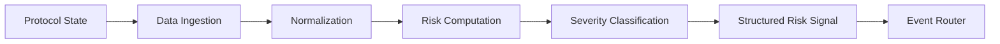
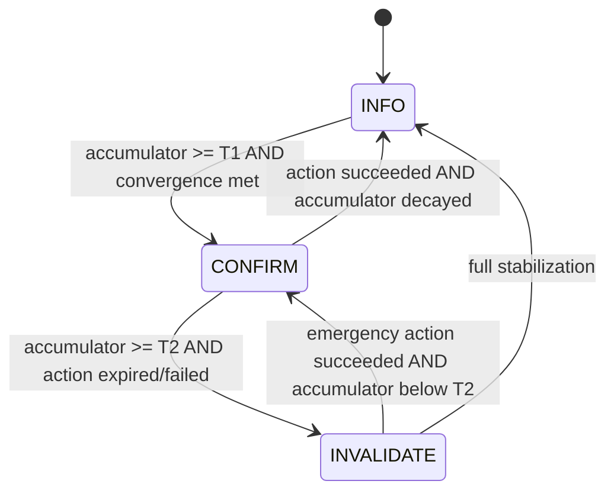

## Purpose

The Risk Intelligence Engine is the analytical core of Aquarius. It continuously monitors protocol state, computes risk metrics, and emits structured risk signals that drive the escalation and mitigation pipeline.

Unlike generic monitoring tools that check thresholds, the Risk Engine understands **protocol-specific risk semantics** — what a health factor means on Aave, how impermanent loss accumulates on Uniswap, and how validator exposure creates risk on Lido.

## Active Chain Validation Profile

Aave risk endpoints and CRE monitoring are now chain-scoped for the selected network context.

- **Active execution scope:** `ethereum`, `polygon`
- **Default chain:** `ethereum`
- **Unsupported chain behavior:** explicit `400` at request boundary
- **Route-level chain passthrough:** protocol health, user risk, projected HF, stress test, actionable metrics, and CRE run

This enforces deterministic chain isolation for risk metrics while preserving a future-extensible adapter model.

## Risk Computation Pipeline



### Stage 1: Data Ingestion

The Event Engine maintains persistent WebSocket connections to blockchain nodes and processes three stream types:

- **AaveEventStream** — Monitors Aave V3 pool events (supply, borrow, repay, liquidation)
- **OracleEventStream** — Tracks price oracle updates and detects anomalies
- **BlockStream** — Processes new blocks for state-dependent calculations

All streams feed into the **Event Router**, a non-blocking dispatcher that uses microtask scheduling to ensure no handler blocks the event loop:

```typescript
export class EventRouter {
  dispatch(event: StreamEvent): void {
    queueMicrotask(() => {
      this.emitter.emit(event.type, event);
      this.emitter.emit("*", event);
    });
  }
}
```

For chain-aware execution, provider routing resolves both mode and chain before ingestion:

- `DATA_PROVIDER_MODE` chooses adapter family (`mock`, `tenderly`, `onchain`, `realtime`)
- chain context (`ethereum`/`polygon`) chooses RPC endpoint + Aave address set
- normalized snapshots are emitted with chain identifier preserved through scoring

### Stage 2: Normalization

Each protocol adapter transforms raw event data into canonical risk types. Aquarius defines a base `EvaluatableRisk` interface that all protocol-specific snapshots extend:

```typescript
interface EvaluatableRisk {
  protocol: "aave" | "lido" | "uniswap";
  chain: string;
  riskScore: number;    // 0-100 composite score
  severity: "low" | "medium" | "high" | "critical";
  timestamp: number;
}
```

Protocol-specific snapshots carry additional fields:

| Protocol | Additional Fields |
|---|---|
| Aave | `healthFactor`, `liquidationThreshold`, `borrowBalance`, `collateralBalance` |
| Uniswap | `impermanentLoss`, `liquiditySkew`, `feeAccrualRate` |
| Lido | `validatorExposure`, `slashingRisk`, `withdrawalDelay` |

### Stage 3: Risk Computation

The Prediction Engine computes four categories of risk intelligence:

#### Health Factor Projection

Projects the health factor forward using oracle velocity and collateral beta weighting. Linear extrapolation with confidence scoring:

```typescript
interface HFProjection {
  currentHF: number;
  projectedHF: number;
  blocksAhead: number;
  confidence: number;      // 0.5-0.95
  breachBlock: number | null;
}
```

Target: under 0.1ms per position.

#### Risk Velocity

Computes the rate of health factor change:

```typescript
interface RiskVelocity {
  slope: number;
  isAccelerating: boolean;
}
```

An accelerating negative slope triggers earlier escalation than a steady decline.

#### Liquidation Probability

A weighted composite of four factors:

| Factor | Weight | Description |
|---|---|---|
| Proximity | 35% | Distance of current HF to 1.0 |
| Trajectory | 30% | Projected HF decline over time |
| Acceleration | 15% | Whether velocity is increasing |
| Volatility | 20% | Whether normal price movement could trigger liquidation |

Returns a 0-1 probability with the identified `primaryDriver`.

#### Stress Testing

Runs hypothetical scenarios against current positions:

```typescript
const PRESET_SCENARIOS = {
  eth_drop_10:  { asset: "ETH",  dropPercent: 10 },
  eth_drop_20:  { asset: "ETH",  dropPercent: 20 },
  eth_drop_30:  { asset: "ETH",  dropPercent: 30 },
  btc_drop_15:  { asset: "BTC",  dropPercent: 15 },
  broad_crash:  { asset: "ALL",  dropPercent: 25 },
  depeg_usdc:   { asset: "USDC", dropPercent: 5  },
};
```

Each scenario returns `affectedPositions`, `totalLossUsd`, `avgHFAfterStress`, and `criticalPositions`.

### Stage 4: Severity Classification

Risk scores map to severity levels:

| Score Range | Severity | System Response |
|---|---|---|
| 0-25 | Low | Monitor only |
| 26-50 | Medium | Increased polling frequency |
| 51-75 | High | Warn + prepare mitigation |
| 76-100 | Critical | Auto-escalate to Aqua Agent |

### Stage 5: Signal Emission

Structured risk signals are emitted through the Event Router with the following shape:

```typescript
interface RiskSignal {
  type: "risk:evaluated";
  protocol: string;
  chain: string;
  riskScore: number;
  severity: RiskSeverity;
  factors: {
    utilization: number;
    liquidationPressure: number;
    oracleHealth: number;
  };
  recommended: "OBSERVE" | "WARN" | "MITIGATE";
  timestamp: number;
}
```

## Position Graph Store

The Event Engine maintains an in-memory **Position Graph Store** — a bounded data structure (max 10,000 positions) that provides O(1) lookups for any tracked position. This store is the single source of truth for real-time position state within the intelligence layer.

<Callout type="warning" title="Bounded Memory">
The Position Graph Store enforces a hard cap of 10,000 positions. LRU eviction ensures memory growth is bounded regardless of chain activity volume.
</Callout>

## Escalation Engine (SELVA FSM)

Risk signals flow into the **SELVA Escalation State Machine**, a deterministic finite-state machine that controls backend behavior based on accumulated risk pressure — not single-metric thresholds.

<Callout type="info" title="Updated in v2">
The escalation engine now uses a risk accumulator with convergence detection. See the [Health Score Engine](/docs/health-engine) for how upstream scores feed into this system.
</Callout>

### Three Stages

| Stage | Meaning | Backend Behavior |
|---|---|---|
| **INFO** | Signals accumulating, risk building but not actionable | Agent observes. No mitigation dispatched. |
| **CONFIRM** | Action threshold crossed, correlated signals aligned | Agent dispatches bounded mitigation (partial repay, collateral top-up). |
| **INVALIDATE** | Mitigation failed or was not executed within the action window | Emergency escalation. Circuit breaker logic. Alert escalation. |



### Risk Accumulator

Instead of checking if a single metric crosses a static threshold, the escalation engine maintains a **weighted accumulator** that rises with risk pressure and decays over time:

```
accumulator += weighted_signal_delta
accumulator -= decay_factor × elapsed_time
```

This prevents noise-triggered escalation. Risk must sustain and build before the system acts.

### Convergence Detection

A transition from INFO to CONFIRM requires **signal convergence** — multiple risk dimensions must align simultaneously. A spike in a single dimension (e.g., a brief utilization surge) does not trigger escalation on its own.

The minimum convergence requirement is configurable (default: 2 dimensions must be elevated).

### Hysteresis

De-escalation thresholds are set lower than escalation thresholds (using a configurable hysteresis factor). This prevents rapid flapping between stages when the accumulator hovers near a boundary.

For example, if T1 (INFO → CONFIRM) is 40, de-escalation (CONFIRM → INFO) requires the accumulator to drop below `T1 × 0.7 = 28`.

### Action Window

When the system enters CONFIRM, a **60-second action window** opens. If no successful mitigation action is reported within this window, and the accumulator continues rising past T2, the system escalates to INVALIDATE.

This ensures the system does not remain in CONFIRM indefinitely when mitigation fails or is not dispatched.

### Default Configuration

| Parameter | Value | Purpose |
|---|---|---|
| T1 | 40 | INFO → CONFIRM threshold |
| T2 | 70 | CONFIRM → INVALIDATE threshold |
| Hysteresis | 0.7 | De-escalation factor |
| Action Window | 60s | Time allowed for mitigation before INVALIDATE |
| Min Convergence | 2 | Dimensions required for CONFIRM |

## Risk Telemetry and Observability

The escalation engine exposes three telemetry features for institutional-grade transparency. These are purely observational — they do not influence state transitions or agent decisions.

### Risk Velocity

Tracks the rate of accumulator change over a rolling 60-second window:

```
velocity = accumulator_now - accumulator_60s_ago
```

A positive velocity means risk is building. A negative velocity means risk is decaying. The magnitude indicates how rapidly conditions are changing.

The velocity is computed from an in-memory **ring buffer** of accumulator snapshots (max 60 entries, bounded memory).

### Stage Stability

Derived from velocity, the stage stability indicator classifies the current state dynamics:

| Velocity (absolute) | Stability | Meaning |
|---|---|---|
| &lt; 2.0 / min | **Stable** | Accumulator is steady; risk is not actively changing |
| &lt; 8.0 / min | **Transitioning** | Accumulator is shifting; stage transition may be approaching |
| &gt;= 8.0 / min | **Escalating** | Accumulator is rising rapidly; high probability of imminent stage change |

This is a derived property — it is computed at read time from the ring buffer and never persisted.

### Escalation Timeline

An append-only audit log that records stage transitions and action results:

```typescript
interface EscalationTimelineEvent {
  type: "ENTER_INFO" | "ENTER_CONFIRM" | "ENTER_INVALIDATE"
      | "ACTION_ATTEMPTED" | "ACTION_SUCCEEDED" | "ACTION_FAILED";
  timestamp: number;
  reason: string;
}
```

The timeline is capped at 20 events (oldest evicted on overflow). It provides a chronological record of what the system did and why — useful for post-incident analysis and audit compliance.

## Actionable Metrics Design Principle

Every metric exposed by Aquarius must satisfy the **No Vanity Metrics** rule:

> A metric is actionable only if it answers three questions: What is happening? Why does it matter? What should someone do right now?

If a metric does not change behavior for a protocol operator, a user, or an automated bot, it is removed.

### Metric Structure

Every actionable metric includes:

| Component | Purpose |
|---|---|
| **Value** | Current measurement |
| **Interpretation** | What this value means in context |
| **Action** | What the user or system should do |
| **Severity** | `safe`, `warning`, or `critical` |

### Current Actionable Metrics

| Metric | What It Drives |
|---|---|
| Cascading Liquidation Exposure | Whether systemic cascade risk requires position reduction |
| Liquidity Buffer Ratio | Whether protocol collateralization supports safe borrowing |
| Volatility Regime | Whether market conditions warrant increased monitoring frequency |
| Time to Liquidation (HF projection) | Whether a user should add collateral before projected breach |
| Stress Simulation Results | Whether a position survives specific market scenarios |

Metrics that are purely informational (e.g., latency numbers, decorative badges, duplicate status indicators) are either placed behind a developer mode toggle or removed entirely.

## Informational Co-Pilot (Option A)

The Risk Co-Pilot is an informational interpretation layer over deterministic risk outputs.

- It **does not** compute risk math.
- It **does not** fetch blockchain state directly.
- It **does not** execute actions.

The co-pilot consumes:

- Unified user-risk projection
- Protocol health summary
- Escalation/risk progression state
- Chain context (`ethereum` or `polygon`)

If model inference is unavailable, Aquarius returns deterministic fallback guidance with explicit limits. This preserves reliability while keeping the deterministic risk engine as the source of truth.
