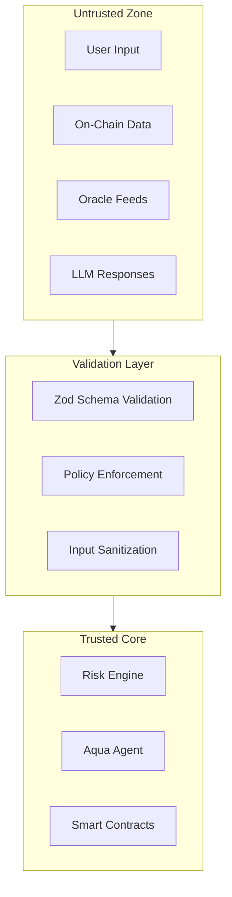

## Security Philosophy

Aquarius follows a strict security posture:

- **Assume all inputs are malicious** until validated
- **On-chain data is untrusted** until verified
- **Internal services do not trust each other** by default
- **Security > performance > convenience** — always

If a feature weakens security assumptions, it does not ship. If uncertain between two approaches, the safer option is chosen.

## Trust Boundaries



Every piece of data that crosses a trust boundary is validated using strict Zod schemas before it enters the trusted core.

## Key Security Properties

### No Custody of User Keys

Aquarius **never** holds, accesses, or stores user private keys. All on-chain actions are executed through:

- Pre-approved spending limits set by the user
- Smart contract methods that verify authorization on-chain
- Chainlink Confidential Compute for sensitive verification

### Vault Isolation

The BufferVault is isolated from other system contracts:

- Vault funds can only be accessed via `deposit()`, `withdraw()`, and `injectLiquidity()`
- Only the registered Aqua Agent can call `injectLiquidity()`
- Vault state is independent of other contract state

### Permission-Bounded Execution

Every mitigation action is bounded by multiple constraints:

| Constraint | Enforced By | Description |
|---|---|---|
| Spending limit | `MitigationExecutor.sol` | Maximum per-action amount set by user |
| Daily action cap | `PolicyGuard.sol` | Maximum actions per user per 24h |
| Single action cap | `PolicyGuard.sol` | Maximum USD value per single action |
| Action whitelist | `AquaAgent.sol` | Only pre-registered action types |
| Agent authorization | `onlyAgent` modifier | Only the registered agent address |

### No Infinite Loops

The Event Router uses microtask scheduling and event counting to prevent infinite loops:

- Each event dispatch is a single microtask
- Event statistics track total count and timing
- The Scheduler monitors for anomalous event rates

### No Arbitrary Execution

The Aqua Agent **cannot** execute arbitrary calls. It can only:

1. Call `repayOnBehalf()` on the Mitigation Executor
2. Call `supplyOnBehalf()` on the Mitigation Executor
3. Call `injectLiquidity()` on the BufferVault

Each of these methods has its own authorization and bounds checking.

### Escalation Gating

Mitigation actions are gated by the escalation engine:

1. Risk must pass through Observe → Warn → Act stages
2. Each stage has explicit severity thresholds
3. Direct jumps from Observe to Act require critical-severity classification
4. The circuit breaker can halt all execution if system health degrades

## Input Validation

All API request payloads are validated using strict Zod schemas:

```typescript
import { z } from "zod";

const ChainParam = z.enum([
  "ethereum", "arbitrum", "base", "solana"
]);

const UserParam = z.string()
  .regex(/^0x[a-fA-F0-9]{40}$/, "Invalid Ethereum address");
```

Invalid requests receive structured error responses without exposing internal implementation details.

## Rate Limiting

All public endpoints enforce rate limiting:

- Per-IP rate limiting prevents abuse
- Burst allowance for legitimate traffic spikes
- Hard caps prevent resource exhaustion

## Logging & Observability

- Logs **never** contain secrets, private keys, or API tokens
- Sensitive fields are redacted by default
- Logs are treated as potentially public artifacts
- Structured logging with severity levels for operational monitoring

## Stream Safety

Real-time streams (WSS, event subscriptions) enforce:

- **Backpressure** — Slow consumers do not cause unbounded memory growth
- **Validation** — All streamed data is validated before emission
- **Abuse protection** — Rate limiting on subscription creation

## Error Handling

- Fail safely and explicitly
- Never leak stack traces or internal state to clients
- Prefer graceful degradation over undefined behavior
- All errors return structured JSON responses with appropriate HTTP status codes

## Known Security Considerations

| Area | Status | Notes |
|---|---|---|
| Smart contract audits | Pending | Formal audit not yet completed |
| Penetration testing | Planned | Scheduled for post-launch |
| Bug bounty program | Planned | Will cover critical contract vulnerabilities |
| Key management | Implemented | No keys stored; all via Confidential Compute |
| Supply chain | Monitored | Dependencies are pinned and reviewed |

<Callout type="warning" title="Audit Status">
Smart contracts have not yet undergone a formal security audit. The current implementation has been validated through the 11-stage validation pipeline, but formal audit is planned and required before mainnet deployment.
</Callout>
