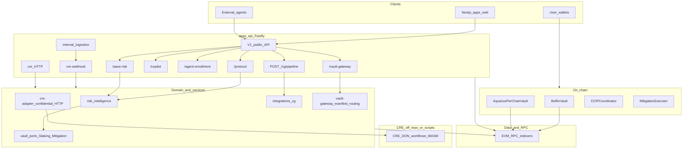
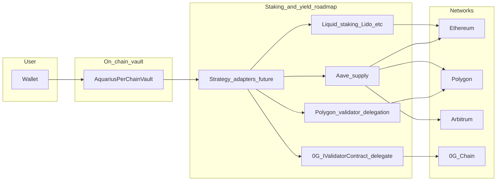

## What this page covers

**0G (Zero Gravity)** is an external decentralized AI and L1 ecosystem. Aquarius uses a **ZG-prefixed server integration** for an optional **intelligence pipeline** and exposes **advisory** cross-chain vault routing that includes a logical **0G chain** entry. This is **complementary** to [Chainlink CRE](/docs/architecture) and **does not** custody user private keys.

For the full stack diagram, see [System Overview](/docs/architecture).

## Full stack API and domain (current)

## ZG pipeline (API)

The **ZG** prefix (`ZG_*` environment variables) names the **Zero Gravity–aligned** server pipeline in the repo at `apps/api/src/integrations/zg/`.

| Capability | Description |
|-------------|-------------|
| **Commitment** | SHA-256 over canonical JSON (`0x…` hex), stable for auditing |
| **Modes** | `mock` (no outbound calls), `live` (optional inference), `off` (503) |
| **Optional inference** | OpenAI-compatible `POST …/v1/chat/completions` when `ZG_INFERENCE_BASE_URL` is set |
| **Optional storage bridge** | `ZG_STORAGE_BRIDGE_URL` — POST commitment + payload to your uploader (e.g. future 0G Storage worker) |

**Route:** `POST /api/v1/zg/pipeline` — see [API Reference](/docs/api#zg-pipeline-and-vault-gateway).

**Config:** `apps/api/src/integrations/zg/config.ts`.

## Vault gateway (advisory)

`apps/api/src/services/vault-gateway/` exposes:

- `GET /api/v1/vault-gateway/manifest` — architecture layers and registered chains
- `GET /api/v1/vault-gateway/routing?chain=&asset=` — buffer vs yield **sleeves** and strategy **kinds** (advisory only)

Chains include logical **`og_chain`** (aliases `0g`, `og`, `galileo` in query). This **does not** move funds or perform delegation.

## On-chain: per-chain vault (not staking yet)

`contracts/src/vaults/AquariusPerChainVault.sol` — ERC-20 share vault; deploy **per chain** with `deploymentChainId` and `chainKey`. **Staking / 0G delegation** is **not** implemented inside this contract; it is a **shell** for future **strategy adapters**.

Deploy notes: `contracts/src/vaults/README.md`.

## Vault, staking, and yield (roadmap)

## Boundaries vs Chainlink CRE

| Layer | CRE | ZG pipeline |
|--------|-----|-------------|
| **Role** | Orchestration, DON workflows, confidential dispatch | Optional AI-scale commitment + inference + bridge hook |
| **Trust** | Consensus-oriented workflow semantics | Server-side advisory; validate all inputs |

## Out of scope (today)

- Full **@0gfoundation/0g-ts-sdk** storage upload in the API process (can be added later with funded keys and audits)
- **Native 0G delegation** from `AquariusPerChainVault` without a separate audited strategy module

## External reference

- [0G documentation](https://docs.0g.ai/)
