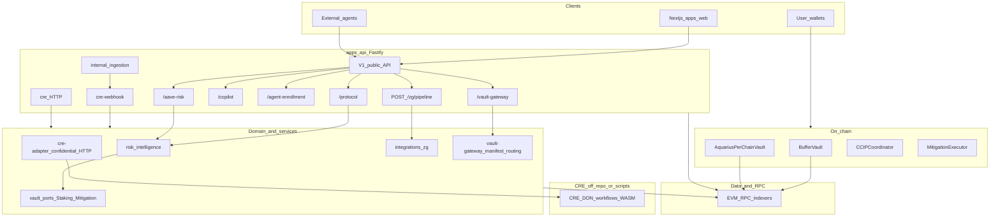
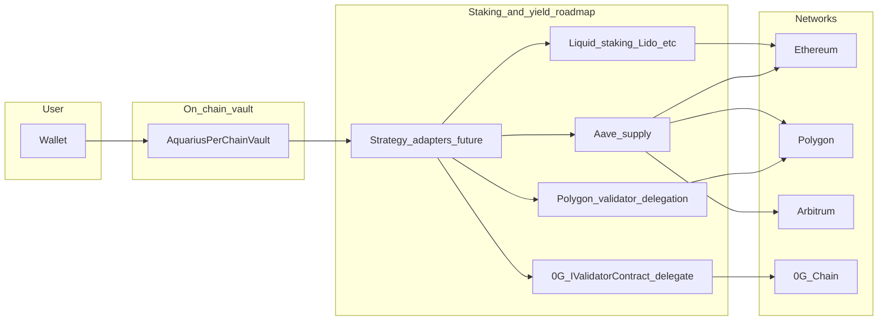

## What this page covers

**0G (Zero Gravity)** is a decentralized AI and chain ecosystem ([0G documentation](https://docs.0g.ai/))—chain, scalable data availability for AI-scale payloads, and decentralized compute/serving. Aquarius integrates along that story through **ZG** (`ZG_*` configuration), a **ZG pipeline** for commitment- and inference-aware flows, and a **vault gateway** with advisory routing (including logical **0G chain**). The sections below follow that infrastructure narrative and separate **what ships in this repo** from **planned next steps**. This stack is **complementary** to [Chainlink CRE](/docs/architecture); Aquarius does not custody user private keys.

For the full stack diagram, see [System Overview](/docs/architecture).

## Full stack API and domain (current)

## Chain and routing

Maps the **0G chain / multi-chain** angle to Aquarius.

- **In this repo:** Read-only **vault gateway** — `apps/api/src/services/vault-gateway/` exposes `GET /api/v1/vault-gateway/manifest` (layers and registered chains) and `GET /api/v1/vault-gateway/routing?chain=&asset=` (buffer vs yield **sleeves**, strategy **kinds**). Responses include logical **`og_chain`** (aliases `0g`, `og`, `galileo` in query). **Advisory only**; does not move funds or perform delegation.
- **Roadmap:** On-chain **strategy adapters** and optional **delegation / yield** paths toward 0G-style networks—see the roadmap diagram below; not live in `AquariusPerChainVault` yet.

## Data and availability

Aligns with **0G Storage / DA**—large, attestable data off the hot settlement path.

- **In this repo:** Optional **`ZG_STORAGE_BRIDGE_URL`**: the ZG pipeline can **POST** commitment metadata and payload to **your** bridge or uploader (e.g. a future 0G Storage–aligned worker). Controlled **hook**, not an in-process 0G Storage SDK.
- **Roadmap:** Deeper integration with **0G Storage / DA** if you standardize on their stack behind that bridge.

## AI and inference

Aligns with **0G compute / serving**—model and inference scaled as infrastructure.

The **ZG** prefix (`ZG_*`) names the server pipeline at `apps/api/src/integrations/zg/`.

| Capability | Description |
|-------------|-------------|
| **Commitment** | SHA-256 over canonical JSON (`0x…` hex), stable for auditing |
| **Modes** | `mock` (no outbound calls), `live` (optional inference), `off` (503) |
| **Optional inference** | OpenAI-compatible `POST …/v1/chat/completions` when `ZG_INFERENCE_BASE_URL` is set |
| **Optional storage bridge** | `ZG_STORAGE_BRIDGE_URL` — POST commitment + payload to your uploader |

**Route:** `POST /api/v1/zg/pipeline` — see [API Reference](/docs/api#zg-pipeline-and-vault-gateway).

**Config:** `apps/api/src/integrations/zg/config.ts`.

- **Roadmap:** First-class routing to **0G Compute / serving** APIs if you replace or augment the generic HTTP inference endpoint.

## Verifiability and audit trail

Aligns with **verifiable intelligence**—outputs that can be traced without blind trust.

- **In this repo:** **SHA-256 commitment** over **canonical JSON** in `integrations/zg/commitment.ts` and `pipeline.ts` — stable **hex fingerprint** for auditing.
- **Roadmap:** Richer **attestation** or **dispute-style verification** if you add them explicitly.

## On-chain vault

Aquarius’s **EVM** shell for per-chain vault logic.

- **In this repo:** `contracts/src/vaults/AquariusPerChainVault.sol` — ERC-20 share vault; deploy per chain with `deploymentChainId` and `chainKey`. **`StakingPort`** in `apps/api/src/protocols/aave/vaults/application/ports/vault.port.ts` for future yield/staking wiring. Deploy notes: `contracts/src/vaults/README.md`.
- **Roadmap:** Allowlisted **strategy modules** (LST, lending sleeves, **0G delegation**-style strategies)—not implied as implemented in-contract today.

## Vault, staking, and yield (roadmap)

## Boundary with Chainlink CRE

| Layer | CRE | ZG pipeline |
|--------|-----|-------------|
| **Role** | Orchestration, DON workflows, confidential dispatch | Optional AI-scale commitment + inference + bridge hook |
| **Trust** | Consensus-oriented workflow semantics | Server-side advisory; validate all inputs |

**Division of responsibility:** **Chainlink CRE** remains the **primary orchestration path for mitigation**. The ZG pipeline and vault gateway **complement** CRE without replacing escalation and execution routing.

## Out of scope (today)

- Full **@0gfoundation/0g-ts-sdk** storage upload in the API process (can be added later with funded keys and audits)
- **Native 0G delegation** from `AquariusPerChainVault` without a separate audited strategy module

## Configuration and references

- **Environment:** `apps/api/src/integrations/zg/config.ts` — e.g. `ZG_PIPELINE_MODE`, `ZG_INFERENCE_BASE_URL`, `ZG_STORAGE_BRIDGE_URL`
- [0G documentation](https://docs.0g.ai/)
