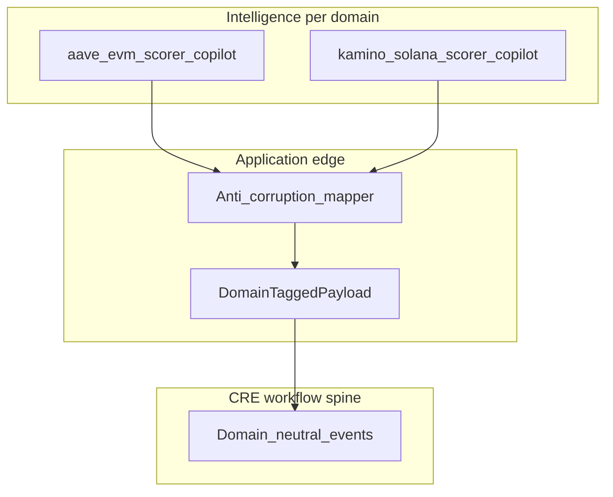

# ADR 0001: Domains and boundaries

## Status

Accepted

## Context

Aquarius is adding a **second integration family** (e.g. Solana + Kamino) alongside the existing EVM/Aave stack. That requires explicit **bounded contexts** so implementation does not drift.

Agreed principles:

- **Orchestration (CRE, workflow runners)** can stay **workflow-oriented** and **domain-neutral** at the spine: stages, triggers, dispatch, correlation.
- **Intelligence** (risk scoring, monitoring, copilot context, embeddings, explanations) must remain **protocol- or domain-specific**. There is no “global copilot” that mixes Aave and Kamino semantics without an explicit **router** that selects a domain-specific implementation.
- **Shared kernel** stays **minimal**: only types and identifiers that truly cross boundaries.

Existing shared types in [`packages/types/risk/base.ts`](../../packages/types/risk/base.ts) define `ProtocolId` and `EvaluatableRisk`. `RiskMetadata` includes a **numeric EVM `chainId`**, which does not model Solana clusters. Kamino-specific snapshots and metadata evolution are **out of scope** for this ADR; they will follow in a later ADR or implementation phase.

## Decision

### 1. Canonical domain IDs (`AquariusDomainId`)

Stable strings for URLs, logs, config, and analytics:

| Domain ID        | Description                          |
|-----------------|--------------------------------------|
| `aave-evm`      | Aave (and EVM family) bounded stack  |
| `kamino-solana` | Kamino on Solana bounded stack       |

New domains extend this union in [`packages/types/domain/boundaries.ts`](../../packages/types/domain/boundaries.ts).

### 2. Legacy `ProtocolId` mapping

[`ProtocolId`](../../packages/types/risk/base.ts) today is `"aave" | "lido" | "uniswap"`. It remains for existing risk API and `EvaluatableRisk` until a deliberate migration.

| `ProtocolId` | `AquariusDomainId` | Notes                                        |
|---------------|-------------------|----------------------------------------------|
| `aave`        | `aave-evm`        | Locked in `LEGACY_PROTOCOL_TO_DOMAIN`        |
| `lido`        | TBD               | e.g. `lido-evm` in a follow-up ADR           |
| `uniswap`     | TBD               | e.g. `uniswap-evm` in a follow-up ADR        |
| *(future)* `kamino` | `kamino-solana` | Add to `ProtocolId` when Kamino ships        |

### 3. Shared kernel (what may cross boundaries)

Allowed to cross domain boundaries in **stable, documented** form:

- **User / tenant identifiers** (opaque strings or UUIDs).
- **Escalation stage** as a **named** concept (enum or string union agreed at the application layer)—not protocol-specific structs.
- **`MitigationIntent` shape** (documented here as a contract; full implementation evolves elsewhere):

```ts
/** Cross-domain intent envelope — concrete payloads are domain-specific. */
interface MitigationIntent {
  readonly intentId: string;
  readonly domain: AquariusDomainId; // from packages/types/domain/boundaries.ts
  readonly actionKind: string;
  readonly createdAt: number;
}
```

Domain-specific execution details (calldata, Solana instructions, etc.) stay **inside** the relevant bounded context.

### 4. Intelligence boundary

- Every **scorer**, **monitor**, and **copilot context builder** is **scoped** by `AquariusDomainId` (or lives under a module path that implies it).
- Routing: a thin **router** may dispatch by `domain` to `aave-evm` vs `kamino-solana` implementations; the router must not embed protocol logic—only delegation.

### 5. CRE boundary

- CRE consumes **domain-neutral workflow events** plus a **domain-tagged payload** [`DomainTaggedPayload<T>`](../../packages/types/domain/boundaries.ts).
- **Pattern:** `{ domain: AquariusDomainId; schemaVersion: string; payload: T }` where `T` is **opaque to CRE core** or mapped **once at the application edge** (anti-corruption layer). CRE core does not import Kamino SDK types or Aave-specific DTOs.
- Mapping happens **before** persistence or **after** CRE output when translating to domain actions.

### 6. Risk metadata evolution

- EVM paths continue to use `RiskMetadata.chainId` as today.
- Non-EVM domains (e.g. `kamino-solana`) will use **domain-specific snapshots** and extended metadata in a **separate** change; do not overload `chainId` for Solana.

## Diagram



## Consequences

- New code **should** use `AquariusDomainId` for cross-cutting concerns; legacy strings like UI `protocol: "aave"` can map via `LEGACY_PROTOCOL_TO_DOMAIN` where needed.
- Adding a domain requires: extend `AquariusDomainId`, add ADR appendix or new ADR if invariants differ materially, add domain-specific intelligence modules.
- CRE refactor to consume `DomainTaggedPayload` everywhere is **incremental**; this ADR does not require an immediate rewrite of [`packages/domain/cre/run-cre-workflow.ts`](../../packages/domain/cre/run-cre-workflow.ts).

## References

- [`docs/architecture.md`](../architecture.md)
- [`packages/types/domain/boundaries.ts`](../../packages/types/domain/boundaries.ts)
- [ADR 0002 — Kamino bounded context surface](0002-kamino-solana-bounded-context.md) (snapshot layering, CRE workflow IDs)
