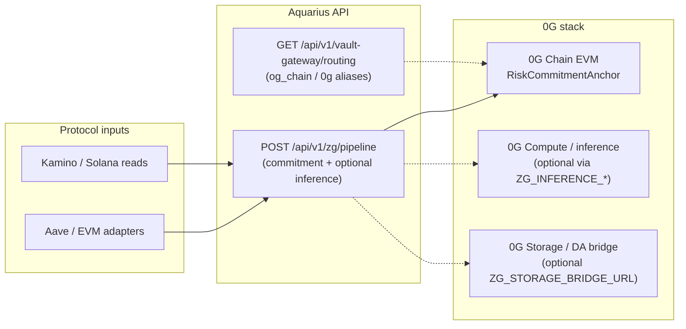

# Aquarius — 0G APAC Hackathon Submission

> **Judge README** — Structured per 0G APAC documentation requirements: project overview, architecture, 0G modules, product support, reproduction, and reviewer notes.  
> See the [main README](../../README.md) for full architecture and technical proof.

<p align="center">
  <a href="https://aquarius-web.vercel.app/">
    
  </a>
  &nbsp;
  <a href="https://youtu.be/b-kWwo4hqwk">
    
  </a>
  &nbsp;
  <a href="https://aquarius-web.vercel.app/docs/introduction">
    
  </a>
</p>

---

## 1. Project overview

**Aquarius** is a protocol-aware risk intelligence and mitigation system for DeFi positions. It continuously monitors position health, computes **deterministic** risk signals off-chain, escalates through a defined state machine, and can trigger **policy-bound** protective actions before liquidation thresholds are reached.

For **0G APAC**, we focused on the **intelligence and attestability layer** aligned with 0G’s stack:

- A **ZG pipeline** (`POST /api/v1/zg/pipeline`) that produces canonical, hashable risk commitments and optional AI inference hooks.
- **Vault-gateway** advisory routing with logical **0G chain** aliases (`og_chain`, `0g`, `galileo`).
- **0G Chain (EVM)** on-chain anchoring of those commitments via `RiskCommitmentAnchor`.

**Complementary work (other tracks, same repo):** Solana/Kamino monitoring (see [Colosseum Frontier](./colosseum-frontier.md)) and Chainlink CRE orchestration (see [Chainlink Convergence](./chainlink-convergence.md)). This README centers on **0G** only.

**Live demo**

- **App:** <https://aquarius-web.vercel.app/>
- **Walkthrough:** <https://youtu.be/b-kWwo4hqwk>
- **Intro:** <https://youtu.be/Z0YKaZFClW4>
- **Deeper 0G notes:** [main README — Zero Gravity (0G) and ZG pipeline](../../README.md#zero-gravity-0g-and-zg-pipeline)

---

## 2. System architecture

### 2.1 High-level flow (0G-relevant path)



**Solid arrows** = implemented and demonstrable today. **Dotted** = configured hooks / roadmap (see §3).

### 2.2 Technical description

| Layer | Responsibility |
|--------|----------------|
| **Risk engine** | Deterministic scoring and escalation (off-chain). |
| **ZG pipeline** | Canonical JSON → SHA-256 **commitment**; optional OpenAI-compatible inference; optional storage bridge POST. |
| **Vault-gateway** | Advisory manifest and routing; normalizes `0g` / `galileo` / `og_chain` for planning (execution on `og_chain` remains advisory-only today). |
| **RiskCommitmentAnchor** | Minimal EVM contract on **0G Chain** storing `bytes32` commitment + context string for auditability. |
| **CRE / execution** | Mitigation orchestration via Chainlink CRE (separate integration; not required to verify the 0G path). |

Full repo architecture: [`docs/architecture.md`](../architecture.md).  
API contract: [`docs/api/public-surface.md`](../api/public-surface.md).

---

## 3. Which 0G modules are used

| 0G module | Status in this submission | Evidence in repo |
|-----------|---------------------------|------------------|
| **0G Chain (EVM)** | **Used — Galileo testnet deploy** | [`contracts/src/og/RiskCommitmentAnchor.sol`](../../contracts/src/og/RiskCommitmentAnchor.sol), [`apps/api/scripts/0g-chain-anchor.ts`](../../apps/api/scripts/0g-chain-anchor.ts) |
| **0G-aligned data / AI pipeline** | **Used — API + commitment hashing** | [`apps/api/src/integrations/zg/`](../../apps/api/src/integrations/zg/), `POST /api/v1/zg/pipeline` |
| **0G Compute (inference)** | **Optional hook** — active when `ZG_INFERENCE_*` is set; demos often use `ZG_PIPELINE_MODE=mock` | `ZG_INFERENCE_BASE_URL`, `ZG_INFERENCE_API_KEY`, `ZG_INFERENCE_MODEL` |
| **0G Storage / DA** | **Exploratory** — optional `ZG_STORAGE_BRIDGE_URL`; not claimed as production DA | ZG config + [main README](../../README.md#zero-gravity-0g-and-zg-pipeline) |
| **Validator / staking** | **Roadmap intent** — aligns with vault strategy; **not** a hackathon deliverable | [`docs/vault-strategy.md`](../vault-strategy.md) |

We do **not** claim live **mainnet** deployment or production 0G Storage/Compute in this submission.

### Why we deployed on Galileo testnet, not 0G mainnet

Aquarius touches **real user economic risk** (lending health, mitigation, buffer vaults). Our team policy for this hackathon:

1. **Product safety** — Core execution paths (Kamino/Solana, vault buffers, autonomous agents) are still in **validation and audit** before any production mainnet posture for user funds.
2. **Scope of `RiskCommitmentAnchor`** — This contract **does not custody user funds**; it only records commitment hashes for attestability. Even so, we kept **all 0G Chain writes on Galileo (chain id 16602)** to match the same pre-audit bar as the rest of the stack.
3. **Reproducibility for judges** — Testnet gas is available via the [public faucet](https://faucet.0g.ai) so reviewers can redeploy without purchasing mainnet 0G.

**Planned next step:** Redeploy `RiskCommitmentAnchor` on **0G mainnet (16661)** after internal validation and external audit, using the same script with `OGF_NETWORK=mainnet` (see [`docs/integrations/0g-chain-hackquest-proof.md`](../integrations/0g-chain-hackquest-proof.md)).

**Team-deployed testnet proof (verifiable on explorer):**

| Item | Value |
|------|--------|
| Network | 0G Galileo Testnet (**16602**) |
| Contract | `0x42bc3b6d386cb040f8109f520a3376bb1630c1dd` |
| Contract explorer | <https://chainscan-galileo.0g.ai/address/0x42bc3b6d386cb040f8109f520a3376bb1630c1dd> |
| Deploy transaction | <https://chainscan-galileo.0g.ai/tx/0x4d0a71feb2591e21c17e4ddda4d9f194e434ad332184fb4f1e67d93dc9085fa0> |

Judges may deploy their **own** contract on Galileo using §5.4 (recommended).

---

## 4. How 0G modules support the product

| 0G module | Product role |
|-----------|----------------|
| **ZG pipeline + commitments** | Turns protocol monitoring output into a **deterministic, verifiable hash** that agents, dashboards, and auditors can reference without trusting opaque LLM text alone. |
| **0G Chain anchor** | Publishes that commitment on **0G Chain** so third parties can verify “this risk snapshot existed at this time” via block explorer — supports hackathon and long-term audit narratives. |
| **Vault-gateway 0G routing** | Lets buffer/yield strategy planning reference **logical 0G chain** routes consistently in manifests (`og_chain` is advisory today; execution adapters are roadmap). |
| **Inference / storage hooks** | Path to run model or persistence workloads on 0G infrastructure without rewriting the core risk engine; gated by env and mode flags. |

**One-line story for judges:**  
*Aquarius computes deterministic risk commitments → optional AI enrichment → anchors the commitment hash on 0G Chain for public verifiability, while keeping high-risk fund movement off mainnet until audit.*

---

## 5. Local deployment and reproduction (for judges)

### 5.1 Prerequisites

- **Node.js** ≥ 20, **pnpm** 10.x (see root `package.json`)
- Git clone of this repository
- Copy [`.env.example`](../../.env.example) → `.env` (never commit `.env`)

### 5.2 Install and compile

```bash
pnpm install
pnpm compile:contracts
```

### 5.3 Run API (minimal 0G demo)

```bash
# In .env for a quick judge run:
# ZG_PIPELINE_MODE=mock
# PORT=3001

pnpm dev --filter api
```

**Pipeline (commitment):**

```bash
curl -s -X POST "http://localhost:3001/api/v1/zg/pipeline" \
  -H "Content-Type: application/json" \
  -d '{"protocol":"kamino","chain":"solana","contextRef":"0g-apac-judge-demo"}'
```

Copy `commitment` from the JSON response (`0x` + 64 hex chars).

**Vault-gateway (0G routing alias — advisory GET):**

```bash
curl -s "http://localhost:3001/api/v1/vault-gateway/routing?chain=0g&asset=OG"
```

Response normalizes `chain` to `og_chain`. See [`docs/api/public-surface.md`](../api/public-surface.md) for other routes.

### 5.4 Optional — deploy your own anchor on Galileo

Full checklist: [`docs/integrations/0g-chain-hackquest-proof.md`](../integrations/0g-chain-hackquest-proof.md).

```bash
# .env (judge-owned wallet — NEVER commit keys)
# OGF_NETWORK=testnet
# OGF_ANCHOR_PRIVATE_KEY=0x<64-hex>

pnpm 0g:chain:deploy:testnet
# → save OGF_ANCHOR_CONTRACT_ADDRESS from output

pnpm --filter api exec tsx --env-file=../../.env scripts/0g-chain-anchor.ts anchor <commitment-from-pipeline> "0g-apac-judge-demo"
```

The `anchor` command prints a Galileo ChainScan transaction URL — a second on-chain proof beyond deploy.

### 5.5 Optional — web UI

```bash
pnpm dev --filter web
```

Open the URL shown in the terminal (typically `http://localhost:3000`). Production build is also on Vercel (badge above).

### 5.6 Key codebase map

| Path | Purpose |
|------|---------|
| [`apps/api/src/integrations/zg/`](../../apps/api/src/integrations/zg/) | ZG pipeline implementation |
| [`apps/api/src/routes/v1/zg/`](../../apps/api/src/routes/v1/zg/) | HTTP routes |
| [`contracts/src/og/RiskCommitmentAnchor.sol`](../../contracts/src/og/RiskCommitmentAnchor.sol) | Anchor contract |
| [`apps/api/scripts/0g-chain-anchor.ts`](../../apps/api/scripts/0g-chain-anchor.ts) | Deploy / anchor CLI |
| [`docs/integrations/0g-chain-hackquest-proof.md`](../integrations/0g-chain-hackquest-proof.md) | Deploy / anchor env vars and troubleshooting |

---

## 6. Reviewer notes (test accounts, faucet, network)

### 6.1 0G Galileo testnet (for redeploy / anchor)

| Field | Value |
|--------|--------|
| Network name | 0G Galileo Testnet |
| RPC | `https://evmrpc-testnet.0g.ai` |
| Chain ID | `16602` |
| Currency symbol | `0G` |
| Block explorer | <https://chainscan-galileo.0g.ai> |
| Faucet | <https://faucet.0g.ai> |

Judges need their **own** funded wallet and `OGF_ANCHOR_PRIVATE_KEY` in `.env` to deploy. We do **not** share private keys.

### 6.2 Team-deployed contract (read-only verification)

Verify our deployment without running scripts:

- **Contract:** `0x42bc3b6d386cb040f8109f520a3376bb1630c1dd` on **Galileo**
- **Deploy tx:** <https://chainscan-galileo.0g.ai/tx/0x4d0a71feb2591e21c17e4ddda4d9f194e434ad332184fb4f1e67d93dc9085fa0>

Run §5.4 `anchor` locally to produce an additional **anchor** transaction URL on the same contract (recommended for judges who want to see a write call, not only contract creation).

### 6.3 API / demo accounts

- **Public demo:** <https://aquarius-web.vercel.app/> — no login required for monitoring views; wallet connect where applicable.
- **Local API:** no shared judge API key required when `ZG_PIPELINE_MODE=mock`.
- **Secrets:** `ZG_INFERENCE_API_KEY`, `OGF_ANCHOR_PRIVATE_KEY`, and private RPC keys are **bring-your-own** via `.env` only.

### 6.4 What we do not provide

- Mainnet 0G contract address (intentionally deferred — §3).
- Shared deployer private key (security).
- Production 0G Storage or Compute endpoints (optional env only).

---

## 7. How this fits the broader Aquarius stack

| Track | Doc | Role |
|-------|-----|------|
| **0G APAC** | This file | 0G pipeline + Chain anchor + data/AI infrastructure |
| **Colosseum Frontier** | [colosseum-frontier.md](./colosseum-frontier.md) | Solana / Kamino detection |
| **Chainlink Convergence** | [chainlink-convergence.md](./chainlink-convergence.md) | CRE orchestration and mitigation |

---

## 8. References

- [0G Chain integration (deploy / anchor checklist)](../integrations/0g-chain-hackquest-proof.md)
- [Main README — 0G section](../../README.md#zero-gravity-0g-and-zg-pipeline)
- [Architecture](../architecture.md)
- [Vault strategy](../vault-strategy.md)
