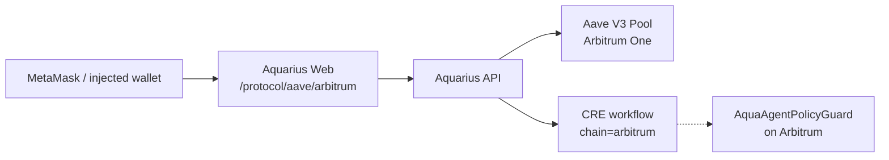

# Aquarius — Arbitrum Open House London Buildathon Submission

> **Judge README** — Arbitrum risk agent track: Aave on Arbitrum One, CRE orchestration, on-chain policy guard.  
> See the [main README](../../README.md) for full architecture.

<p align="center">
  <a href="https://aquarius-web.vercel.app/protocol/aave/arbitrum">
    
  </a>
  &nbsp;
  <a href="https://aquarius-web.vercel.app/">
    
  </a>
  &nbsp;
  <a href="https://github.com/FrankezeCode/Aquarius">
    
  </a>
</p>

---

## TL;DR (30 seconds)

**Aquarius is an agentic DeFi risk system on Arbitrum:** read Aave v3 positions on **Arbitrum One (42161)**, score risk deterministically, orchestrate via **Chainlink CRE**, and enforce bounds with **`AquaAgentPolicyGuard`** on-chain.

- **Live path:** Connect wallet on `/protocol/aave/arbitrum` → user risk + CRE agent loop.
- **Judge API:** `GET /api/v1/aave-risk/arbitrum/agent-pack/:address` — one-shot demo bundle.
- **On-chain proof:** `AquaAgentPolicyGuard` on **Arbitrum Sepolia** — `0xf02f4e1d59c156dde20fa84007f69a45deb4a6fa` ([Arbiscan](https://sepolia.arbiscan.io/address/0xf02f4e1d59c156dde20fa84007f69a45deb4a6fa)). Judges can redeploy with `pnpm arbitrum:policy-guard:deploy:sepolia`.

---

## 1. Project overview

Aquarius monitors DeFi lending health and escalates through **observe → protect → escalate** before liquidation. For **Arbitrum Open House**, we ship the **Arbitrum execution venue**:

| Step | What happens |
|------|----------------|
| **Monitor** | Aave v3 `getUserAccountData` on Arbitrum via RPC |
| **Score** | Deterministic health / severity + AI recommendation |
| **Orchestrate** | `GET /api/cre/run?chain=arbitrum` — CRE workflow spine |
| **Policy** | `AquaAgentPolicyGuard` on Arbitrum — amount/frequency bounds for autonomous actions |

**Complementary tracks:** [Colosseum Frontier](./colosseum-frontier.md) (Solana/Kamino detection), [Chainlink Convergence](./chainlink-convergence.md) (CRE backbone), [0G APAC](./0g-apac.md) (commitment anchoring).

### Live demo

| Resource | Link |
|----------|------|
| **Arbitrum Aave agent UI** | <https://aquarius-web.vercel.app/protocol/aave/arbitrum> |
| **Full app** | <https://aquarius-web.vercel.app/> |
| **GitHub** | <https://github.com/FrankezeCode/Aquarius> |

---

## 2. System architecture



| Layer | Path |
|--------|------|
| **Reads** | `AaveContractReader` + pool `0x794a61358D6845594F94dc1DB02A252b5b4814aD` on Arbitrum |
| **User risk API** | `GET /api/v1/aave-risk/user-risk/:address?chain=arbitrum` |
| **Agent bundle** | `GET /api/v1/aave-risk/arbitrum/agent-pack/:address` |
| **CRE poll** | `GET /api/cre/run?chain=arbitrum` |
| **Policy contract** | `contracts/src/AquaAgentPolicyGuard.sol` |

---

## 3. Arbitrum integration (what is used)

| Component | Status | Evidence |
|-----------|--------|----------|
| **Arbitrum One (42161)** | **Used** — Aave v3 reads + CRE `chain=arbitrum` | [`chain.ts`](../../apps/api/src/routes/v1/aave-risk/chain.ts), [`constants.ts`](../../apps/api/src/infrastructure/aave/constants.ts) |
| **AquaAgentPolicyGuard** | **Used — Arbitrum Sepolia deploy** | [`AquaAgentPolicyGuard.sol`](../../contracts/src/AquaAgentPolicyGuard.sol), [`arbitrum-policy-guard.ts`](../../apps/api/scripts/arbitrum-policy-guard.ts) |
| **CRE orchestration** | **Used** | [`/api/cre/run`](../../apps/api/src/routes/cre/index.ts), [`run-cre-workflow.ts`](../../packages/domain/cre/run-cre-workflow.ts) |
| **Vault-gateway** | **Advisory** — `arbitrum` in manifest | [`manifest.ts`](../../apps/api/src/services/vault-gateway/manifest.ts) |
| **Full AquaAgent + mitigation** | **Roadmap** — policy guard first for hackathon scope | [`AquaAgent.sol`](../../contracts/src/AquaAgent.sol) |

We do **not** claim production mainnet autonomous mitigation in this submission.

### Why we deployed on Arbitrum Sepolia, not Arbitrum One

Aquarius touches **real user economic risk** (lending health, mitigation, buffer vaults). Our team policy for this buildathon:

1. **Product safety** — Core execution paths (autonomous agents, buffer vaults, full mitigation) remain in **validation and audit** before production mainnet posture for user funds.
2. **Scope of `AquaAgentPolicyGuard`** — This contract **does not custody user funds**; it enforces per-action and daily USD bounds for policy-bound agents. Even so, we kept **on-chain guard writes on Arbitrum Sepolia (chain id 421614)** to match the same pre-audit bar as the rest of the stack.
3. **Reproducibility for judges** — Sepolia ETH is available from public faucets so reviewers can redeploy without mainnet capital.

**Planned next step:** Redeploy `AquaAgentPolicyGuard` on **Arbitrum One (42161)** after internal validation and external audit, using `pnpm arbitrum:policy-guard:deploy`.

**Team-deployed testnet proof (verifiable on explorer):**

| Item | Value |
|------|--------|
| Network | Arbitrum Sepolia (**421614**) |
| Contract | `AquaAgentPolicyGuard` |
| Address | `0xf02f4e1d59c156dde20fa84007f69a45deb4a6fa` |
| Contract explorer | <https://sepolia.arbiscan.io/address/0xf02f4e1d59c156dde20fa84007f69a45deb4a6fa> |
| Deploy transaction | <https://sepolia.arbiscan.io/tx/0x618471c0e07eb1b4b7eadd7b16218a8ae77ec690a86da9b12f354c0c342c8a17> |

Judges may deploy their **own** policy guard on Sepolia using §5.4 (recommended).

---

## 4. How Arbitrum supports the product

Arbitrum’s **low fees and fast blocks** make sub-minute risk polling and future automated mitigation viable for retail users. Aquarius uses Arbitrum as the **primary EVM execution rail** where CRE workflows already list `arbitrum` as executable alongside ethereum and polygon.

**One-line pitch:** *Detect Aave risk on Arbitrum → CRE agent decides → on-chain policy guard bounds any autonomous mitigation.*

---

## 5. Local reproduction (judges)

### 5.1 Prerequisites

- Node.js ≥ 20, pnpm 10.x
- Clone repo, copy `.env.example` → `.env`

### 5.2 Quick demo (mock — no RPC)

```bash
pnpm install
pnpm dev --filter api
```

```bash
# CRE agent loop on Arbitrum (mock positions)
curl -s "http://localhost:3001/api/cre/run?chain=arbitrum"

# Full agent pack (any valid 0x address in mock mode)
pnpm arbitrum:agent-demo -- 0x0000000000000000000000000000000000000001
```

### 5.3 Live Aave on Arbitrum One

```bash
# .env
DATA_PROVIDER_MODE=onchain
RPC_URL_ARBITRUM=https://arb-mainnet.g.alchemy.com/v2/<key>

pnpm dev --filter api
curl -s "http://localhost:3001/api/v1/aave-risk/user-risk/0x<wallet>?chain=arbitrum"
```

### 5.4 Deploy policy guard (on-chain proof)

**Arbitrum Sepolia (recommended for first deploy):**

```bash
# ARBITRUM_NETWORK=sepolia
# ARBITRUM_DEPLOY_PRIVATE_KEY=0x…

pnpm arbitrum:policy-guard:deploy:sepolia
```

**Arbitrum One:**

```bash
pnpm arbitrum:policy-guard:deploy
```

Save `ARBITRUM_POLICY_GUARD_ADDRESS` from output. Agent pack responses include this address when set.

### 5.5 Web UI

```bash
pnpm dev --filter web
```

Open `http://localhost:3000/protocol/aave/arbitrum` — connect wallet on **Arbitrum One**.

---

## 6. Reviewer notes

| Network | Chain ID | Default RPC | Explorer |
|---------|----------|-------------|----------|
| **Arbitrum One** | `42161` | `https://arb1.arbitrum.io/rpc` | <https://arbiscan.io> |
| **Arbitrum Sepolia** | `421614` | `https://sepolia-rollup.arbitrum.io/rpc` | <https://sepolia.arbiscan.io> |

- **Secrets:** `ARBITRUM_DEPLOY_PRIVATE_KEY`, RPC keys — env only, never commit.
- **Execution POSTs** remain gated (`VAULT_GATEWAY_EXECUTION_ENABLED=false` by default).
- **Best Agentic Project angle:** CRE + AI recommendation + policy guard = bounded autonomy.
- **Team contract (Sepolia):** `0xf02f4e1d59c156dde20fa84007f69a45deb4a6fa` — set `ARBITRUM_POLICY_GUARD_ADDRESS` in `.env` so agent-pack responses include it.

---

## 7. How this fits the broader stack

| Track | Role |
|-------|------|
| **Arbitrum Open House** | EVM agent + Aave on L2 + on-chain policy |
| **Chainlink Convergence** | CRE orchestration spine |
| **Colosseum Frontier** | Solana detection |
| **0G APAC** | Commitment attestability |

---

## 8. References

- [Chainlink Convergence submission](./chainlink-convergence.md)
- [Public API surface](../api/public-surface.md)
- [ADR 0003 — Orchestration & execution](../adr/0003-phase0-orchestration-and-execution.md)
- [Aave contract reader](../../apps/api/src/infrastructure/aave/AaveContractReader.ts)
