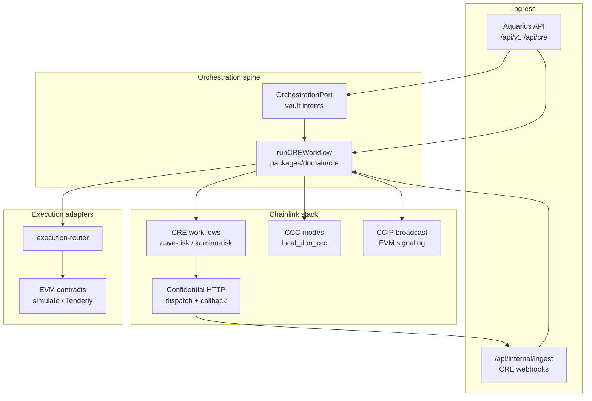

# Aquarius — Chainlink Convergence Hackathon Submission

> **Judge README** — Structured for Chainlink Convergence review: project overview, architecture, Chainlink modules, product support, reproduction, and reviewer notes.  
> See the [main README](../../README.md) for full architecture, validation artifacts, and the [CRE Requirement Compliance Checklist](../../README.md#cre-requirement-compliance-checklist-submission-proof-pack).

<p align="center">
  <a href="https://chain.link/hack-26/projects/aquarius">
    
  </a>
  &nbsp;
  <a href="https://aquarius-web.vercel.app/">
    
  </a>
  &nbsp;
  <a href="https://youtu.be/b-kWwo4hqwk">
    
  </a>
  &nbsp;
  <a href="../../README.md">
    
  </a>
</p>

---

## TL;DR (30 seconds)

**Aquarius uses Chainlink CRE as the orchestration spine** that turns deterministic risk signals into **staged, traceable, policy-bound** mitigation — observe → protect → escalate — with **CCC execution modes**, **confidential HTTP** dispatch/callback validation, **CCIP-style** cross-chain signaling, and a **vault-gateway** intent rail gated for safety.

- **Shipped in repo:** CRE workflows (`aave-risk`, `kamino-risk`), `runCREWorkflow` core, API `/api/cre`, webhook ingest, local DON + CLI simulation proofs.
- **Hackathon posture:** **Simulation-first** and **execution-gated** (`VAULT_GATEWAY_EXECUTION_ENABLED=false` by default) until audit and production DON cutover.
- **Complements:** [Colosseum Frontier](./colosseum-frontier.md) (detection) and [0G APAC](./0g-apac.md) (ZG commitments / 0G Chain anchor).

**Online submission:** <https://chain.link/hack-26/projects/aquarius>

---

## 1. Project overview

### 1.1 What Aquarius is (Convergence slice)

Aquarius is a protocol-aware **risk intelligence and mitigation** system. For **Chainlink Convergence**, we built the **controlled execution and orchestration backbone**:

1. **Monitor** — read position health (Aave EVM today; Kamino/Solana via bounded context).
2. **Detect** — deterministic scoring + escalation state machine.
3. **Orchestrate** — `runCREWorkflow` evaluates policy and dispatches CRE-compatible workflows.
4. **Act (gated)** — CCC adapters (`local_don_ccc` in validation), execution router, optional vault-gateway `POST` intents.
5. **Signal (optional)** — CCIP-style risk broadcast on configured EVM deployments.

### 1.2 Problem

Reactive dashboards show metrics but do not **orchestrate** protection. Users need a layer that connects **deterministic risk** to **traceable automation** with explicit policy, rate limits, and non-custodial API boundaries ([ADR 0003](../adr/0003-phase0-orchestration-and-execution.md)).

### 1.3 Solution (Convergence scope)

| Capability | Role |
|------------|------|
| **CRE workflows** | Orchestration layer per hackathon requirement — cron/HTTP triggers, domain actions in workflow TS. |
| **Confidential HTTP** | DON dispatch → Aquarius callback → correlated ingestion (`ingestionMode: confidential-http`). |
| **`local_don_ccc`** | Local validation of CCC execution path without claiming production DON. |
| **Vault-gateway** | Typed execution intents, Bearer auth, idempotency, feature-flagged execution. |
| **CCIP services** | Cross-chain risk propagation patterns (env-configured destinations). |

**Complementary tracks (same repo):**

- **Detection** — [Colosseum Frontier](./colosseum-frontier.md) (Kamino / Solana wallet UX).
- **Attestability** — [0G APAC](./0g-apac.md) (ZG pipeline + `RiskCommitmentAnchor` on 0G Chain).

### 1.4 Live demo & media

| Resource | Link |
|----------|------|
| **Chainlink hack project page** | <https://chain.link/hack-26/projects/aquarius> |
| **Live app** | <https://aquarius-web.vercel.app/> |
| **Walkthrough** | <https://youtu.be/b-kWwo4hqwk> |
| **Intro** | <https://youtu.be/Z0YKaZFClW4> |
| **Docs** | <https://aquarius-web.vercel.app/docs/introduction> |
| **GitHub** | <https://github.com/FrankezeCode/Aquarius> |

---

## 2. System architecture

### 2.1 Orchestration flow (Chainlink-centric)



### 2.2 Technical description

| Layer | Responsibility |
|--------|----------------|
| **`runCREWorkflow`** | Single orchestration entry used by API, CLI, and adapters ([`packages/domain/cre/run-cre-workflow.ts`](../../packages/domain/cre/run-cre-workflow.ts)). |
| **CRE workflows** | [`workflows/aave-risk/`](../../workflows/aave-risk/), [`workflows/kamino-risk/`](../../workflows/kamino-risk/) — CRE CLI v1.3 settings, `main.ts` logic. |
| **Action layer** | [`cre-adapter.ts`](../../apps/api/src/protocols/aave/action-layer/cre-adapter.ts) bridges domain decisions to workflow calls. |
| **Webhook ingest** | [`cre-webhook.ts`](../../apps/api/src/routes/internal/ingest/cre-webhook.ts) — Zod validation, Kamino + Aave workflow ids. |
| **Vault-gateway** | Advisory GETs; `POST /intents` when `VAULT_GATEWAY_EXECUTION_ENABLED` ([`docs/vault-strategy.md`](../vault-strategy.md)). |
| **Public API** | `/api/cre/run`, `/api/cre/demo` — see [`docs/api/public-surface.md`](../api/public-surface.md). |

Deeper diagrams and ADRs: [`docs/architecture.md`](../architecture.md), [main README — Integrations](../../README.md#integrations).

### 2.3 Staged risk model

```text
observe → protect → escalate
```

Implemented via escalation state machine, CRE workflow branches, and execution-router policy — mitigation only when mode flags and deployment config allow.

---

## 3. Which Chainlink modules are used

| Chainlink module | Status in this submission | Evidence in repo |
|------------------|---------------------------|------------------|
| **CRE (Workflows)** | **Used — orchestration layer** | [`workflows/aave-risk/`](../../workflows/aave-risk/), [`workflows/kamino-risk/`](../../workflows/kamino-risk/), [`run-cre-workflow.ts`](../../packages/domain/cre/run-cre-workflow.ts) |
| **CRE CLI simulation** | **Validated** | Command in §5.3; [`artifacts/cre-cli-sim-output.txt`](../../artifacts/cre-cli-sim-output.txt) |
| **Confidential HTTP** | **Validated — local DON simulation** | [`docs/confidential-http-local-simulation.md`](../confidential-http-local-simulation.md), [`artifacts/confidential-http-validation.json`](../../artifacts/confidential-http-validation.json) |
| **CCC (`local_don_ccc`)** | **Used in validation / demo modes** | Execution router, replay TTL envs in `.env.example` |
| **CCC (`real_ccc` production)** | **Roadmap** — not claimed for hackathon | [README — Production caveats](../../README.md#real-cre-don-and-production-caveats) |
| **CCIP** | **Integrated — env-configured** | `CCIP_DESTINATION_CHAINS` in [`.env.example`](../../.env.example); CCIP services in API |
| **Vault-gateway execution rail** | **Implemented — off by default** | `VAULT_GATEWAY_EXECUTION_ENABLED=false` |

We do **not** claim a **production CRE DON** deployment or live mainnet automated mitigation for all users in this submission.

### Honesty: simulation-first vs production

| Topic | Hackathon / repo today | Production (post-audit) |
|-------|------------------------|-------------------------|
| **CRE DON** | Local simulation + CLI `workflow simulate` | Live workflow on Chainlink platform |
| **Confidential HTTP** | Proven in **local** DON sim | Stable gateway URLs, auth, ops runbooks |
| **Vault-gateway POST** | Code complete; **flag off** by default | Enable per environment with Bearer rotation |
| **Webhook auth** | Zod + rate limits | Shared-secret / signature verification (hardening list) |
| **Replay / idempotency** | In-memory ledgers in some paths | Durable store + Redis orchestration jobs |

Aquarius touches **real user economic risk** when execution is enabled. Convergence demo emphasizes **orchestration proof** and **policy gates**, not unattended mainnet fund movement for judges.

---

## 4. How Chainlink modules support the product

| Module | Product role |
|--------|----------------|
| **CRE workflows** | Satisfies “orchestration layer” requirement — schedules and runs risk evaluation + mitigation dispatch as code, not ad-hoc cron scripts. |
| **Confidential HTTP** | Lets DON-initiated work call back into Aquarius with **correlation IDs** and typed ingestion — foundation for privacy-preserving automation. |
| **CCC / `local_don_ccc`** | Exercises controlled execution modes in CI and local sim without requiring judges to fund live DON infrastructure. |
| **CCIP** | Propagates risk posture / intents across configured chains for multi-venue strategies. |
| **Vault-gateway** | Standardizes **execution intents** (validation, rate limit, idempotency) separate from read-only risk GETs. |

**One-line story for judges:**  
*Deterministic risk detection feeds `runCREWorkflow` → CRE workflows orchestrate policy-bound mitigation → confidential callbacks and CCC paths prove the execution rail — gated until audit.*

---

## 5. Local deployment and reproduction (for judges)

### 5.1 Prerequisites

- **Node.js** ≥ 20, **pnpm** 10.x
- Clone: <https://github.com/FrankezeCode/Aquarius>
- Copy [`.env.example`](../../.env.example) → `.env`
- **Optional:** [CRE CLI](https://docs.chain.link/cre) for `workflow simulate` (see §5.3)
- **Optional:** `GROQ_API_KEY` for AI agent paths inside workflows

### 5.2 Install and API smoke

```bash
pnpm install
cp .env.example .env   # Windows: copy .env.example .env

pnpm dev --filter api
```

In another terminal:

```bash
curl -s http://localhost:3001/health
curl -s "http://localhost:3001/api/cre/run?workflowId=aave-risk-monitor"
```

Adjust query params per [`apps/api/src/routes/cre/index.ts`](../../apps/api/src/routes/cre/index.ts).

### 5.3 CRE CLI workflow simulation (primary hackathon proof)

From repository root (requires CRE CLI installed):

```bash
cre version

cre -T staging-settings workflow simulate workflows/aave-risk \
  --non-interactive \
  --trigger-index 0 \
  --engine-logs
```

**Success markers:** `Workflow compiled`, `Workflow Simulation Result`, `"status": "completed"`.  
Cron trigger index `0` does **not** require `--http-payload`.

Artifacts (if generated in your run): [`artifacts/cre-cli-sim-output.txt`](../../artifacts/cre-cli-sim-output.txt), [`artifacts/cre-cli-version.txt`](../../artifacts/cre-cli-version.txt).

**Kamino workflow (parallel bounded context):**

```bash
cre -T staging-settings workflow simulate workflows/kamino-risk \
  --non-interactive \
  --trigger-index 0 \
  --engine-logs
```

See [`workflows/kamino-risk/README.md`](../../workflows/kamino-risk/README.md).

### 5.4 Local CRE DON + confidential HTTP validation

```bash
pnpm run:local-cre-don-sim
```

Generates:

- [`artifacts/confidential-http-validation.json`](../../artifacts/confidential-http-validation.json)
- [`artifacts/local-cre-don-simulation-proof.json`](../../artifacts/local-cre-don-simulation-proof.json)

Runbook: [`docs/confidential-http-local-simulation.md`](../confidential-http-local-simulation.md).

### 5.5 Additional simulation scripts

```bash
pnpm run:cre              # CRE simulation entry
pnpm run:ccc-demo         # CCC demo path
pnpm run:confidential-validation
```

### 5.6 Vault-gateway (advisory vs execution)

**Advisory (no Bearer, no execution flag):**

```bash
curl -s "http://localhost:3001/api/v1/vault-gateway/manifest"
curl -s "http://localhost:3001/api/v1/vault-gateway/routing?chain=ethereum&asset=USDC"
```

**Execution intents (disabled unless enabled):**

```bash
# Requires in .env:
# VAULT_GATEWAY_EXECUTION_ENABLED=true
# VAULT_GATEWAY_INTENT_TOKEN=<secret>

curl -s -X POST "http://localhost:3001/api/v1/vault-gateway/intents" \
  -H "Authorization: Bearer <token>" \
  -H "Content-Type: application/json" \
  -d @path/to/intent.json
```

See [ADR 0003](../adr/0003-phase0-orchestration-and-execution.md) and [`docs/vault-strategy.md`](../vault-strategy.md).

### 5.7 Key codebase map

| Path | Purpose |
|------|---------|
| [`packages/domain/cre/run-cre-workflow.ts`](../../packages/domain/cre/run-cre-workflow.ts) | Orchestration spine |
| [`apps/api/src/routes/cre/`](../../apps/api/src/routes/cre/) | Public CRE HTTP surface |
| [`apps/api/src/routes/internal/ingest/cre-webhook.ts`](../../apps/api/src/routes/internal/ingest/cre-webhook.ts) | Webhook callback ingest |
| [`apps/api/src/infrastructure/execution/`](../../apps/api/src/infrastructure/execution/) | Execution router, CCC modes |
| [`workflows/aave-risk/`](../../workflows/aave-risk/) | Primary Aave CRE workflow |
| [`workflows/kamino-risk/`](../../workflows/kamino-risk/) | Kamino CRE workflow package |
| [`docs/implementation/phase2-orchestration-ports.md`](../implementation/phase2-orchestration-ports.md) | Orchestration ports |
| [README — CRE checklist](../../README.md#cre-requirement-compliance-checklist-submission-proof-pack) | Requirement → evidence table |

---

## 6. Reviewer notes

### 6.1 Environment variables (names only)

| Variable | Purpose |
|----------|---------|
| `VAULT_GATEWAY_EXECUTION_ENABLED` | Gate `POST /vault-gateway/intents` (default **false**) |
| `VAULT_GATEWAY_INTENT_TOKEN` | Bearer secret for intents |
| `CRE_CONFIDENTIAL_HTTP_*` | Confidential dispatch / callback URLs and timeouts |
| `LOCAL_DON_CCC_*` | Replay TTL, timeout, default user for local CCC sim |
| `CCIP_DESTINATION_CHAINS` | CCIP routing configuration |
| `DATA_PROVIDER_MODE` | `mock` / `tenderly` / `onchain` for Aave reads in workflows |
| `TENDERLY_RPC_URL` | When using Tenderly validation profile |

Never commit `.env` or log secrets.

### 6.2 What judges should expect

| Expectation | Detail |
|-------------|--------|
| **CRE requirement** | Workflow exists, simulates with CLI, orchestrates monitor → agent → adapter path |
| **No production DON required** | Local sim + artifacts are the intended proof pack |
| **Execution POSTs** | Off unless you explicitly enable flags and tokens |
| **Screenshots** | Optional slots: [`docs/submission/screenshots/README.md`](../submission/screenshots/README.md) |

### 6.3 CRE requirement compliance (quick map)

| Criterion | Evidence |
|-----------|----------|
| Workflow is orchestration layer | `run-cre-workflow.ts`, `/api/cre`, `workflows/aave-risk` |
| Blockchain + external / AI path | Aave monitor/scorer, AI agent, `cre-adapter` |
| Local DON simulation | `artifacts/confidential-http-validation.json`, `pnpm run:local-cre-don-sim` |
| CRE CLI simulation | Command in §5.3 + `artifacts/cre-cli-sim-output.txt` |

Full table: [main README — CRE checklist](../../README.md#cre-requirement-compliance-checklist-submission-proof-pack).

### 6.4 What we do not provide

- Shared production DON credentials.
- Guaranteed live mainnet execution on judge accounts.
- Completed production webhook HMAC (documented hardening item).

---

## 7. Chainlink Convergence criteria — where to find it

| Review theme | Section |
|--------------|---------|
| CRE as orchestration backbone | §1, §2, §5.3 |
| Controlled / policy-bound execution | §3–§4, §5.6, ADR 0003 |
| Confidential HTTP / DON path | §5.4 |
| CCC execution modes | §3, §5.5 |
| CCIP / cross-chain | §3, `CCIP_DESTINATION_CHAINS` |
| End-to-end product story | §1 + [walkthrough](https://youtu.be/b-kWwo4hqwk) |
| Online hackathon page | [chain.link/hack-26/projects/aquarius](https://chain.link/hack-26/projects/aquarius) |

---

## 8. How this fits the broader Aquarius stack

| Track | Doc | Role |
|-------|-----|------|
| **Chainlink Convergence** | This file | CRE orchestration, CCC, confidential HTTP, vault-gateway execution |
| **Colosseum Frontier** | [colosseum-frontier.md](./colosseum-frontier.md) | Solana / Kamino detection |
| **0G APAC** | [0g-apac.md](./0g-apac.md) | ZG pipeline + 0G Chain commitments |

```text
Frontier (detect) → Convergence (orchestrate + act) → 0G (attest / AI infra)
```

---

## 9. References

- [Main README](../../README.md)
- [Architecture](../architecture.md)
- [Confidential HTTP local simulation](../confidential-http-local-simulation.md)
- [Public API surface](../api/public-surface.md)
- [Vault strategy](../vault-strategy.md)
- [ADR 0001 — Domains](../adr/0001-domains-and-boundaries.md)
- [ADR 0003 — Orchestration & execution](../adr/0003-phase0-orchestration-and-execution.md)
- [Phase 2 orchestration ports](../implementation/phase2-orchestration-ports.md)
- [Mutation routes security checklist](../security/mutation-routes-review-checklist.md)
