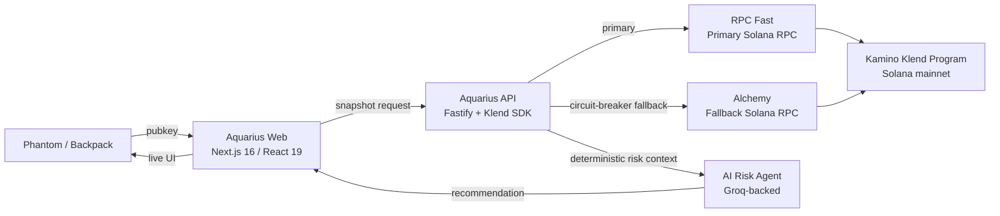

# Aquarius — Colosseum Frontier Hackathon Submission

> This document is the dedicated submission overview for the **Colosseum Frontier Hackathon**.
> Aquarius is being built as an early-stage Solana risk intelligence company — not a one-week hackathon experiment.

  
  &nbsp;
  
  &nbsp;
  

---

## TL;DR (30 seconds)

**Aquarius is a Bloomberg terminal for your Solana lending position.** Connect Phantom or Backpack, watch your real Kamino obligation in real time, and get an AI-generated risk recommendation *before* the liquidation cascade hits — not after.

- **Live today:** Phantom + Backpack connect → live Kamino obligation snapshot → AI-assisted risk explanation.
- **Next:** Drift, MarginFi, Save, alerts, treasury dashboards.
- **Why now:** Solana DeFi grew at unprecedented pace. Risk tooling didn't.

---

## 3-Minute Demo Video

| | |
|---|---|
| **Loom video** | TODO_LOOM_URL |
| **Live app** | <https://aquarius-web.vercel.app/protocol/kamino> |
| **Main README** | [../../README.md](../../README.md) |
| **Walkthrough video (long)** | <https://youtu.be/b-kWwo4hqwk> |
| **Intro video** | <https://youtu.be/Z0YKaZFClW4> |
| **Whitepaper / docs** | <https://aquarius-web.vercel.app/docs/introduction> |
| **GitHub repo** | TODO_GITHUB_URL |
| **X / build in public** | TODO_X_HANDLE |
| **Contact** | TODO_EMAIL |

### Suggested timestamps for the Loom

| Time | Section |
|---|---|
| 0:00 – 0:20 | Founder intro + one-line vision |
| 0:20 – 0:45 | Problem (with one concrete data point) |
| 0:45 – 1:15 | Why Solana, why now |
| 1:15 – 2:15 | **Live demo** — connect Phantom → real Kamino position → live health score → AI recommendation |
| 2:15 – 2:45 | Market opportunity + roadmap |
| 2:45 – 3:00 | Closing ask |

---

## 1. Vision

Aquarius is a Solana-native risk intelligence layer for wallet-connected DeFi positions.

The goal is to give every Solana DeFi user — retail and institutional — the same quality of real-time, predictive, action-oriented risk intelligence that traditional finance has had for decades, with none of the custodial trade-offs.

This is not a one-event experiment. The goal is to build Aquarius into the default risk infrastructure for Solana DeFi, then expand cross-protocol and cross-chain.

---

## 2. Problem

Solana DeFi is fast, liquid, and increasingly the default home for on-chain leverage. But position risk is still managed manually:

- Each protocol shows you stats, but never tells you what to do.
- Risk lives in scattered dashboards, explorers, Telegram channels, and gut instinct.
- By the time a user sees a problem, the response window has already collapsed.
- The result: preventable liquidations and unnecessary user losses, every cycle.

The pain is most acute in lending — where a single market move can cascade across collateral, borrow, and reserves in seconds — but it generalizes to perps, leveraged liquidity, and treasury positions.

---

## 3. Solution

Aquarius connects a user's wallet to a real-time risk intelligence layer.

For the Colosseum Frontier submission, Aquarius focuses on **Kamino lending** as the flagship integration:

1. The user connects **Phantom** or **Backpack**.
2. Aquarius reads the wallet's Kamino obligation directly from Solana mainnet through a hardened RPC layer.
3. Computes a deterministic health score, severity bucket, reserve exposure, and risk progression stage.
4. Surfaces a one-sentence AI-generated recommendation backed by the deterministic numbers.
5. Polls live every 30 seconds — pauses when the tab is hidden, refreshes immediately on return, and follows wallet account switches.

The product is **non-custodial and read-first by design**. Aquarius never moves funds from the user's wallet; the user (and, in the future, user-defined automated agents) decide whether and how to act.

---

## 4. Why Solana

Frontier asks why Solana. The honest answer is that Solana is now the only mainstream environment where this product is **technically realistic and economically viable**:

- **Speed.** Solana's block times and confirmation speed make sub-30-second risk monitoring meaningful, not theatre.
- **Cost.** Low fees mean the future automated mitigation tier (auto-repay, auto-rebalance) is actually affordable for retail users.
- **Wallet UX.** Phantom and Backpack provide first-class injected wallet flows — Aquarius integrates with them directly without the heavy `@solana/wallet-adapter-*` SDK, keeping the bundle small and the UX instant.
- **Protocol density.** Kamino, Drift, MarginFi, Save, Jupiter, and others have all reached the maturity required for cross-protocol risk analysis.
- **Infrastructure quality.** RPC Fast, Helius, Alchemy and others now offer the SLA needed to power production-grade real-time monitoring.

---

## 5. Architecture

### Production hygiene already shipped

- **Per-provider RPC fallback** with circuit breakers (5 consecutive failures → 30 s open). Primary RPC Fast, secondary Alchemy, no single point of failure for the read path.
- **Per-call timeouts + structured 504s.** No client hangs even when the upstream RPC misbehaves.
- **Cluster-mismatch guards** at both server and client. The browser surfaces an amber banner if `NEXT_PUBLIC_SOLANA_CLUSTER` ever disagrees with what the API is serving.
- **Zero-dep Phantom + Backpack integration.** Direct injected provider detection with multi-stage fallback polling, Wallet Standard event listening, and silent reconnect on page reload.
- **Live monitoring loop.** 30-second polling that pauses when the tab is hidden, refreshes immediately on visibility return, and subscribes to wallet `accountChanged` and `disconnect` events.
- **Out-of-order response guard.** Late refreshes can never overwrite fresher snapshots.
- **Observability.** Per-provider RPC latency, error counters, fallback activation count, and primary-circuit-open gauge.

---

## 6. How It Works

Aquarius follows a staged risk intelligence flow:

1. **Monitor** — read the user's Kamino obligation from Solana mainnet.
2. **Detect** — compute health, severity, reserve exposure, and a 0–100 composite risk score.
3. **Analyze** — pass deterministic risk context to the AI agent for human-readable explanation.
4. **Recommend** — surface a one-sentence advisory action.
5. **Prepare orchestration** — the architecture is built so future signed flows (auto-repay, rebalance) can route through controlled execution adapters without changing the read path.

For Frontier, the demo is intentionally **read-first and non-custodial**. The path to signed flows exists in the architecture and is the next milestone, not the current one.

---

## 7. Demo

### Live demo path

1. Open <https://aquarius-web.vercel.app/protocol/kamino>.
2. Click **Connect Phantom** (or **Connect Backpack**).
3. Approve the wallet popup.
4. Watch the page load your real Kamino obligation: composite risk score, severity, LTV, reserve concentration, AI recommendation.
5. The status indicator ticks "Updated Ns ago" — leave the tab open and watch it refresh live.
6. Switch accounts inside Phantom — the monitor follows the new account automatically.

### Current demo scope

- Phantom wallet connection (zero-dep adapter).
- Backpack wallet connection (zero-dep adapter).
- Silent reconnect on page reload (`onlyIfTrusted`).
- Kamino risk snapshot API — deterministic scoring + severity.
- RPC Fast as primary provider.
- Alchemy as automatic fallback provider.
- Cluster mismatch guard (server + client).
- Live polling with visibility-pause and account-change handling.
- AI-assisted recommendation layer.

---

## 8. Market Opportunity

- Solana DeFi total value locked has scaled into the multi-billion-dollar range, with **Kamino alone among the largest lending venues**.
- Liquidations on Solana lending protocols are a recurring source of preventable user loss, with academic and industry research consistently showing a meaningful fraction are addressable through earlier action.
- The directly comparable wedge in EVM (DeFiSaver, Instadapp, etc.) supports a multi-billion-dollar adjacent business — Solana has no equivalent yet.
- **Adjacent surfaces** that scale Aquarius beyond retail: protocol-embedded risk feeds (B2B API tier), DAO and fund treasury dashboards (Squads, Realms), MEV-aware rebalancing (Jito).

> Replace this section with current numbers from DeFiLlama / Kamino's own dashboard before final submission. Specific live numbers always beat vibes for judges.

### Business model

1. **Pro tier** — monthly subscription for real-time alerts (Telegram / Discord / X), multi-wallet, cross-protocol coverage.
2. **Protocol API** — protocols embed Aquarius's risk feed in their own UIs, paid per call.
3. **Treasury / institutional** — annual contracts for risk dashboards covering DAO and fund treasuries.
4. **Action affiliate** — non-extractive fees on rebalance / repay actions executed through partner protocols.

---

## 9. Initial Usage & Traction

- **Live deployment:** <https://aquarius-web.vercel.app/>
- **Live Kamino monitor:** <https://aquarius-web.vercel.app/protocol/kamino>
- **Beta users:** TODO — fill in once you have signed-up testers.
- **X / build in public:** TODO_X_HANDLE
- **Selected feedback:** TODO — capture 3–5 short testimonials from Solana DeFi users connecting their real wallets.

> Even informal beta feedback from Solana DeFi friends carries serious weight in the Colosseum deck. Aim for 3–5 short quotes before the submission deadline.

---

## 10. Future Roadmap

### Near term (post-Frontier)

- Real Kamino mainnet alerting (Telegram, Discord, email).
- Sharable, signed risk snapshot links for build-in-public moments.
- Improved AI agent recommendations grounded in historical position behaviour.

### Solana protocol expansion

- **Drift** position risk and perps liquidation distance.
- **MarginFi** lending risk.
- **Save** (Solend successor) lending risk.
- **Jupiter** position and liquidity routing insights.

### Infrastructure expansion

- Validator and RPC health signals integrated into the protocol risk score.
- Protocol-level risk APIs for B2B integrations.
- Treasury dashboards for DAOs and funds (Squads, Realms).
- Autonomous mitigation agents with user-defined policies.

---

## 11. Team / Builder Story

Aquarius is being built by a founder focused on DeFi risk infrastructure, agentic automation, and non-custodial financial safety.

The project started from a simple observation: in DeFi, users almost always receive critical information *too late*. Aquarius exists to shorten the time between **risk detection** and **safe action**.

This is intentionally a long-term project. The Frontier submission is the focused Solana cut of a broader risk intelligence vision, and the work continues regardless of the hackathon outcome.

> TODO: replace with a more personal 2–3 sentence founder story. Why this problem, why you, why you'll keep building it after Frontier.

---

## 12. Sponsor / Ecosystem Alignment

- **Kamino** — primary integration. Aquarius reads obligations directly via the Klend SDK.
- **RPC infrastructure (RPC Fast, Alchemy)** — production-grade primary / fallback architecture with explicit per-provider observability.
- **Phantom + Backpack** — native zero-dep wallet integration; small bundle, instant connect, silent reconnect.
- **AI / agent track** (if applicable) — Groq-powered advisory layer with deterministic backing.

---

## 13. Compliance with Colosseum's published criteria

| Colosseum criterion | Where it lives in this submission |
|---|---|
| Team background | Section 11 (Team / Builder Story) |
| Product description | Sections 1–3 (Vision, Problem, Solution) |
| Why you started building | Section 11 (Team / Builder Story) |
| Market opportunity | Section 8 (Market Opportunity) |
| Initial usage / traction | Section 9 (Initial Usage & Traction) |
| How the product works (demo) | Sections 6–7 (How It Works, Demo) plus Loom link at top |
| Founder-mode startup framing | TL;DR + Section 1 + Section 11 + Section 10 (Roadmap) |
| Sub-3-minute demo video | Loom link + suggested timestamps at top |

---

## 14. Closing Ask

Aquarius is applying to the Colosseum accelerator and is open to:

- **Pre-seed conversations** to convert this hackathon submission into the default risk layer for Solana DeFi.
- **Design partners** at Solana protocols who want a real-time risk feed embedded in their UI or alerts.
- **Mentorship and feedback** from operators who have built risk-adjacent infrastructure on Solana or in TradFi.

If you're a judge, mentor, or potential design partner — let's talk.

| | |
|---|---|
| 📬 Email | TODO_EMAIL |
| 🐦 X | TODO_X_HANDLE |
| 💻 GitHub | TODO_GITHUB_URL |
| 🌐 Live | <https://aquarius-web.vercel.app/protocol/kamino> |

---

> See the [main README](../../README.md) for the full technical project documentation, architecture deep-dives, and other hackathon submissions.
