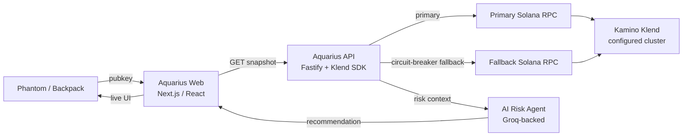

# Aquarius — Colosseum Frontier Hackathon Submission

> **Judge README** — Structured for Colosseum Frontier review: project overview, architecture, Solana integrations, product support, reproduction, and reviewer notes.  
> Aquarius is being built as an early-stage **Solana risk intelligence** company — not a one-week hackathon experiment.  
> See the [main README](../../README.md) for full architecture and technical proof.

<p align="center">
  <a href="https://youtu.be/aDlJyN_ay8U?si=l8fBysdaaYN0Bi0m">
    
  </a>
  &nbsp;
  <a href="https://aquarius-web.vercel.app/protocol/kamino">
    
  </a>
  &nbsp;
  <a href="../../README.md">
    
  </a>
</p>

---

## TL;DR (30 seconds)

**Aquarius is a Bloomberg terminal for your Solana lending position.** Connect Phantom or Backpack, watch your Kamino obligation in real time, and get an AI-generated risk recommendation *before* the liquidation cascade hits — not after.

- **Live today:** Phantom + Backpack connect → Kamino obligation snapshot → deterministic score + AI-assisted explanation.
- **Frontier demo:** Read-first, **non-custodial** — Aquarius does not move user funds.
- **Next:** Drift, MarginFi, Save, alerts, treasury dashboards, policy-bound mitigation (via CRE adapters in repo).

**Founders pitch (video):** <https://youtu.be/aDlJyN_ay8U?si=l8fBysdaaYN0Bi0m>

---

## 1. Project overview

### 1.1 Vision

Aquarius is a **Solana-native risk intelligence layer** for wallet-connected DeFi positions. The goal is real-time, predictive, action-oriented risk intelligence for retail and institutional users — **non-custodial** by design.

For **Colosseum Frontier**, the flagship surface is **Kamino lending**:

1. User connects **Phantom** or **Backpack**.
2. Aquarius reads the wallet’s Kamino obligation from Solana (cluster configured by deployment — see §6).
3. Computes deterministic health, severity, reserve exposure, and composite risk score.
4. Surfaces a concise **AI recommendation** grounded in those numbers (Groq-backed).
5. Refreshes on a live loop (default ~30s), pauses when the tab is hidden, follows wallet account switches.

### 1.2 Problem

Solana DeFi is fast and liquid, but position risk is still managed manually: scattered dashboards, reactive alerts, and liquidation pressure that arrives too late. Lending is the sharpest wedge — one market move can cascade across collateral, borrow, and reserves in seconds.

### 1.3 Solution (Frontier scope)

Aquarius connects a wallet to a **read-first** intelligence layer. Users see *what to do* backed by deterministic metrics, not only raw protocol stats. Signed mitigation (repay, rebalance) is **architected** in the API and CRE paths but **gated off by default** until audit and policy review (`KAMINO_WRITE_ENABLED=false` in `.env.example`).

**Complementary work (other tracks, same repo):** [0G APAC](./0g-apac.md) (ZG pipeline + 0G Chain commitments), [Chainlink Convergence](./chainlink-convergence.md) (CRE orchestration). This README centers on **Solana / Kamino**.

### 1.4 Live demo & media

| Resource | Link |
|----------|------|
| **Founders pitch** | <https://youtu.be/aDlJyN_ay8U?si=l8fBysdaaYN0Bi0m> |
| **Live Kamino monitor** | <https://aquarius-web.vercel.app/protocol/kamino> |
| **Full app** | <https://aquarius-web.vercel.app/> |
| **Long walkthrough** | <https://youtu.be/b-kWwo4hqwk> |
| **Intro video** | <https://youtu.be/Z0YKaZFClW4> |
| **Docs / whitepaper** | <https://aquarius-web.vercel.app/docs/introduction> |
| **GitHub** | <https://github.com/FrankezeCode/Aquarius> |

> **Contact / social:** Replace `TODO_EMAIL` and `TODO_X_HANDLE` below before final Colosseum deck export if required by the submission form.

---

## 2. System architecture

### 2.1 High-level flow (Frontier / Kamino path)



### 2.2 Technical description

| Layer | Responsibility |
|--------|----------------|
| **Web (`apps/web`)** | Wallet connect (zero-dep Phantom/Backpack), Kamino monitor UI, cluster-mismatch banner, live polling. |
| **API (`apps/api`)** | `GET /api/v1/kamino-risk/snapshot`, health, optional repay simulate (gated); Klend market reads. |
| **RPC layer** | Primary + fallback with circuit breaker (5 failures → 30s open), per-call timeouts, structured 504s. |
| **Risk engine** | Deterministic scoring, severity, progression stage (bounded context `kamino-solana`). |
| **AI layer** | Human-readable recommendation from deterministic context (not raw LLM-only risk). |
| **CRE (roadmap / staging)** | `kamino-risk*` webhooks for escalation and mitigation intents — see [Chainlink Convergence](./chainlink-convergence.md). |

Full architecture: [`docs/architecture.md`](../architecture.md).  
Kamino API routes: [`apps/api/src/routes/v1/kamino-risk/`](../../apps/api/src/routes/v1/kamino-risk/).  
Hardening checklist: [`docs/security/kamino-solana-hardening.md`](../security/kamino-solana-hardening.md).

### 2.3 Production hygiene (shipped)

- Per-provider **RPC fallback** with circuit breakers.
- **Cluster-mismatch guards** (server + browser) when `NEXT_PUBLIC_SOLANA_CLUSTER` ≠ API `SOLANA_CLUSTER`.
- **Out-of-order response guard** on snapshot refreshes.
- **Visibility-aware polling** (pause hidden tab, refresh on return).
- **Observability:** RPC latency, error counters, fallback activation (internal metrics).

---

## 3. Which Solana / ecosystem components are used

| Component | Status in this submission | Evidence in repo |
|-----------|---------------------------|------------------|
| **Kamino (Klend)** | **Used — read path** | [`apps/api/src/protocols/kamino-solana/`](../../apps/api/src/protocols/kamino-solana/), [`apps/web/protocols/kamino/`](../../apps/web/protocols/kamino/) |
| **Phantom / Backpack** | **Used — wallet connect** | [`apps/web/adapters/kamino-solana/solana-wallet.ts`](../../apps/web/adapters/kamino-solana/solana-wallet.ts) |
| **Solana RPC (Helius / RPC Fast / Alchemy-class)** | **Used — env-configured** | `SOLANA_RPC_URL`, `SOLANA_RPC_URL_FALLBACK` in [`.env.example`](../../.env.example) |
| **Groq (LLM advisory)** | **Used when `GROQ_API_KEY` set** | Copilot / recommendation paths |
| **Solana devnet** | **Supported for development & judge repro** | `SOLANA_CLUSTER=devnet` + matching wallet + market pubkeys |
| **Solana mainnet-beta** | **Supported — typical for real Kamino positions** | Default in `.env.example`; live Vercel when RPC/cluster are mainnet |
| **Kamino repay / signed txs** | **Not Frontier demo** — simulate route exists, **write disabled by default** | `KAMINO_WRITE_ENABLED=false`, [`kamino-repay-policy.ts`](../../apps/api/src/protocols/kamino-solana/policy/kamino-repay-policy.ts) |
| **Drift, MarginFi, Save, Jupiter** | **Roadmap** | §9 |

We do **not** claim production alerting (Telegram/Discord) or autonomous on-chain mitigation as **shipped** for Frontier.

### Cluster honesty (mainnet vs devnet)

| Environment | Typical use |
|-------------|-------------|
| **Hosted demo (Vercel)** | Aimed at **real Kamino positions** when deployment uses `SOLANA_CLUSTER=mainnet-beta` and a mainnet-capable RPC. Connect a **mainnet** wallet with a Kamino obligation. |
| **Local / hackathon development** | Team validates against **devnet** (`SOLANA_CLUSTER=devnet`) and Kamino devnet market pubkeys before widening write surfaces. |
| **UI mock mode** | `next dev` can show mock dashboard data without RPC — see `NEXT_PUBLIC_KAMINO_USE_MOCK` in `.env.example`. |

**Why signed mitigation is not the Frontier demo:** Aquarius touches **real economic risk**. Repay and autonomous agents require audit, mint allowlists, and rate limits ([`docs/security/kamino-solana-hardening.md`](../security/kamino-solana-hardening.md)). Frontier submission is intentionally **read-first**.

---

## 4. How integrations support the product

| Integration | Product role |
|-------------|----------------|
| **Kamino Klend reads** | Ground truth for obligation health, LTV, reserves — the core “monitor” step. |
| **Phantom / Backpack** | Frictionless wallet-native UX; no custodial keys on our servers for the read path. |
| **Dual RPC + circuit breaker** | Production-grade reads under RPC failure — monitoring must not silently die. |
| **Deterministic + AI stack** | Numbers are reproducible; AI explains and recommends, not replaces, the risk model. |
| **CRE hooks (repo)** | Future path for escalation and mitigation without rewriting the Kamino bounded context. |

**One-line story for judges:**  
*Connect wallet → Aquarius reads Kamino → deterministic risk score → AI explains what to do next — before liquidation bots earn their incentive.*

---

## 5. Local deployment and reproduction (for judges)

### 5.1 Prerequisites

- **Node.js** ≥ 20, **pnpm** 10.x
- Git clone: <https://github.com/FrankezeCode/Aquarius>
- Copy [`.env.example`](../../.env.example) → `.env`
- **Phantom or Backpack** browser extension (for full UI demo)
- **Solana RPC URL** with sufficient quota (Helius, RPC Fast, Alchemy, etc.) — never commit keys

### 5.2 Install and run

```bash
pnpm install
cp .env.example .env   # Windows: copy .env.example .env
```

**API:**

```bash
# Minimal local API (mock-friendly):
# DATA_PROVIDER_MODE=mock
# PORT=3001
# For live Kamino reads also set:
# SOLANA_RPC_URL=https://...
# SOLANA_CLUSTER=mainnet-beta   # or devnet
# KAMINO_MARKET_PUBKEY=...
# GROQ_API_KEY=...              # optional, for AI text

pnpm dev --filter api
```

**Web (second terminal):**

```bash
# NEXT_PUBLIC_API_URL=http://localhost:3001
# NEXT_PUBLIC_SOLANA_CLUSTER=mainnet-beta   # must match SOLANA_CLUSTER

pnpm dev --filter web
```

Open `http://localhost:3000/protocol/kamino` (or the port shown in the terminal).

### 5.3 API smoke (no wallet)

```bash
curl -s http://localhost:3001/health

curl -s "http://localhost:3001/api/v1/kamino-risk/health"
```

**Snapshot** (requires live RPC + valid wallet/market pubkeys):

```bash
curl -s "http://localhost:3001/api/v1/kamino-risk/snapshot?wallet=<BASE58_PUBKEY>&market=<KAMINO_MARKET_PUBKEY>"
```

### 5.4 Judge demo path (UI)

1. Open <http://localhost:3000/protocol/kamino> (or production: <https://aquarius-web.vercel.app/protocol/kamino>).
2. Click **Connect Phantom** or **Connect Backpack**.
3. Approve connection — use a wallet on the **same cluster** as the API (`SOLANA_CLUSTER`).
4. Observe composite risk score, severity, LTV, reserves, AI recommendation.
5. Watch **“Updated Ns ago”** refresh; switch Phantom accounts to confirm follow behavior.

### 5.5 Mock dashboard (no RPC)

For UI-only review in `next dev`:

```bash
# apps/web — see .env.example
# NEXT_PUBLIC_KAMINO_USE_MOCK=1
```

Production builds only use mock when explicitly enabled per `.env.example` comments.

### 5.6 Key codebase map

| Path | Purpose |
|------|---------|
| [`apps/web/protocols/kamino/kamino-risk-monitor.tsx`](../../apps/web/protocols/kamino/kamino-risk-monitor.tsx) | Live monitor UI |
| [`apps/api/src/routes/v1/kamino-risk/`](../../apps/api/src/routes/v1/kamino-risk/) | Public Kamino API |
| [`apps/api/src/protocols/kamino-solana/`](../../apps/api/src/protocols/kamino-solana/) | Klend reader, scorer, policy |
| [`workflows/kamino-risk/`](../../workflows/kamino-risk/) | CRE workflow package |
| [`docs/adr/0002-kamino-solana-bounded-context.md`](../adr/0002-kamino-solana-bounded-context.md) | Domain boundaries |

---

## 6. Reviewer notes (wallets, cluster, RPC)

### 6.1 Solana clusters

| Cluster | `SOLANA_CLUSTER` | Wallet must be on |
|---------|------------------|-------------------|
| Mainnet (real Kamino) | `mainnet-beta` | Mainnet |
| Devnet (development) | `devnet` | Devnet |

Set **`NEXT_PUBLIC_SOLANA_CLUSTER`** to the **same** value as `SOLANA_CLUSTER`. Mismatch triggers an amber banner in the UI.

### 6.2 RPC and secrets

- **`SOLANA_RPC_URL`** — server-side primary (may embed API key; **never commit**).
- **`SOLANA_RPC_URL_FALLBACK`** — optional secondary provider.
- Do **not** reuse server RPC keys in `NEXT_PUBLIC_*` vars.

### 6.3 Devnet testing

- Use a **devnet** wallet (Phantom → Settings → Developer Settings → testnet mode / devnet).
- Fund via [Solana devnet faucet](https://faucet.solana.com/) if needed.
- Point API at devnet Kamino market pubkeys (team-specific; set `KAMINO_MARKET_PUBKEY` in `.env`).

### 6.4 What we do not provide

- Shared judge wallet private keys.
- Guaranteed mainnet Kamino obligation on every judge wallet (use your own funded position or mock mode).
- Production Telegram/Discord alerts (roadmap).

### 6.5 Hosted vs local

| Surface | URL |
|---------|-----|
| Production Kamino page | <https://aquarius-web.vercel.app/protocol/kamino> |
| API (if split-deployed) | Set `NEXT_PUBLIC_API_URL` on Vercel to your API origin |

---

## 7. Colosseum published criteria — where to find it

| Colosseum criterion | Section in this document |
|---------------------|--------------------------|
| Team background | §10 |
| Product description | §1 |
| Why you started building | §10 |
| Market opportunity | §8 |
| Initial usage / traction | §8 |
| How the product works (demo) | §4–§5 + [founders pitch](https://youtu.be/aDlJyN_ay8U?si=l8fBysdaaYN0Bi0m) |
| Founder-mode startup framing | TL;DR + §1 + §9–§10 |
| Demo video | [Founders pitch](https://youtu.be/aDlJyN_ay8U?si=l8fBysdaaYN0Bi0m) + §5.4 |

---

## 8. Market opportunity & traction

### Market

- Solana DeFi TVL is in the **multi-billion-dollar** range; **Kamino** is among the largest lending venues.
- Liquidations remain a recurring source of preventable user loss; earlier action is the wedge Aquarius owns.
- EVM comparables (DeFiSaver, Instadapp) show appetite for risk automation — Solana lacks an equivalent **wallet-native** layer.

> Refresh TVL / Kamino stats from [DeFiLlama](https://defillama.com/) or Kamino dashboards before your final deck.

### Business model (high level)

1. **Pro tier** — alerts, multi-wallet, cross-protocol.
2. **Protocol API** — embedded risk feeds (B2B).
3. **Treasury / institutional** — DAO and fund dashboards.
4. **Action affiliate** — non-extractive fees on partner-routed mitigations.

### Traction

| Item | Status |
|------|--------|
| Live deployment | <https://aquarius-web.vercel.app/> |
| Kamino monitor | <https://aquarius-web.vercel.app/protocol/kamino> |
| Beta users / testimonials | TODO — add 3–5 quotes before final submission |
| Build in public | TODO_X_HANDLE |

---

## 9. Roadmap (post-Frontier)

**Near term**

- Kamino mainnet alerting (Telegram, Discord, email).
- Sharable signed risk snapshot links.
- Richer AI recommendations from historical behavior.

**Solana protocol expansion**

- Drift, MarginFi, Save, Jupiter integrations.

**Infrastructure**

- Validator / RPC health in composite scores.
- B2B protocol APIs.
- Treasury dashboards (Squads, Realms).
- Autonomous mitigation agents under user policy (CRE + gated writes).

---

## 10. Team & closing ask

Aquarius is built by a founder focused on **DeFi risk infrastructure**, agentic automation, and **non-custodial** safety. The project started from a simple observation: users often learn about risk **too late**. Frontier is the focused **Solana cut** of a longer-term vision; development continues regardless of outcome.

> TODO: Add a personal 2–3 sentence founder story (why you, why you’ll keep building after Frontier).

**We are open to:**

- **Pre-seed conversations** — default risk layer for Solana DeFi.
- **Design partners** — protocols embedding real-time risk feeds.
- **Mentorship** from operators who’ve built risk infrastructure on Solana or TradFi.

| | |
|---|---|
| Email | TODO_EMAIL |
| X | TODO_X_HANDLE |
| GitHub | <https://github.com/FrankezeCode/Aquarius> |
| Live | <https://aquarius-web.vercel.app/protocol/kamino> |

---

## 11. How this fits the broader Aquarius stack

| Track | Doc | Role |
|-------|-----|------|
| **Colosseum Frontier** | This file | Solana / Kamino detection + wallet-native UX |
| **0G APAC** | [0g-apac.md](./0g-apac.md) | ZG pipeline + 0G Chain commitments |
| **Chainlink Convergence** | [chainlink-convergence.md](./chainlink-convergence.md) | CRE orchestration and mitigation |

---

## 12. References

- [Main README](../../README.md)
- [Architecture](../architecture.md)
- [Kamino / Solana hardening](../security/kamino-solana-hardening.md)
- [ADR 0002 — Kamino bounded context](../adr/0002-kamino-solana-bounded-context.md)
- [Public API surface](../api/public-surface.md)
- [Kamino roadmap](../roadmap.md)
