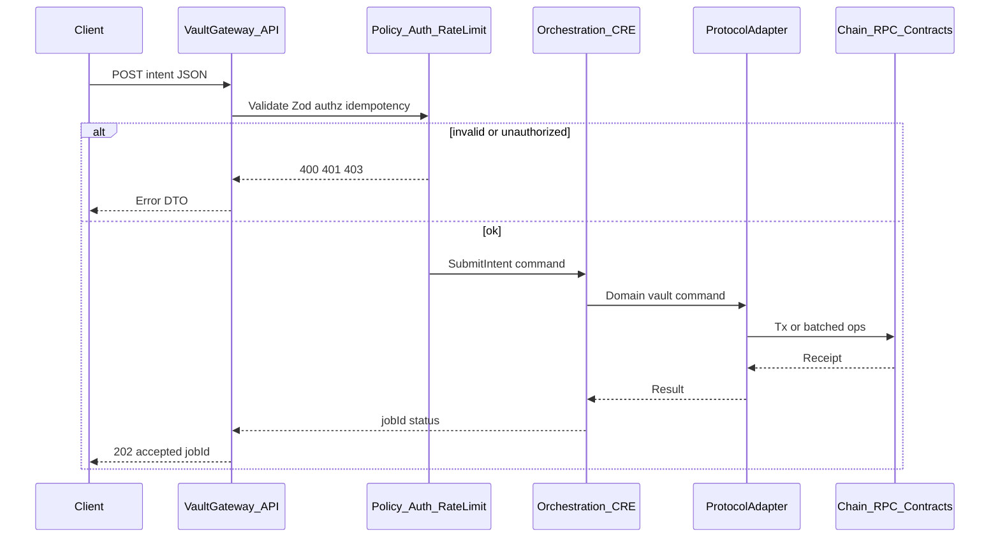

# Vault strategy and vault-gateway contract (Phase 1)

**Document status:** Phase 1 — single source of truth for product narrative + API sketch.  
**Schema version:** 1  
**Last updated:** 2026-03-28

**Phase 0 gate:** Orchestration, custody, environment, and comms decisions are recorded in [**ADR 0003**](adr/0003-phase0-orchestration-and-execution.md). Implementation of vault-gateway `POST` / `OrchestrationPort` should follow that ADR.

**API surface (all routes, advisory vs execution):** [**`docs/api/public-surface.md`**](api/public-surface.md) (Phase 8).

This document is the authoritative place for:

- **Strategy narrative:** PoS participation, buffer vault, and agent solvency (with **Live** vs **Roadmap** labels).
- **Vault-gateway HTTP contract sketch:** existing read-only endpoints + **proposed** execution-intent shapes (for Zod implementation in a later phase).
- **Sequence model:** client → gateway → policy → orchestration → adapter → chain.

Implementation code may lag this document; sections below call out what is **live in repo today** vs **target architecture**.

---

## 1. Strategy narrative

### 1.1 Network participation (PoS)

**Roadmap.** Aquarius intends to participate in securing **proof-of-stake networks** it integrates with—via **validation and/or delegation**—so the protocol has **skin in the game** on the same chains users rely on. This is **not** a generic retail staking product; it aligns protocol incentives with **network health** and operational seriousness (uptime, slashing awareness).

**Live today (docs/code alignment).** Staking, native delegation, and LST routing are described as **roadmap** in [`contracts/src/vaults/README.md`](../contracts/src/vaults/README.md) and the root [`README.md`](../README.md) (“Vault, staking, and yield”). On-chain vault shell is **ERC-20 share accounting** per [`AquariusPerChainVault`](../contracts/src/vaults/AquariusPerChainVault.sol); **strategy adapters** are the planned extension point.

### 1.2 Buffer vault and user value

**Target.** Users allocate capital to a **buffer vault** (or sleeve) designed to **backstop** lending positions and, where strategy design allows, **earn yield** on the chosen asset. Capital is **operational insurance liquidity**: available when mitigation needs to move fast—not a generic savings narrative unless product and legal approve that framing.

**Live today.** Risk mitigation domain maps elevated risk to **`INCREASE_BUFFER`** and related actions (see Aave vaults domain in `apps/api`). Advisory **vault-gateway** routing describes **buffer_insurance** / **yield_seeker** sleeves in policy form (no execution).

### 1.3 Agent solvency and draw

**Target.** Aquarius **monitors and reinforces solvency** of the buffer so liquidity remains **available when Aqua agents** must act (e.g. protective paths under policy). Draw rules, minimum buffer ratios, and orchestration live under **policy + workflows**, not in the advisory router alone.

**Live today.** Agent and vault services exist under `apps/api/src/protocols/aave/vaults/`; **internal buffer health** (TVL vs policy minimum, stress projection, optional `watch` → `INCREASE_BUFFER` suggestion) is exposed at `GET /api/internal/vault/buffer-health` and summarized under `domains["aave-buffer"]` in `GET /api/internal/metrics/domains` — see [**runbook: buffer solvency**](runbooks/buffer-solvency.md). Full **closed-loop** buffer solvency automation on mainnet is **roadmap** unless explicitly shipped elsewhere.

### 1.4 Disclosure (internal)

Yield, insurance-like language, and validation involve **regulatory and product disclosure** obligations. Public copy must separate **north-star architecture** from **what is deployed** in each release.

---

## 2. Vault-gateway API contract sketch

**Base URL (API v1):** `{origin}/api/v1/vault-gateway`

**GET** routes remain advisory and cache-friendly. **POST** execution is implemented behind env flags and auth (see ADR 0003 and [`post-intents.ts`](../apps/api/src/routes/v1/vault-gateway/post-intents.ts)).

### 2.1 Implemented today

| Method | Path | Query / body | Response (summary) |
|--------|------|----------------|----------------------|
| `GET` | `/manifest` | — | JSON manifest, per-chain `delegationExecution` (Phase 7c), `executionBackedDelegation`, plus `disclosureKind: "advisory"` ([`manifest.ts`](../apps/api/src/services/vault-gateway/manifest.ts), [`routes.ts`](../apps/api/src/routes/v1/vault-gateway/routes.ts)). |
| `GET` | `/routing` | `chain` (string, 1–64), `asset` (string, 1–32) | [`RoutingRecommendation`](../apps/api/src/services/vault-gateway/types.ts), optional `delegationExecution` on sleeves where relevant, `executionBackedDelegation`, plus `disclosureKind: "advisory"`. |
| `POST` | `/intents` | Zod body: `intentType` (`cre.workflow` \| `aave.buffer.top_up` \| `aave.vault.protect` \| `pos.delegate` + fields per type), `chain`, `asset`, `amount`, `idempotencyKey`, optional `correlationId` ([`intent.schema.ts`](../apps/api/src/services/vault-gateway/intent.schema.ts)) | `kind: "submitted"` (202) or `kind: "rejected"`; requires `VAULT_GATEWAY_EXECUTION_ENABLED=true` and `Authorization: Bearer` token. |
| `GET` | `/jobs/:jobId` | Same Bearer as POST; optional `includeResult=true` | `kind: "status"` with `running` / `completed` / `failed` — poll after [`post-intents.ts`](../apps/api/src/routes/v1/vault-gateway/post-intents.ts) ([`get-job.ts`](../apps/api/src/routes/v1/vault-gateway/get-job.ts)). |

**Validation:** Query parsed with Zod in [`schema.ts`](../apps/api/src/services/vault-gateway/schema.ts) (`vaultRoutingQuerySchema`); POST body in [`intent.schema.ts`](../apps/api/src/services/vault-gateway/intent.schema.ts).

**Trust boundary (GET):** Router is **pure** (`resolveVaultRouting`); **no I/O**, no custody. Disclaimer in [`router.ts`](../apps/api/src/services/vault-gateway/router.ts) states advisory use. When `POS_DELEGATION_ENABLED_CHAINS` includes a chain, manifest/routing expose **live-staged delegation** honesty via `delegationExecution` / `executionBackedDelegation` without implying APY or venue execution guarantees.

### 2.2 Phase 4 — Async jobs, Redis, staging E2E

- **Intent → workflow id:** [`workflow-registry.ts`](../apps/api/src/services/vault-gateway/workflow-registry.ts) maps `cre.workflow` → `aave-risk-monitor` (override with `VAULT_INTENT_CRE_WORKFLOW_ID`).
- **Persistence:** Job state and vault idempotency use [`OrchestrationJobStore`](../apps/api/src/application/ports/orchestration-job-store.port.ts) — in-memory when no Redis URL; set `REDIS_URL` or `VAULT_ORCHESTRATION_REDIS_URL` for multi-instance staging.
- **Execution paths:** With `ORCHESTRATION_EXECUTION_MODE=live` and no `CRE_VAULT_WORKFLOW_TRIGGER_URL`, vault intents run **`runCREWorkflow` asynchronously** (HTTP returns `orchestrationStatus: running`, then `completed` / `failed`). With `CRE_VAULT_WORKFLOW_TRIGGER_URL`, a remote trigger is invoked; completion may arrive via **`POST /api/internal/vault-gateway/cre-job-callback`** (`X-Vault-Job-Secret` = `INTERNAL_VAULT_JOB_CALLBACK_SECRET`).
- **Staging checklist:** Enable `VAULT_GATEWAY_EXECUTION_ENABLED`, configure Bearer token, set `ORCHESTRATION_EXECUTION_MODE=live` (not `mock`), optional Redis; `POST /intents` → `GET /jobs/:jobId` until status is terminal.

### 2.3 Phase 5 — Intent types → workflow ids → protocol adapters

| `intentType` | Default workflow id | Orchestration behavior |
|--------------|---------------------|-------------------------|
| `cre.workflow` | `aave-risk-monitor` | `runCREWorkflow` (or remote trigger when `CRE_VAULT_WORKFLOW_TRIGGER_URL` is set). |
| `aave.buffer.top_up` | `aave-buffer-top-up` | `AaveVaultAdapter` → simulated staking + in-memory buffer vault (`vaultTrace.simulated=true`). |
| `aave.vault.protect` | `aave-vault-protect` | `AaveVaultAdapter` → `VaultService.evaluateAndMitigate` with **declared** `riskLevel` (gateway does not score). |
| `pos.delegate` | `pos-partner-delegate` | `PartnerDelegationAdapter` → EVM `recordDelegationIntent` on configured router (mock or testnet; see Phase 7 env). |

**Phase 7 runbooks:** curated delegation router deploy and smoke — [`runbooks/phase7-delegation-router.md`](runbooks/phase7-delegation-router.md); validator operations pilot (non-code) — [`runbooks/phase7b-validator-pilot.md`](runbooks/phase7b-validator-pilot.md).

Env `VAULT_INTENT_CRE_WORKFLOW_ID` still overrides the mapped workflow id for all types when set. Simulated buffer owner: `VAULT_PROTOCOL_SIMULATED_OWNER` (see config). Completed jobs may include `result.vaultTrace` on the GET job payload (`includeResult=true`).

### 2.4 Execution envelope (implemented — Zod in [`intent.schema.ts`](../apps/api/src/services/vault-gateway/intent.schema.ts))

Base fields match Phase 3; `aave.vault.protect` adds `aqAssetId` and `riskLevel`.

**Unified envelope (proposed)**

| Field | Type | Required | Description |
|-------|------|----------|-------------|
| `schemaVersion` | `number` | yes | Document/API version (e.g. `1`). |
| `intentType` | `string` | yes | Namespaced intent, e.g. `vault.buffer.top_up`, `vault.delegate`, `vault.withdraw`. |
| `chain` | `string` | yes | Logical chain id (align with manifest / router normalization). |
| `asset` | `string` | yes | Symbol or asset id (product-specific). |
| `amount` | `{ value: string, decimals: number }` | optional | Integer string + decimals to avoid float errors; required when intent moves value. |
| `idempotencyKey` | `string` (UUID) | yes | Client-supplied key for safe retries. |
| `correlationId` | `string` | optional | Trace across services. |
| `metadata` | `record` | optional | Opaque client metadata (no secrets). |

**Example JSON (proposed)**

```json
{
  "schemaVersion": 1,
  "intentType": "vault.buffer.top_up",
  "chain": "ethereum",
  "asset": "USDC",
  "amount": { "value": "1000000", "decimals": 6 },
  "idempotencyKey": "550e8400-e29b-41d4-a716-446655440000",
  "metadata": { "source": "web" }
}
```

**Proposed endpoints (choose one style in implementation)**

| Method | Path (proposed) | Purpose |
|--------|------------------|---------|
| `POST` | `/intents` | Single entry: body = envelope above; returns `jobId` / `workflowId` + status URL. |
| `POST` | `/execute` | Alias of `/intents` if product prefers one verb. |

**Success response (proposed)**

| Field | Type | Description |
|-------|------|-------------|
| `status` | `"accepted" \| "rejected"` | |
| `jobId` | `string` | Correlation to orchestration (CRE workflow or internal job). |
| `advisoryOnly` | `boolean` | `false` when an execution workflow was started. |

**Handlers (target architecture):** validate → **authz** → **rate limit** → map to domain command → **`OrchestrationPort`** (CRE) → **protocol adapter** — no raw chain calls from the route handler.

---

## 3. Sequence diagram (target execution path)

Intended flow once execution is implemented: **vault-gateway** remains a façade; **orchestration** owns workflow state; **protocol** adapters talk to chain.



**Advisory path (today and future):** `GET /manifest` and `GET /routing` do not invoke this sequence; they remain cacheable reads.

---

## 4. Exit criteria (Phase 1)

- [x] One doc (**this file**) holds narrative + **Live / Roadmap** labels + API sketch + diagram.
- [x] GET contract summarized from existing code paths.
- [x] POST payload fields listed for Zod/OpenAPI in a later phase.
- [ ] Legal/product review of public excerpts (when publishing).

---

## 5. Related code and docs

- Vault-gateway routes: [`apps/api/src/routes/v1/vault-gateway/routes.ts`](../apps/api/src/routes/v1/vault-gateway/routes.ts)
- Router (advisory): [`apps/api/src/services/vault-gateway/router.ts`](../apps/api/src/services/vault-gateway/router.ts)
- ADR domains: [`docs/adr/0001-domains-and-boundaries.md`](adr/0001-domains-and-boundaries.md)
- Root architecture: [`README.md`](../README.md)
